# German Made Easy for Marathi & Hindi Speakers

> **Level: Goethe A1 → A2 (CEFR)**
> Complete project brief: curriculum, lessons, grammar, vocabulary, conversations, exercises, pronunciation, culture, revision tests — all produced with AI, with explanations in **Marathi** (मराठी) and **Hindi** (हिंदी), and English meanings.

Marathi and Hindi speakers have very few high-quality German learning books. This project creates a unique **German A1 & A2 Beginner Guide (German → Marathi → Hindi → English)** using AI — built **chapter by chapter** for higher quality, following the **Goethe A1 and A2 syllabus**.

---

## 1. Project Overview

| | |
|---|---|
| **Title** | German Made Easy for Marathi & Hindi Speakers |
| **Level** | Goethe A1 → A2 (CEFR) |
| **Audience** | Marathi speakers (मराठी) and Hindi speakers (हिंदी) |
| **Languages** | 🇩🇪 German · 🇮🇳 Marathi · 🇮🇳 Hindi · 🇬🇧 English (meaning) |

### Example vocabulary table

| German | English | Hindi | Marathi | Pronunciation |
| --- | --- | --- | --- | --- |
| Hallo | Hello | नमस्ते | नमस्कार | हालो |
| Danke | Thank you | धन्यवाद | धन्यवाद | डांके |
| Bitte | Please | कृपया | कृपया | बिटे |
| Guten Morgen | Good morning | सुप्रभात | शुभ सकाळ | गूटन मॉर्गन |
| Tschüss | Bye | अलविदा | निरोप | त्स्युस |
| Wie geht's? | How are you? | आप कैसे हैं? | कसे आहेस? | वी गेट्स? |
| Ich heiße Rahul | My name is Rahul | मेरा नाम राहुल है | माझं नाव राहुल आहे | इख हाइसे राहुल |
| Ja / Nein | Yes / No | हाँ / नहीं | होय / नाही | या / नाइन |

---

## 2. German Alphabet (Das Alphabet)

The German alphabet has **26 Latin letters + 3 umlauts (Ä Ö Ü) + ß (Eszett)** = **30 letters**.

### Alphabet chart

| # | Letter | Name (German) | Hindi | Marathi | Pronunciation |
| --- | --- | --- | --- | --- | --- |
| 1 | A a | a | ए | ए | आ |
| 2 | Ä ä | ä | ए | ए | ए (like English "bed") |
| 3 | B b | be | बे | बे | बे |
| 4 | C c | ce | से | से | त्से |
| 5 | D d | de | दे | दे | दे |
| 6 | E e | e | ए | ए | ए |
| 7 | F f | ef | एफ | एफ | एफ |
| 8 | G g | ge | गे | गे | गे |
| 9 | H h | ha | हा | हा | हा |
| 10 | I i | i | इ | इ | इ |
| 11 | J j | jot | योट | योट | योट |
| 12 | K k | ka | का | का | का |
| 13 | L l | el | एल | एल | एल |
| 14 | M m | em | एम | एम | एम |
| 15 | N n | en | एन | एन | एन |
| 16 | O o | o | ओ | ओ | ओ |
| 17 | Ö ö | ö | ऑ | ऑ | ऑ (like English "girl") |
| 18 | P p | pe | पे | पे | पे |
| 19 | Q q | ku | कू | कू | कू |
| 20 | R r | er | एर | एर | एर (rolled) |
| 21 | S s | es | एस | एस | एस |
| 22 | T t | te | ते | ते | ते |
| 23 | U u | u | उ | उ | उ |
| 24 | Ü ü | ü | उ़ | उ़ | उ़ (round lips) |
| 25 | V v | vau | फाऊ | फाऊ | फाऊ (like F) |
| 26 | W w | we | वे | वे | वे (like English V) |
| 27 | X x | iks | इक्स | इक्स | इक्स |
| 28 | Y y | ypsilon | उप्सिलोन | उप्सिलोन | उप्सिलोन |
| 29 | Z z | zett | त्सेत | त्सेत | त्सेत |
| 30 | ß ß | eszett | एस-त्सेत | एस-त्सेत | एस-त्सेत (sharp स) |

### Special sounds (important for Marathi/Hindi speakers)

| Sounds | How it sounds | Example | Pronunciation |
| --- | --- | --- | --- |
| sch | श | Schule | शूले |
| ch (soft) | ख (light) | ich | इख |
| ch (hard) | ख़ (deep) | Nacht | नाख्ट |
| ei | आइ (like "eye") | ein | आइन |
| ie | ई (long) | nie | नी |
| eu / äu | ऑइ | neu | नोइ |
| st (start of word) | श्त | Stadt | श्टाट |
| sp (start of word) | श्प | Spiel | श्पील |

---

## 3. Pronunciation Rules

Explained in Marathi and Hindi — the easiest rules for beginners:

- **Vowels are short or long, never nasal** — a = आ, e = ए, i = इ, o = ओ, u = उ.
- **Umlauts are new sounds for Marathi/Hindi speakers**: ä = ए, ö = ऑ (like "girl"), ü = उ़ (say उ with round lips).
- **ei = आइ** (ein = आइन) but **ie = ई** (nie = नी) — "the second vowel is pronounced".
- **ch**: after e/i → soft ख (ich = इख); after a/o/u → hard ख़ (Nacht = नाख्ट). Never "च"!
- **sch = श** (Schule = शूले). **st/sp** at word start = श्त/श्प (Stadt = श्टाट, Spiel = श्पील).
- **z = त्स**, never ज़ (Zeit = त्साइट).
- **v = फ** (Vater = फाटर) but **w = व** (Wasser = वासर) — the opposite of English!
- **ß = sharp स** (Straße = श्ट्रासे). ß comes after long vowels; ss after short vowels.
- **j = य** (Jahr = यार), **qu = क्व** (Quelle = क्वेले).
- **r** is rolled like Marathi/Hindi र; at word end it weakens to अ (Vater ≈ फाटा).
- **All nouns are capitalized**: der Tisch, die Schule, das Buch — always.
- **Stress** is usually on the first syllable: LEH-rer, ZEI-tung.

---

## 4. Numbers (Die Zahlen)

### 0–20

| # | German | English | Hindi | Marathi | Pronunciation |
| --- | --- | --- | --- | --- | --- |
| 0 | null | zero | शून्य | शून्य | नुल |
| 1 | eins | one | एक | एक | आइन्स |
| 2 | zwei | two | दो | दोन | त्स्वाइ |
| 3 | drei | three | तीन | तीन | द्राइ |
| 4 | vier | four | चार | चार | फीर |
| 5 | fünf | five | पाँच | पाच | फुन्फ |
| 6 | sechs | six | छह | सहा | ज़ेक्स |
| 7 | sieben | seven | सात | सात | ज़ीबेन |
| 8 | acht | eight | आठ | आठ | आख्ट |
| 9 | neun | nine | नौ | नऊ | नोइन |
| 10 | zehn | ten | दस | दहा | त्सेन |
| 11 | elf | eleven | ग्यारह | अकरा | एल्फ |
| 12 | zwölf | twelve | बारह | बारा | त्स्वोल्फ |
| 13 | dreizehn | thirteen | तेरह | तेरा | द्राइत्सेन |
| 14 | vierzehn | fourteen | चौदह | चौदा | फीर्त्सेन |
| 15 | fünfzehn | fifteen | पंद्रह | पंधरा | फुन्फ्त्सेन |
| 16 | sechzehn | sixteen | सोलह | सोळा | ज़ेख्त्सेन |
| 17 | siebzehn | seventeen | सत्रह | सतरा | ज़ीप्त्सेन |
| 18 | achtzehn | eighteen | अठारह | अठरा | आख्त्सेन |
| 19 | neunzehn | nineteen | उन्नीस | एकोणीस | नोइन्त्सेन |
| 20 | zwanzig | twenty | बीस | वीस | त्स्वान्त्सिख |

### Tens and beyond

| German | Meaning | Pronunciation | German | Meaning | Pronunciation |
| --- | --- | --- | --- | --- | --- |
| 30 dreißig | तीस | द्राइसिख | 70 siebzig | सत्तर | ज़ीप्त्सिख |
| 40 vierzig | चालीस | फीर्त्सिख | 80 achtzig | अस्सी | आख्त्सिख |
| 50 fünfzig | पचास | फुन्फ्त्सिख | 90 neunzig | नब्बे | नोइन्त्सिख |
| 60 sechzig | साठ | ज़ेख्त्सिख | 100 hundert | सौ | हुंडर्ट |
| 1000 tausend | हज़ार | हजार | ताउज़ेन्ट | — | — |

### Number rules (Marathi & Hindi explanation)

- **German counts units BEFORE tens**: 21 = ein**und**zwanzig ("one-and-twenty"), 45 = fünf**und**vierzig.
- This is like the old Marathi/Hindi style: एकवीस, पंचेचाळीस / इक्कीस, पैंतालीस.
- **eins → ein** before a noun: *ein Buch* (एक किताब), but *eins, zwei, drei* when counting.

---

## 5. Core Grammar (Grammatik)

> Every rule explained first in Marathi (मराठी), then Hindi (हिंदी), then with German examples.

### Articles der / die / das — लेख / आर्टिकल

German nouns have **3 genders** — this is the hardest new concept for Marathi/Hindi speakers (both languages have no articles):

| Article | Gender | Meaning | Memory color | Examples |
| --- | --- | --- | --- | --- |
| der | masculine (पुल्लिंग) | the | 🔵 blue | der Mann, der Tisch, der Sohn |
| die | feminine (स्त्रीलिंग) | the | 🔴 red | die Frau, die Schule, die Tochter |
| das | neuter (नपुंसक) | the | 🟢 green | das Kind, das Buch, das Haus |
| die (plural) | all plurals | the | 🔴 | die Männer, die Frauen, die Kinder |

> **Memory trick:** always learn the noun WITH its article: *der Tisch*, *die Lampe*, *das Auto*. Color-code your flashcards: blue / red / green.

### Cases — कारक / कारक

German has 4 cases. Hindi/Marathi use postpositions (को, से, का / ला, ने, चा); German changes the **article** instead:

| Case | Question | der | die | das | Plural | Like Hindi/Marathi |
| --- | --- | --- | --- | --- | --- | --- |
| Nominativ (कर्ता) | who? कौन? | der | die | das | die | ने/ने (subject) |
| Akkusativ (कर्म) | whom? किसे? | den | die | das | die | को / ला |
| Dativ (संप्रदान) | to whom? किसको? | dem | der | dem | den | को, को देता / ला |
| Genitiv (संबंध) | whose? किसका? | des | der | des | der | का / चा |

### Sein (to be) — असणे / होना

| Pronoun | Sein | Pronunciation | Marathi | Hindi |
| --- | --- | --- | --- | --- |
| ich | bin | बिन | मी आहे | मैं हूँ |
| du | bist | बिस्ट | तू आहेस | तू है |
| er / sie / es | ist | इस्ट | तो/ती/ते आहे | वह है |
| wir | sind | ज़िन्ट | आम्ही आहोत | हम हैं |
| ihr | seid | ज़ाइट | तुम्ही आहात | तुम हो |
| sie / Sie | sind | ज़िन्ट | ते आहेत | वे हैं |

### Haben (to have) — कडे असणे / के पास होना

| Pronoun | Haben | Pronunciation | Marathi | Hindi |
| --- | --- | --- | --- | --- |
| ich | habe | हाबे | माझ्याकडे आहे | मेरे पास है |
| du | hast | हास्ट | तुझ्याकडे आहे | तेरे पास है |
| er / sie / es | hat | हाट | त्याच्याकडे आहे | उसके पास है |
| wir | haben | हाबेन | आमच्याकडे आहे | हमारे पास है |
| ihr | habt | हाप्त | तुमच्याकडे आहे | तुम्हारे पास है |
| sie / Sie | haben | हाबेन | त्यांच्याकडे आहे | उनके पास है |

### Word order — वाक्यरचना / वाक्य रचना

- **Normal sentence: verb in position 2.** *Ich **lerne** Deutsch.* (मैं जर्मन सीखता हूँ)
- **Question: verb in position 1.** ***Lernst*** *du Deutsch?* (क्या तुम जर्मन सीखते हो?)
- **Modal verbs: infinitive at the END.** *Ich **kann** Deutsch **sprechen**.* (मैं जर्मन बोल सकता हूँ)
- This is different from Hindi/Marathi where the verb comes at the end — German puts it second!

---

## 6. Vocabulary Essentials (Wortschatz)

### Days of the week — सप्ताह के दिन / आठवड्याचे दिवस

| German | English | Hindi | Marathi | Pronunciation |
| --- | --- | --- | --- | --- |
| Montag | Monday | सोमवार | सोमवार | मोंटाग |
| Dienstag | Tuesday | मंगलवार | मंगळवार | डीन्स्टाग |
| Mittwoch | Wednesday | बुधवार | बुधवार | मिट्वोख |
| Donnerstag | Thursday | गुरुवार | गुरुवार | डॉनर्स्टाग |
| Freitag | Friday | शुक्रवार | शुक्रवार | फ्राइटाग |
| Samstag | Saturday | शनिवार | शनिवार | ज़ाम्स्टाग |
| Sonntag | Sunday | रविवार | रविवार | ज़ोंटाग |

### Months — महीने / महिने

| German | English | Hindi | Marathi | Pronunciation |
| --- | --- | --- | --- | --- |
| Januar | January | जनवरी | जानेवारी | यानुआर |
| Februar | February | फ़रवरी | फेब्रुवारी | फेब्रुआर |
| März | March | मार्च | मार्च | मेर्स |
| April | April | अप्रैल | एप्रिल | अप्रिल |
| Mai | May | मई | मे | माई |
| Juni | June | जून | जून | यूनी |
| Juli | July | जुलाई | जुलै | यूली |
| August | August | अगस्त | ऑगस्ट | आउगुस्ट |
| September | September | सितंबर | सप्टेंबर | सेप्टेम्बर |
| Oktober | October | अक्टूबर | ऑक्टोबर | ओक्टोबर |
| November | November | नवंबर | नोव्हेंबर | नोवेम्बर |
| Dezember | December | दिसंबर | डिसेंबर | देज़ेम्बर |

### Colors — रंग

| German | English | Hindi | Marathi | Pronunciation |
| --- | --- | --- | --- | --- |
| rot | red | लाल | लाल | रोट |
| blau | blue | नीला | निळा | ब्लाऊ |
| grün | green | हरा | हिरवा | ग्रून |
| gelb | yellow | पीला | पिवळा | गेल्प |
| orange | orange | नारंगी | केशरी | ओरांशे |
| rosa | pink | गुलाबी | गुलाबी | रोज़ा |
| schwarz | black | काला | काळा | श्वार्ट्स |
| weiß | white | सफ़ेद | पांढरा | वाइस |
| grau | grey | स्लेटी | राखाडी | ग्राऊ |
| braun | brown | भूरा | तपकिरी | ब्राऊन |
| lila | purple | बैंगनी | जांभळा | लीला |

### Family — परिवार / कुटुंब

| German | English | Hindi | Marathi | Pronunciation |
| --- | --- | --- | --- | --- |
| die Mutter | mother | माँ | आई | मुटर |
| der Vater | father | पिता | वडील | फाटर |
| der Bruder | brother | भाई | भाऊ | ब्रूडर |
| die Schwester | sister | बहन | बहीण | श्वेस्टर |
| der Sohn | son | बेटा | मुलगा | ज़ोन |
| die Tochter | daughter | बेटी | मुलगी | टोख्टर |
| der Großvater | grandfather | दादा/नाना | आजोबा | ग्रोस्फाटर |
| die Großmutter | grandmother | दादी/नानी | आजी | ग्रोस्मुटर |
| der Onkel | uncle | चाचा/मामा | काका/मामा | ओन्केल |
| die Tante | aunt | चाची/मामी | काकू/मावशी | टांटे |
| der Cousin | cousin (m) | चचेरा भाई | चुलत भाऊ | कुज़िन |
| die Cousine | cousin (f) | चचेरी बहन | चुलत बहीण | कुज़िने |

### Food — खाना / जेवण

| German | English | Hindi | Marathi | Pronunciation |
| --- | --- | --- | --- | --- |
| das Brot | bread | ब्रेड/रोटी | पाव | ब्रोट |
| der Apfel | apple | सेब | सफरचंद | आप्फेल |
| das Wasser | water | पानी | पाणी | वासर |
| die Milch | milk | दूध | दूध | मिल्ख |
| der Käse | cheese | चीज़ | चीज | केज़े |
| das Ei | egg | अंडा | अंडे | आइ |
| die Kartoffel | potato | आलू | बटाटा | कार्टोफेल |
| das Fleisch | meat | मांस | मांस | फ्लाइश |
| der Fisch | fish | मछली | मासा | फिश |
| das Obst | fruit | फल | फळ | ओब्स्ट |
| das Gemüse | vegetables | सब्ज़ी | भाजी | गेम्यूज़े |
| der Reis | rice | चावल | तांदूळ | राइस |
| der Kaffee | coffee | कॉफ़ी | कॉफी | काफे |
| der Tee | tea | चाय | चहा | ते |

---

## 7. Sample Lesson — Greetings (Begrüßung)

> A complete, ready-to-use model lesson. Use it as the template for every chapter (see `lesson-template.md`).

### 7.1 Objectives — लक्ष्य / ध्येय

- Greet people and say goodbye — लोगों का अभिवादन करना / लोकांना अभिवादन करणे
- Ask and answer *Wie geht's?* — "आप कैसे हैं?" / "कसे आहेस?"
- Introduce yourself with *Ich heiße...* — "मेरा नाम..." / "माझं नाव..."

### 7.2 Vocabulary (20 words)

| German | English | Hindi | Marathi | Pronunciation |
| --- | --- | --- | --- | --- |
| Hallo | Hello | नमस्ते | नमस्कार | हालो |
| Guten Morgen | Good morning | सुप्रभात | शुभ सकाळ | गूटन मॉर्गन |
| Guten Tag | Good day | नमस्ते | नमस्कार | गूटन टाग |
| Guten Abend | Good evening | शुभ संध्या | शुभ संध्याकाळ | गूटन आबेंट |
| Gute Nacht | Good night | शुभ रात्रि | शुभ रात्री | गूटे नाख्ट |
| Danke | Thank you | धन्यवाद | धन्यवाद | डांके |
| Danke schön | Thank you very much | बहुत धन्यवाद | खूप धन्यवाद | डांके शून |
| Bitte | Please | कृपया | कृपया | बिटे |
| Bitte schön | You're welcome | कृपया | कृपया | बिटे शून |
| Entschuldigung | Excuse me / Sorry | माफ़ कीजिए | माफ करा | एंटशुल्डीगुंग |
| Tschüss | Bye | अलविदा | निरोप | त्स्युस |
| Auf Wiedersehen | Goodbye (formal) | अलविदा | निरोप | आउफ वीडेर्ज़ेन |
| Wie geht's? | How are you? | आप कैसे हैं? | कसे आहेस? | वी गेट्स? |
| Mir geht es gut | I'm fine | मैं ठीक हूँ | मी ठीक आहे | मीर गेट एस गूट |
| Und dir? | And you? | और तुम? | आणि तू? | उंट डीर? |
| Ich heiße... | My name is... | मेरा नाम... | माझं नाव... | इख हाइसे... |
| Wie heißt du? | What's your name? | तुम्हारा नाम क्या है? | तुझं नाव काय? | वी हाइस्ट डू? |
| Freut mich | Nice to meet you | आपसे मिलकर खुशी हुई | आनंद झाला | फ्रॉइट मिख |
| Ja | Yes | हाँ | होय | या |
| Nein | No | नहीं | नाही | नाइन |

### 7.3 Dialogue — संवाद (In the street / रस्त्यावर / रस्त्यावर)

| German | Pronunciation | English | Hindi | Marathi |
| --- | --- | --- | --- | --- |
| Anna: Hallo! Wie geht's? | हालो! वी गेट्स? | Hello! How are you? | नमस्ते! आप कैसे हैं? | नमस्कार! कसे आहेस? |
| Ben: Hallo, Anna! Mir geht es gut. Und dir? | हालो, आना! मीर गेट एस गूट. उंट डीर? | Hello, Anna! I'm fine. And you? | नमस्ते, आना! मैं ठीक हूँ. और तुम? | नमस्कार, आना! मी ठीक आहे. आणि तू? |
| Anna: Danke, auch gut. Ich heiße Anna. Wie heißt du? | डांके, आऊख गूट. इख हाइसे आना. वी हाइस्ट डू? | Thanks, fine too. My name is Anna. What's your name? | धन्यवाद, मैं भी ठीक हूँ. मेरा नाम आना है. तुम्हारा नाम क्या है? | धन्यवाद, मीही ठीक आहे. माझं नाव आना आहे. तुझं नाव काय? |
| Ben: Ich heiße Ben. Freut mich! | इख हाइसे बेन. फ्रॉइट मिख! | My name is Ben. Nice to meet you! | मेरा नाम बेन है. आपसे मिलकर खुशी हुई! | माझं नाव बेन आहे. आनंद झाला! |
| Anna: Freut mich auch! Tschüss! | फ्रॉइट मिख आऊख! त्स्युस! | Nice to meet you too! Bye! | मुझे भी खुशी हुई! अलविदा! | मलाही आनंद झाला! निरोप! |
| Ben: Auf Wiedersehen! | आउफ वीडेर्ज़ेन! | Goodbye! | अलविदा! | निरोप! |

### 7.4 Grammar notes

- **du** is informal (तू); use **Sie** (आप) for elders and strangers.
- **ß** in *heißt* sounds like sharp स: हाइस्ट.
- **ei = आइ**: heiße = हाइसे.
- German **nouns are capitalised** (Anna, Ben).
- Questions with *Wie...?* = "कैसे/कसे...?"

### 7.5 Practice sentences (10)

1. Hallo! Wie geht's? → नमस्ते! आप कैसे हैं? / नमस्कार! कसे आहेस?
2. Mir geht es gut, danke. → मैं ठीक हूँ, धन्यवाद. / मी ठीक आहे, धन्यवाद.
3. Guten Morgen, Frau Singh. → सुप्रभात, श्रीमती सिंह. / शुभ सकाळ, श्रीमती सिंह.
4. Ich heiße Ravi. → मेरा नाम रवि है. / माझं नाव रवी आहे.
5. Wie heißt du? → तुम्हारा नाम क्या है? / तुझं नाव काय?
6. Tschüss, bis morgen! → अलविदा, कल मिलेंगे! / निरोप, उद्या भेटू!
7. Danke schön, Herr Meier. → बहुत धन्यवाद, श्री मायर. / खूप धन्यवाद, श्री मायर.
8. Entschuldigung, wo ist der Bahnhof? → माफ़ कीजिए, स्टेशन कहाँ है? / माफ करा, स्थानक कुठे आहे?
9. Freut mich, Sie kennenzulernen. → आपसे मिलकर खुशी हुई. / तुम्हाला भेटून आनंद झाला.
10. Gute Nacht und träum schön! → शुभ रात्रि! / शुभ रात्री!

### 7.6 Exercises (10) — अभ्यास / सराव

1. Fill the blank: *Guten M___gen* (answer: or)
2. Fill the blank: *Da___e* (answer: nk)
3. Fill the blank: *Tsch___ss* (answer: ü)
4. Match: Guten Morgen ↔ सुप्रभात
5. Match: Tschüss ↔ अलविदा
6. True/False: "ei" in *ein* sounds like ई. (False — it is आइ)
7. True/False: *Ich* is pronounced "इच". (False — it is इख)
8. Correct the error: *ich heisse ravi* → Ich heiße Ravi (capital I, ß, capital name)
9. Put in order: (geht's, wie, du?) → Wie geht's dir?
10. What does *Freut mich* mean in Hindi and Marathi? → आपसे मिलकर खुशी हुई / आनंद झाला

### 7.7 MCQ (5) — बहुविकल्पी / बहुपर्यायी

1. "Guten Morgen" means: (a) good morning ✔ (b) good night (c) goodbye
2. "Bitte" means: (a) please ✔ (b) thank you (c) sorry
3. The "ch" in *ich* sounds like: (a) च (b) ख ✔ (c) श
4. "Wie heißt du?" means: (a) how are you? (b) what's your name? ✔ (c) where are you?
5. "Tschüss" means: (a) goodbye ✔ (b) hello (c) please

### 7.8 Translation practice (5)

1. मेरा नाम सुनील है. → Ich heiße Sunil.
2. आप कैसे हैं? → Wie geht's?
3. बहुत धन्यवाद. → Danke schön.
4. अलविदा, कल मिलेंगे! → Tschüss, bis morgen!
5. कृपया, एक कॉफ़ी. → Einen Kaffee, bitte.

### 7.9 Speaking practice

- Say hello to your teacher: Hallo, Herr Lehrer!
- Answer: Wie geht's? → Mir geht es gut, danke. Und dir?
- Say good night at 10 pm: Gute Nacht!

### 7.10 Writing practice

Write 3 sentences introducing yourself: *Hallo! Ich heiße ___ . Ich komme aus Indien. Mir geht es gut.*

---

## 8. Flashcards (Sample — Flashcard prompt template)

> Front: German word. Back: Pronunciation, English, Hindi, Marathi, Example sentence, Difficulty.

| Front | Pronunciation | English | Hindi | Marathi | Example | Level |
| --- | --- | --- | --- | --- | --- | --- |
| Hallo | हालो | Hello | नमस्ते | नमस्कार | Hallo, wie geht's? | A1 |
| Danke | डांके | Thanks | धन्यवाद | धन्यवाद | Danke für alles! | A1 |
| Bitte | बिटे | Please | कृपया | कृपया | Ein Wasser, bitte. | A1 |
| Guten Morgen | गूटन मॉर्गन | Good morning | सुप्रभात | शुभ सकाळ | Guten Morgen, Mama! | A1 |
| Tschüss | त्स्युस | Bye | अलविदा | निरोप | Tschüss, bis bald! | A1 |
| ja | या | Yes | हाँ | होय | Ja, gern. | A1 |
| nein | नाइन | No | नहीं | नाही | Nein, danke. | A1 |
| ich | इख | I | मैं | मी | Ich bin Ravi. | A1 |
| du | डू | you (informal) | तू | तू | Wie heißt du? | A1 |
| das Wasser | वासर | water | पानी | पाणी | Ich trinke Wasser. | A1 |
| das Brot | ब्रोट | bread | ब्रेड | पाव | Das Brot ist frisch. | A1 |
| die Mutter | मुटर | mother | माँ | आई | Meine Mutter kocht. | A1 |
| der Vater | फाटर | father | पिता | वडील | Mein Vater arbeitet. | A1 |
| die Schule | शूले | school | स्कूल | शाळा | Die Schule ist groß. | A1 |
| das Haus | हाऊस | house | घर | घर | Mein Haus ist klein. | A1 |

---

## 9. Sample Quiz (Goethe-style)

### Chapter Quiz — Greetings (10 points)

1. How do you say "नमस्ते" in German? → Hallo
2. "Danke" = ? → धन्यवाद / धन्यवाद
3. *Guten ___* (morning) → Morgen
4. Choose: *Wie ___ du?* (heißt / heiße / heißen) → heißt
5. Choose: *Gute ___* (Nacht / Tag / Morgen) → Nacht
6. True/False: "ei" sounds like आइ. → True
7. True/False: German nouns are not capitalised. → False
8. Write the greeting for the morning: → Guten Morgen
9. Write "goodbye" in two ways: → Tschüss / Auf Wiedersehen
10. Translate: *Mir geht es gut* → मैं ठीक हूँ / मी ठीक आहे

**Answer key:** 1 Hallo · 2 धन्यवाद · 3 Morgen · 4 heißt · 5 Nacht · 6 True · 7 False · 8 Guten Morgen · 9 Tschüss, Auf Wiedersehen · 10 मैं ठीक हूँ / मी ठीक आहे

---

## 10. Common Mistakes by Marathi/Hindi Speakers

| # | Mistake | Correct | Why (Hindi/Marathi explanation) |
| --- | --- | --- | --- |
| 1 | "इच" for ich | इख | ch after e/i = soft ख |
| 2 | Vater as "वाटर" | फाटर | German v = फ, not व |
| 3 | Wasser as "वासर" | वासर | German w = व (English "v" sound) |
| 4 | Zeit as "ज़ाइट" | त्साइट | z = त्स, never ज़ |
| 5 | ein as "ईन" | आइन | ei = आइ ("eye") |
| 6 | nie as "नाइ-ए" | नी | ie = ई (long) |
| 7 | Nacht as "नाचट" | नाख्ट | ch after a/o/u = hard ख़ |
| 8 | Missing article gender | der/die/das | Hindi/Marathi have no articles — learn article + noun together |
| 9 | Verb at end of main clause | Ich lerne Deutsch | German verb must be in position 2 |
| 10 | Du vs Sie confusion | Sie with strangers | du = तू, Sie = आप |
| 11 | Counting "बीस-एक" order | einundzwanzig | German says "one-and-twenty" |
| 12 | Lowercase nouns | die Schule | ALL German nouns are capitalised |

---

## 11. Book Table of Contents (Goethe A1 + A2)

> Page numbers are placeholders — update after layout.

| Section | Page |
| --- | --- |
| **Part 1 — Introduction** | |
| Why Learn German? (जर्मन क्यों सीखें?) | 1 |
| Germany Overview (जर्मनी परिचय) | 5 |
| German Alphabet (अक्षर) | 9 |
| Pronunciation (उच्चारण) | 17 |
| Numbers (अंक) | 25 |
| Greetings (अभिवादन) | 31 |
| **Part 2 — A1 Level** | |
| Ch 1: Greetings (Begrüßung) | 39 |
| Ch 2: Introducing Yourself (Vorstellung) | 47 |
| Ch 3: Countries (Länder) | 55 |
| Ch 4: Family (Familie) | 63 |
| Ch 5: Numbers (Zahlen) | 73 |
| Ch 6: Time (Uhrzeit) | 81 |
| Ch 7: Food (Essen) | 91 |
| Ch 8: Travel (Reisen) | 101 |
| Ch 9: Grammar (Grammatik) | 111 |
| Ch 10: Revision (Wiederholung) | 125 |
| **Part 3 — A2 Level** | |
| Daily Life (Alltag) | 135 |
| Office (Büro) | 145 |
| Hospital (Krankenhaus) | 155 |
| Bank (Bank) | 165 |
| Renting House (Wohnung mieten) | 175 |
| Job Interview (Vorstellungsgespräch) | 185 |
| Shopping (Einkaufen) | 195 |
| School (Schule) | 205 |
| Travel (Reisen A2) | 215 |
| Past Tense (Präteritum/Perfekt) | 225 |
| Modal Verbs (Modalverben) | 235 |
| Reflexive Verbs (Reflexive Verben) | 243 |
| Prepositions (Präpositionen) | 251 |
| Letter Writing (Brief) | 261 |
| Email Writing (E-Mail) | 269 |
| **Exam Preparation (परीक्षा तयारी / परीक्षा की तैयारी)** | |
| Goethe A1 & A2 Exam Guide (परीक्षा मार्गदर्शिका) | 277 |
| Mock Test A1 (Start Deutsch 1) | 285 |
| Mock Test A2 (Start Deutsch 2) | 295 |
| Practice Test (Übungstest) | 305 |
| Answer Key (उत्तर / उत्तरे) | 317 |
| Vocabulary Glossary (शब्दकोश) | 301 |
| Index (अनुक्रमणिका) | 320 |

---

## 12. Complete AI Workflow

### Phase 1 – Planning (Table of Contents)

> You are an experienced German language teacher. Create a complete table of contents for a German language book for Marathi and Hindi speakers. Follow Goethe A1 and A2 syllabus. Include grammar, vocabulary, conversations, exercises, pronunciation, culture, and revision tests.

### Phase 2 – Research (trilingual tables)

For every chapter ask AI to explain: German · English meaning · Hindi translation · Marathi translation — always in table format.

### Phase 3 – Chapter prompt (use for every chapter)

> You are a Goethe-certified German language instructor. Write Chapter {N} for a German language book for Marathi and Hindi speakers. Include: 1. Theory 2. German words 3. Pronunciation 4. English meaning 5. Hindi translation 6. Marathi translation 7. Example sentences 8. Daily conversations 9. Grammar notes 10. Memory tricks 11. Exercises 12. Answer key 13. Vocabulary list 14. Cultural tips. Write in simple language suitable for complete beginners. Use tables wherever possible.

### Phase 4 – Grammar prompt

> Explain German grammar for Marathi and Hindi speakers. Explain: Rule, Formula, Examples, Common mistakes, Comparison with Hindi, Comparison with Marathi, Practice exercises, Solutions, Difficulty level, Memory tricks.

### Phase 5 – Vocabulary prompt

> Create 500 German vocabulary words. Columns: German, Pronunciation, English, Hindi, Marathi, Example Sentence, Category, Difficulty. Sort by topic.

### Phase 6 – Conversations prompt

> Create 100 daily German conversations. Topics: Greeting, School, Office, Restaurant, Airport, Hotel, Hospital, Shopping, Bus, Train, Bank, Friendship, Travel. Each conversation must include: German, Pronunciation, Hindi, Marathi, English, Vocabulary, Grammar Notes.

### Phase 7 – Exercises prompt

> Create A1 German exercises. Include: MCQ, fill blanks, translation, speaking, listening practice ideas, writing, vocabulary matching, answer key.

### Phase 8 – Revision prompt (Goethe mock test)

> Create an A1 Goethe-style mock test. Reading, writing, listening practice script, speaking questions, answer key, scoring.

> **Exam files for this project:**
> - [`goethe-exam-guide.md`](goethe-exam-guide.md) — A1 & A2 structures, scoring, sample questions, ~80 exam words, tips
> - [`mock-test-a1.md`](mock-test-a1.md) — full Goethe A1 mock (80 min, 100 points, pass 60) with answer key
> - [`mock-test-a2.md`](mock-test-a2.md) — full Goethe A2 mock (105 min, 100 points, pass 60) with answer key

> **A1 exam:** Hören 20 min (4 parts) · Lesen 25 min (5 parts) · Schreiben 20 min (form + ~30-word message) · Sprechen 15 min (introduction, spelling, questions, requests). **A2 exam:** Hören/Lesen/Schreiben 30 min each · Sprechen 15 min (introduction, topic card, questions, requests). Pass mark: 60/100.

### Phase 9 – Flashcards prompt

> Create German flashcards. Front: German word. Back: Pronunciation, English, Hindi, Marathi, Example sentence, Difficulty.

### Phase 10 – Images prompt

> Create a colorful educational illustration for German vocabulary. Theme: {Kitchen}. Objects should include: Table, Chair, Plate, Glass, Knife, Spoon. Each object should have labels in: German, Hindi, Marathi. Modern textbook style.

Repeat for: House, School, Hospital, Market, Family, Office, Fruits, Vegetables, Transport, Animals.

> **Note:** A starter set of 11 hand-made vector illustrations (SVG) for this project is included in the [`images/`](images/) folder — see the [Image Gallery](#16-image-gallery).

### Phase 11 – AI Review

> Review this German chapter for a book for Marathi/Hindi speakers. Check: German accuracy, umlauts and ß, English meaning, Hindi translation, Marathi translation, Goethe A1/A2 compliance, pronunciation, exercises, consistency. Suggest improvements.

### Phase 12 – Book Formatting

Format for: A4 PDF, 6×9 inch paperback, ePub, Kindle, color edition, black-and-white edition. Include: table of contents, page numbers, headers, answer key, glossary, index.

---

## 13. Recommended AI Tools

| Purpose | AI Tool |
| --- | --- |
| Book writing | ChatGPT |
| Grammar explanations | ChatGPT |
| Translation review | DeepL, ChatGPT |
| Vocabulary expansion | ChatGPT |
| Image generation | DALL·E, Midjourney, Adobe Firefly |
| Page layout | Canva, Adobe InDesign |
| Audiobook / TTS | ElevenLabs |
| Pronunciation audio | Google Translate, ElevenLabs |
| Flashcards | Anki |
| Video lessons | Canva + CapCut |
| Publishing | Amazon KDP |

---

## 14. Suggested Book Series

| # | Book |
| --- | --- |
| 1 | German A1 for Marathi Speakers |
| 2 | German A2 for Marathi Speakers |
| 3 | German Grammar Made Easy (Marathi) |
| 4 | German Vocabulary (3000 Words) |
| 5 | German Conversation Book |
| 6 | German Workbook |
| 7 | German Writing Practice |
| 8 | Goethe A1 Practice Tests |
| 9 | Goethe A2 Practice Tests |
| 10 | German Verbs with Marathi & Hindi Meanings |

---

## 15. Build Strategy

> Build the book **chapter by chapter** — never in one prompt. This produces much higher quality.

**Recommended loop for every chapter:**
1. Generate the chapter (Phase 3 prompt)
2. Cross-check translations with DeepL
3. Run Phase 11 AI review
4. Add exercises, quiz, images and audio
5. Assemble into the book (Phase 12)

---

## 16. Image Gallery

A starter set of **12 flat vector illustrations (SVG)** — simple colorful style, white background, educational. Open them in any browser or SVG viewer; they can later be recreated with AI image tools at higher quality.

### Das Alphabet — German Alphabet Chart

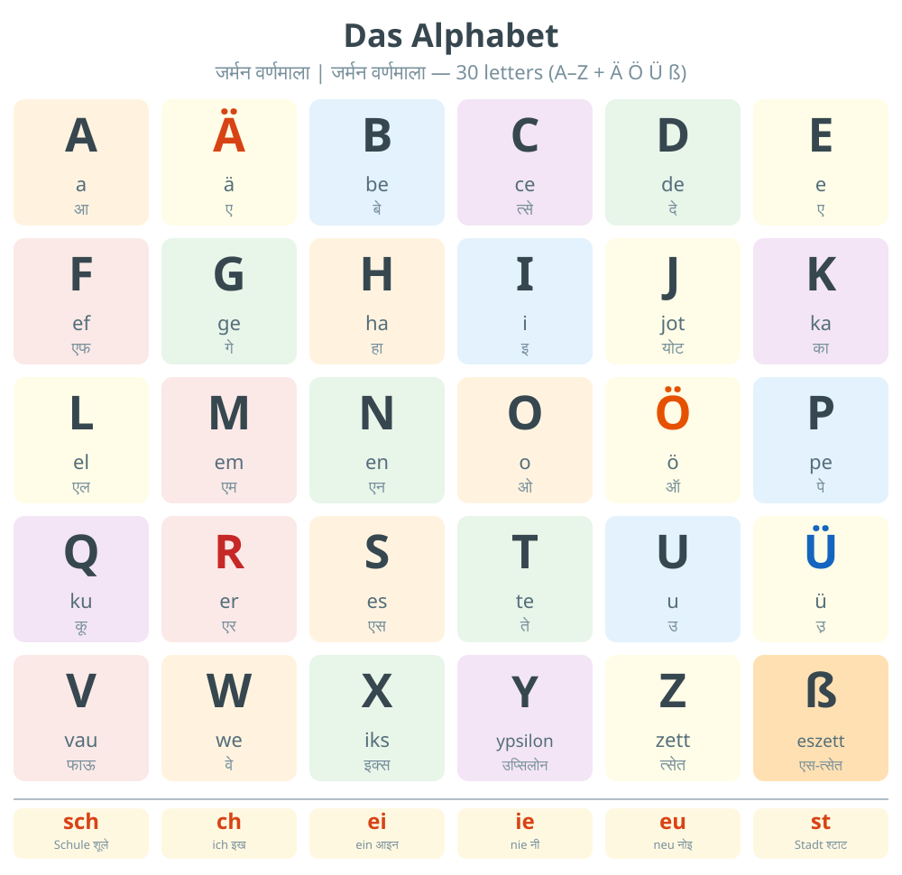

### Die Begrüßung — Greetings

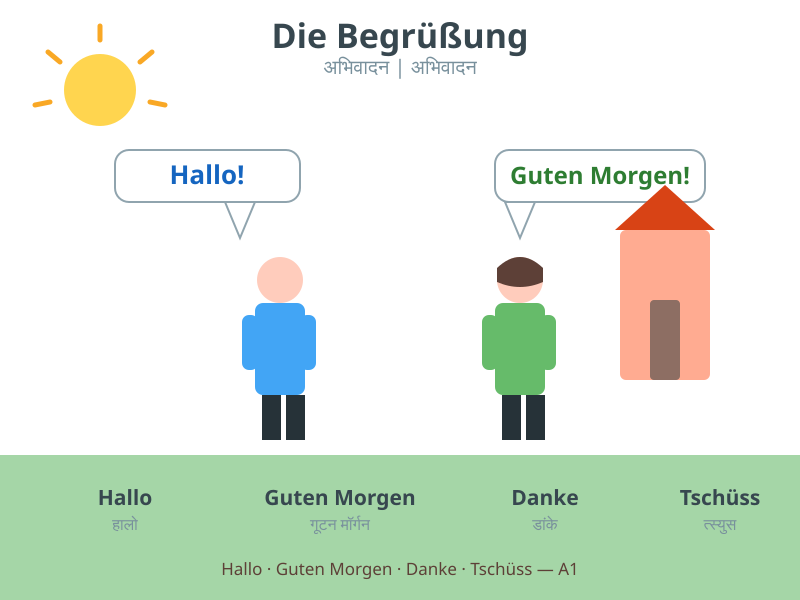

### Die Familie — Family

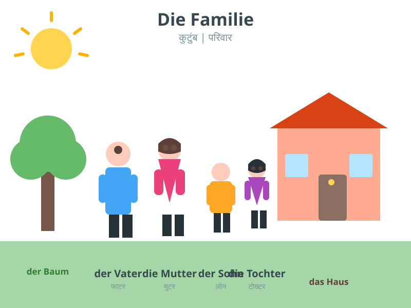

### Die Zahlen — Numbers

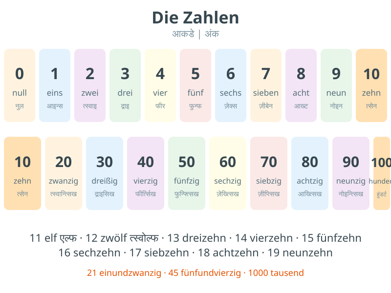

### Die Farben — Colors

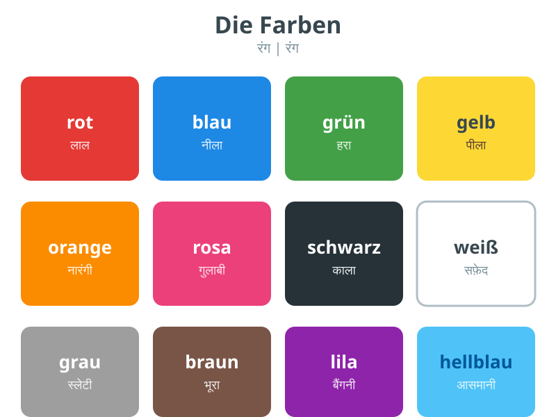

### Die Wochentage und die Uhrzeit — Days, Time & Clock

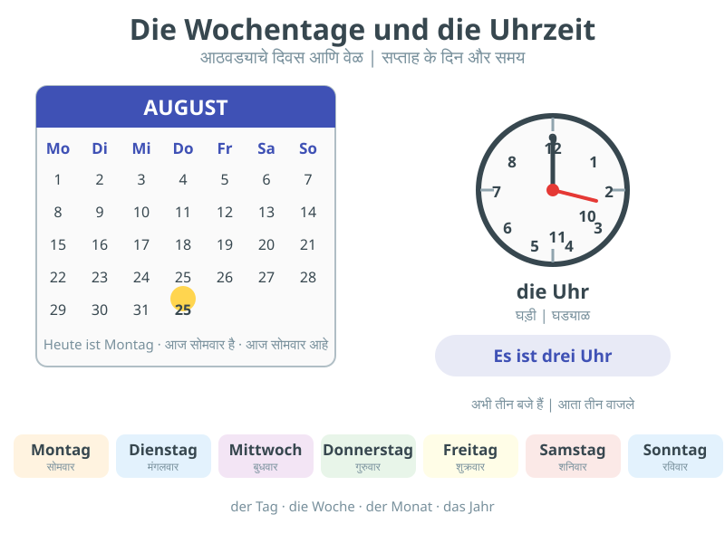

### Das Essen — Food

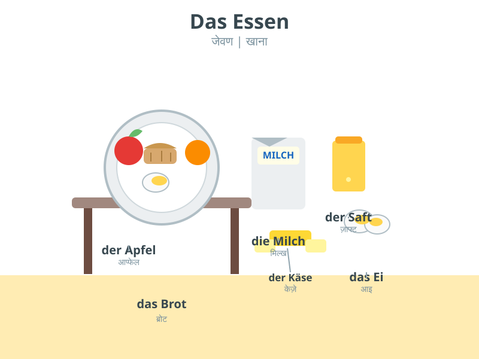

### Das Haus — House

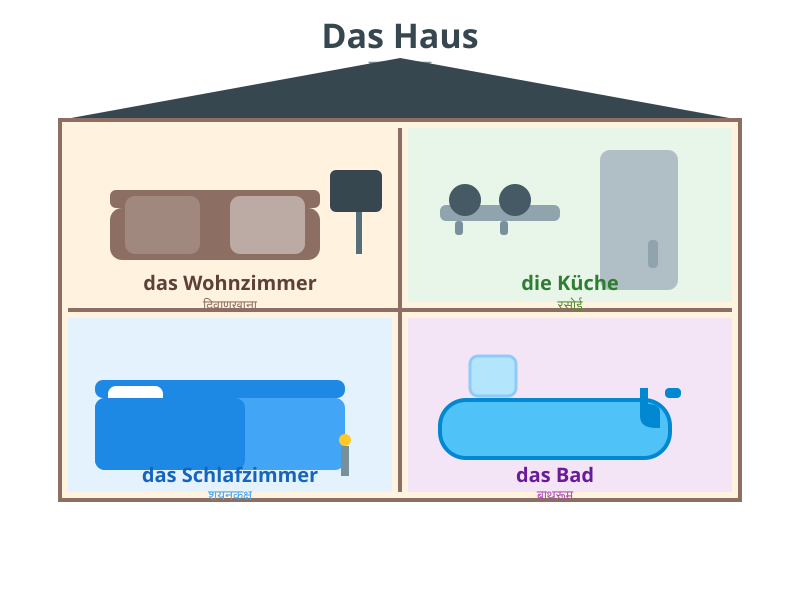

### Die Schule — School

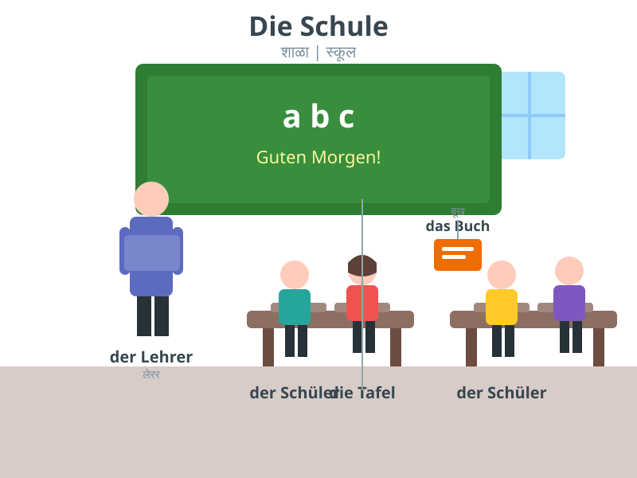

### Die Verkehrsmittel — Transport

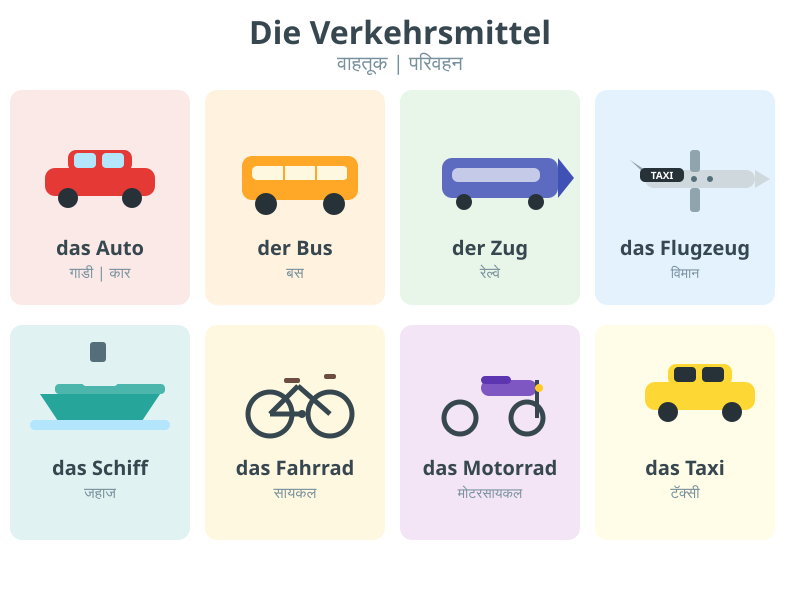

### Die Prüfung — Goethe A1 & A2 Exam

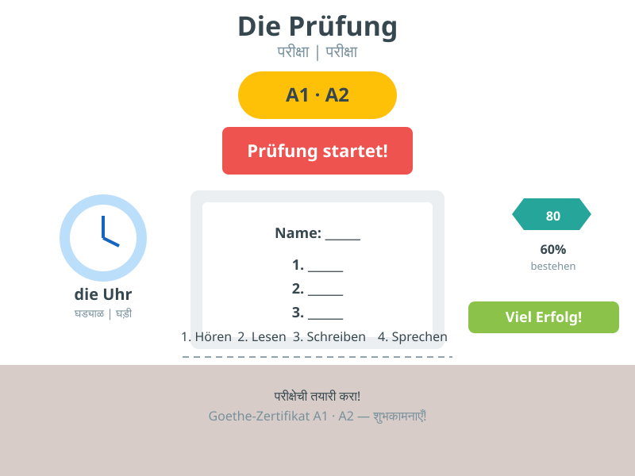

### Cover mock — Book Cover

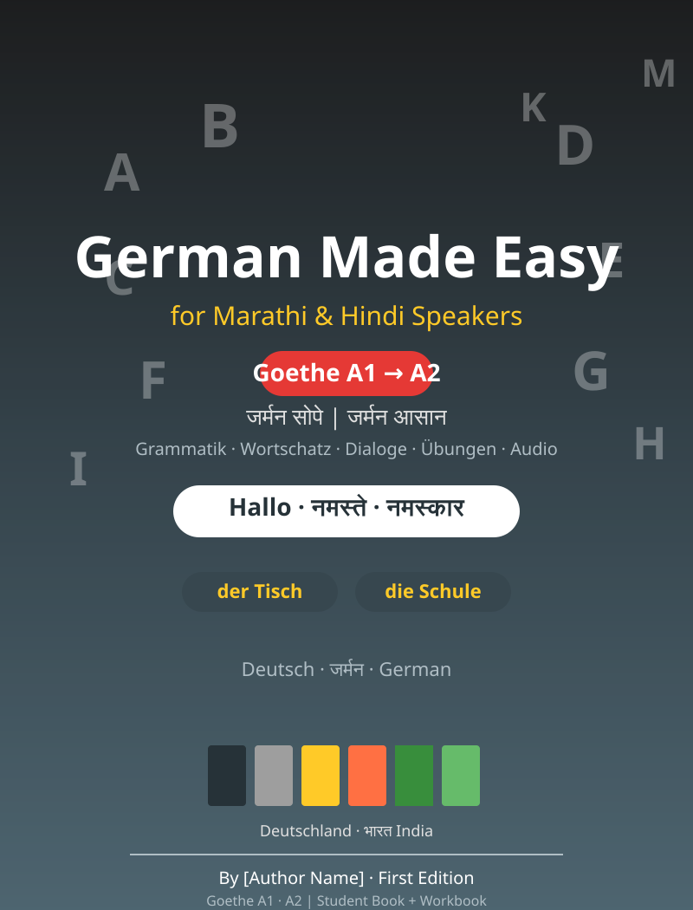
