# Spanish Made Easy for Marathi & Hindi Speakers

> **Level: A1 → A2 (CEFR)**
> Complete project brief: curriculum, lessons, grammar, vocabulary, dialogues, exercises, images, audio, flashcards, quizzes, workbook, teacher guide, review and formatting, with explanations in **Marathi** and **Hindi**.

A **Spanish learning book from Marathi + Hindi** is valuable because most Spanish books are written through English. This project creates a complete **A1 and A2 CEFR-level** course with explanations in Marathi and Hindi, exercises, audio, images, and quizzes.

---

## 1. Project Overview

| | |
|---|---|
| **Title** | Spanish Made Easy for Marathi & Hindi Speakers |
| **Level** | A1 → A2 (CEFR) |
| **Audience** | Marathi speakers (मराठी) and Hindi speakers (हिंदी) |
| **Languages** | 🇪🇸 Spanish · 🇮🇳 Marathi · 🇮🇳 Hindi · English pronunciation (optional) |

### Example vocabulary table

| Spanish | Marathi | Hindi | Pronunciation |
| --- | --- | --- | --- |
| Hola | नमस्कार | नमस्ते | ओला |
| Gracias | धन्यवाद | धन्यवाद | ग्रासियास |
| Buenos días | शुभ सकाळ | सुप्रभात | ब्वेनोस दियास |
| ¿Cómo estás? | तू कसा आहेस? | तुम कैसे हो? | कोमो एस्तास? |
| Adiós | निरोप | अलविदा | अदिओस |
| Por favor | कृपया | कृपया | पोर फाबोर |

---

## 2. Spanish Alphabet (El Alfabeto)

The Spanish alphabet has **27 letters** — the 26 English letters plus **Ñ (eñe)**.

### Alphabet chart

| # | Letter | Name (Spanish) | Marathi | Hindi | Pronunciation |
| --- | --- | --- | --- | --- | --- |
| 1 | A a | a | ए | ए | आ |
| 2 | B b | be | बे | बे | बे |
| 3 | C c | ce | से | से | से (सी before e/i) |
| 4 | D d | de | दे | दे | दे |
| 5 | E e | e | ए | ए | ए |
| 6 | F f | efe | एफे | एफे | एफे |
| 7 | G g | ge | खे | खे | खे (गा before a/o/u) |
| 8 | H h | hache | आचे | आचे | आचे (silent) |
| 9 | I i | i | इ | इ | इ |
| 10 | J j | jota | खोटा | ख़ोटा | ख़ोटा |
| 11 | K k | ka | का | का | का |
| 12 | L l | ele | एले | एले | एले |
| 13 | M m | eme | एमे | एमे | एमे |
| 14 | N n | ene | एने | एने | एने |
| 15 | Ñ ñ | eñe | एन्ये | एन्ये | एन्ये |
| 16 | O o | o | ओ | ओ | ओ |
| 17 | P p | pe | पे | पे | पे |
| 18 | Q q | cu | कू | कू | कू |
| 19 | R r | erre | एरे | एरे | एरे |
| 20 | S s | ese | एसे | एसे | एसे |
| 21 | T t | te | ते | ते | ते |
| 22 | U u | u | उ | उ | उ |
| 23 | V v | uve | उवे | उवे | उवे |
| 24 | W w | uve doble | उवे दोबले | उवे दोबले | उवे दोबले |
| 25 | X x | equis | एकीस | एकीस | एकीस |
| 26 | Y y | ye | ये | ये | ये |
| 27 | Z z | zeta | सेता | सेता | सेता |

### Extra sounds (special letter groups)

| Letters | Name | Pronunciation | Example |
| --- | --- | --- | --- |
| RR | erre doble | दोबले एरे (strong rolled र) | perro → पेरो |
| LL | elle | एये (य sound) | llave → यावे |
| CH | che | चे | chico → चिको |

---

## 3. Pronunciation Rules

Explained in Marathi and Hindi — the easiest rules for beginners:

- **Vowels are always short and clear** — A = आ, E = ए, I = इ, O = ओ, U = उ. There is no long/short distinction like in Hindi/Marathi.
- **H is always silent** — `hola` = ओला (not "होला"), `hotel` = ओतेल.
- **J sounds like Hindi/Marathi ख़** (deep guttural k) — `jamón` = ख़ामोन, `José` = ख़ोसे.
- **Ñ (eñe)** sounds like **न्य** (ny) — `niño` = नीन्यो, `España` = एस्पान्या.
- **LL sounds like य (y)** — `llave` = यावे, `llamar` = यामार.
- **RR is a strong rolled र** (tongue trill) — `perro` = पेरो, `arroz` = अरोस.
- **C**: before a/o/u → क (`casa` = कासा); before e/i → से/सी (`cebra` = सेब्रा).
- **G**: before a/o/u → ग (`gato` = गातो); before e/i → खे/खी (`gente` = खेंते).
- **Q is always क** and always followed by ue/ui — `que` = के, `quién` = कियेन.
- **Z** = से (Latin America) or थे (Spain) — `zapato` = सापातो.
- **Stress rule**: words ending in a vowel, **n** or **s** are stressed on the **second-to-last** syllable (`casa` = **का**-सा). Any exception shows a written accent (´): `está`, `café`, `jamón`.

---

## 4. Book Production Workflow

### Phase 1 – Research

Plan the complete CEFR A1 syllabus (see Section 5 for the suggested curriculum).

> You are a Spanish teacher. Create a complete CEFR A1 syllabus for Marathi and Hindi speakers. Divide into lessons with grammar, vocabulary, dialogues, exercises and quizzes.

**Output:** CEFR syllabus, lesson order, vocabulary list, grammar progression.

### Phase 2 – Book Structure

```
Book 1
├── Introduction
├── Spanish Alphabet
├── Pronunciation
├── Greetings
├── Numbers
├── Days
├── Months
├── Family
├── Food
├── Travel
├── Shopping
├── Restaurant
├── Hotel
├── Directions
├── Weather
├── Health
├── Grammar
├── Exercises
├── Revision
├── Mini Test
├── Vocabulary
└── Answer Key
```

### Phase 3 – Generate Every Lesson

> Create Lesson 1. Topic: Greetings. Explain in Marathi and Hindi. Include: Spanish words, meaning, pronunciation, grammar, dialogue, 20 vocabulary words, 10 practice sentences, 10 exercises, MCQ, translation practice, speaking practice, writing practice.

Repeat for every lesson.

### Phase 4 – Grammar Creation

> Teach Spanish grammar for beginners. Explain every grammar point first in Marathi, then Hindi, then examples in Spanish, then exercises. Keep CEFR A1 level.

**Topics:** Gender, Articles, Ser, Estar, Tener, Present tense, Pronouns, Questions, Negatives, Adjectives, Prepositions.

### Phase 5 – Vocabulary Builder

> Generate 3000 Spanish vocabulary words. Organize by topic. Columns: Spanish, Marathi, Hindi, Pronunciation, Example sentence, Difficulty, CEFR level.

**Topics:** Family, House, Nature, Office, Travel, School, Hospital, Food, Animals, Jobs, Technology.

### Phase 6 – Conversation Generator

> Generate beginner dialogues. Every dialogue should have Spanish, Marathi translation, Hindi translation, pronunciation, grammar notes, vocabulary list, exercises.

**Topics:** Meeting, Airport, Taxi, Restaurant, Hotel, Shopping, Doctor, School, Friends, Office.

### Phase 7 – Exercises

> Create exercises after every lesson. Include: fill blanks, MCQ, true/false, matching, translation, speaking, listening, writing, answer key.

### Phase 8 – Images

Create illustrations for: family, classroom, restaurant, airport, city, shopping, weather, food, body parts.

> Flat vector illustration for Spanish language learning book. Simple colorful style. White background. Educational.

> **Note:** A starter set of 19 hand-made vector illustrations (SVG) for this project is included in the [`images/`](images/) folder — see the [Image Gallery](#18-image-gallery).

### Phase 9 – Audio

Generate audio recordings: Spanish pronunciation, slow speed, normal speed, dialogue audio, listening practice.

### Phase 10 – Flashcards

> Generate flashcards. Front: Spanish. Back: Marathi, Hindi, Example, Pronunciation.

Import into spaced-repetition apps if desired.

### Phase 11 – Quizzes

Generate: Lesson Quiz, Chapter Quiz, Mid Test, Final Test, Speaking Test, Reading Test, Listening Test.

### Phase 12 – Workbook

Separate workbook with: writing pages, translation, sentence creation, picture description, speaking practice, review tests.

> **DELE exam files for this project:**
> - [`dele-exam-guide.md`](dele-exam-guide.md) — DELE A1 & A2 structures, the 2-group scoring rule, sample questions, ~70 exam words, tips
> - [`mock-test-a1.md`](mock-test-a1.md) — full DELE A1 mock (lectura 45 min, auditiva 20 min, escritas 25 min, orales 10 min) with answer key
> - [`mock-test-a2.md`](mock-test-a2.md) — full DELE A2 mock (lectura 60 min, auditiva 35 min, escritas 45 min, orales 12 min) with answer key

> **DELE A1/A2:** 4 pruebas — Comprensión de lectura, Comprensión auditiva, Expresión e interacción escritas, Expresión e interacción orales (25 points each). **Pass rule:** ≥30/50 in Group 1 (lectura + escritas) **AND** ≥30/50 in Group 2 (auditiva + orales) — both groups must pass!

### Phase 13 – Teacher Guide

Create: lesson objectives, activities, games, pronunciation tips, common mistakes by Marathi/Hindi speakers, homework, assessment rubric.

> **Teacher's Guide (Section 7 above):** written by a Spanish teacher who speaks Marathi/Hindi. Contains: linguistic advantages (5 vowels = Marathi vowels, b/v = ब, me gusta = मुझे पसंद है), **Course 1: A1 (12-week syllabus + top 100 words + skills + exam prep)**, **Course 2: A2 (12-week syllabus + 100 words + skills + exam prep)**, false friends, 10 transfer errors, pronunciation drills, classroom activities, Indian-context vocabulary.

> **Teacher's golden rules:** teach Spanish through Hindi/Marathi grammar (gustar = मुझे पसंद है, tener + age = मेरी उम्र है). Spanish vowels are EXACTLY Marathi vowels — drill purity (कोमो, never कोउमो). The biggest enemy is SOV → SVO word order: Hindi says मैं किताब पढ़ता हूँ, Spanish says **yo leo el libro**.

### Phase 14 – Quality Review

> Review this Spanish learning book. Check: grammar, Spanish accuracy, Marathi translation, Hindi translation, CEFR compliance, pronunciation, exercises, consistency. Suggest improvements.

### Phase 15 – Book Formatting

Format for: A4 PDF, 6×9 inch paperback, ePub, Kindle, color edition, black-and-white edition. Include: table of contents, page numbers, headers, answer key, glossary, index.

---

## 5. A1 Curriculum (Suggested)

| # | Lesson |
| --- | --- |
| 1 | Spanish Alphabet |
| 2 | Pronunciation |
| 3 | Greetings |
| 4 | Introductions |
| 5 | Numbers |
| 6 | Days & Months |
| 7 | Time |
| 8 | Family |
| 9 | Colors |
| 10 | Food |
| 11 | Drinks |
| 12 | Home |
| 13 | School |
| 14 | Clothes |
| 15 | Shopping |
| 16 | Restaurant |
| 17 | Hotel |
| 18 | Directions |
| 19 | Transportation |
| 20 | Weather |
| 21 | Body Parts |
| 22 | Health |
| 23 | Daily Routine |
| 24 | Present Tense |
| 25 | Revision |
| 26 | Final Test |

---

## 6. A2 Curriculum (Suggested)

| # | Lesson |
| --- | --- |
| 1 | Past Tense (Pretérito Perfecto) |
| 2 | Imperfect |
| 3 | Future |
| 4 | Reflexive Verbs |
| 5 | Comparisons |
| 6 | Travel |
| 7 | Office |
| 8 | Banking |
| 9 | Internet |
| 10 | Social Media |
| 11 | Festivals |
| 12 | Health |
| 13 | Shopping Conversations |
| 14 | Telephone |
| 15 | Emails |
| 16 | Formal vs Informal Speech |
| 17 | Story Reading |
| 18 | Listening Practice |
| 19 | Speaking Practice |
| 20 | Writing Practice |
| 21 | Grammar Revision |
| 22 | Mock Exam |

---

## 7. Teacher's Guide - A1 + A2 Courses (शिक्षक मार्गदर्शिका / शिक्षक मार्गदर्शन)

> Written by a Spanish teacher who also speaks Marathi (मराठी) and Hindi (हिंदी).
> Two complete courses: **Course 1 = A1 (12 weeks)** and **Course 2 = A2 (12 weeks)** — grammar, vocabulary, skills and exam preparation for both DELE levels.
>
> Related files: [Exam Guide](dele-exam-guide.md) · [Mock Test A1](mock-test-a1.md) · [Mock Test A2](mock-test-a2.md)

---

### Part 0 — The Teacher's Diagnosis: The Easiest Sounds, The Hardest Order

Spanish is phonetically the EASIEST language for Marathi/Hindi speakers — but word order is the biggest fight.

| Advantage | Hindi | Marathi | Spanish | How to use it |
| --- | --- | --- | --- | --- |
| **5 pure vowels** | अ आ इ ई उ ऊ… | आ ए इ ओ ऊ | a e i o u | Spanish vowels = **exactly** Marathi vowels. Indians say them correctly on day 1 — rare gift! |
| **Rolled r (rr)** | Hindi ड़ | Marathi ड़ | rr | The rolled r exists in their mouths already — drill perro/pero |
| **b/v = ब** | ब | ब | b/v both = ब | No distinction needed — instant relief |
| **Gender** | पुल्लिंग/स्त्रीलिंग | पुल्लिंग/स्त्रीलिंग | -o/-a | Spanish gender is VISIBLE in the word ending (el libro, la casa) — much easier than German |
| **Formal/informal** | आप/तुम | तुम्ही/तू | usted/tú | Same concept, same rules |
| **tener + age** | मेरी उम्र है | माझे वय आहे | tengo 25 años | NOT "to be + age" — teach as a memorized structure |
| **gustar** | मुझे … पसंद है | मला … आवडते | me gusta… | **IDEAAL match!** Hindi "मुझे पसंद है" = Spanish "me gusta" — the reverse-object structure already exists in their brains! |

> **Teacher's golden rule:** Spanish grammar clicks when taught via **gustar = मुझे पसंद है**, **tener = मेरे पास है**, and **ser/estar** as permanent vs temporary (मराठीचे असणे). The only real enemy is **SVO word order** — Hindi says मैं किताब पढ़ता हूँ (SOV), Spanish says **yo leo el libro** (SVO).

---

### Course 1 — SPANISH A1 (12 Weeks)

### 1A. A1 Syllabus — Week by Week

| Week | Topic | Grammar | Vocabulary | Exam link |
| --- | --- | --- | --- | --- |
| 1 | Alphabet & sounds (ñ, ll, rr, j, z, h) | Spelling your name | Greetings: hola, buenos días, adiós | Orales: introduction |
| 2 | **ser** (permanent) | yo soy / tú eres… | Countries, nationalities | Lectura T1: notices |
| 3 | **tener** (have + age) | Tengo 25 años; tener hambre | Numbers 0–30 | Auditiva: numbers |
| 4 | **Regular -ar verbs** | hablar, comprar, trabajar | School & work | Lectura T2: messages |
| 5 | **Regular -er/-ir verbs** | comer, beber, vivir; numbers to 100 | Food & drinks | Auditiva: prices |
| 6 | **gustar** (मुझे पसंद है!) | me gusta / me gustan | Hobbies, free time | Orales: monologue |
| 7 | **estar** (temporary/location) | estoy cansado; ¿Dónde está? | House & city | Lectura T3: texts |
| 8 | **Question words** + order | ¿qué, quién, dónde, cuándo, cómo, por qué? | Family | Orales: dialogue |
| 9 | **SVO word order battle** | yo leo el libro (NOT SOV!) | Daily routine verbs | Escritas T2: message |
| 10 | **ir a + future** | voy a comer | Shopping, clothes | Lectura T4: longer text |
| 11 | **Reflexive verbs** | me levanto, me llamo | Time, days, months | Escritas T1: form |
| 12 | **Full DELE A1 mock test** | Revision of all | All A1 topics | [Mock Test A1](mock-test-a1.md) |

### 1B. A1 Vocabulary — Top 100 Frequency Words (learn FIRST — they are 50% of speech)

| # | Spanish | Pronunciation | English | Hindi | Marathi | Example |
| --- | --- | --- | --- | --- | --- | --- |
| 1 | yo | यो | I | मैं | मी | Yo soy Riya. |
| 2 | tú | तू | you (informal) | तुम | तू | Tú eres mi amigo. |
| 3 | usted | उस्तेद | you (formal) | आप | तुम्ही | ¿Cómo está usted? |
| 4 | nosotros | नोसोत्रोस | we | हम | आम्ही | Nosotros vivimos en India. |
| 5 | ellos/ellas | एयोस/एयास | they | वे | ते/त्या | Ellas son mis hermanas. |
| 6 | él | एल | he | वह | तो | Él es mi padre. |
| 7 | ella | एया | she | वह | ती | Ella se llama Ana. |
| 8 | ser | सेर | to be (permanent) | होना | असणे | Yo soy ingeniero. |
| 9 | estar | एस्तार | to be (temporary) | होना | असणे | Estoy cansado. |
| 10 | tener | तेनेर | to have | होना (पास) | कडे असणे | Tengo un coche. |
| 11 | hay | आय | there is/are | है/हैं | आहे/आहेत | Hay un restaurante. |
| 12 | el/la | एल/ला | the | — | — | el libro, la casa |
| 13 | un/una | उन/उना | a/an | एक | एक | un perro, una mesa |
| 14 | y | य | and | और | आणि | Pan y queso. |
| 15 | o | ओ | or | या | किंवा | ¿Té o café? |
| 16 | pero | पेरो | but | लेकिन | पण | Es caro pero bueno. |
| 17 | no | नो | no/not | नहीं | नाही | No entiendo. |
| 18 | sí | सी | yes | हाँ | हो | Sí, claro. |
| 19 | por favor | पोर फ़ावोर | please | कृपया | कृपया | Un café, por favor. |
| 20 | gracias | ग्रासियास | thanks | धन्यवाद | धन्यवाद | Muchas gracias. |
| 21 | de | दे | of/from | का/से | चा/पासून | Soy de Mumbai. |
| 22 | en | एन | in/on | में/पर | मध्ये/वर | Vivo en Pune. |
| 23 | a | आ | to/at | को | ला | Voy a casa. |
| 24 | con | कोन | with | के साथ | सोबत | Vengo con mi madre. |
| 25 | sin | सिन | without | बिना | शिवाय | Café sin azúcar. |
| 26 | para | पारा | for | के लिए | साठी | Es para ti. |
| 27 | por | पोर | for/by/through | के द्वारा | द्वारे | Lo hago por ti. |
| 28 | qué | के | what | क्या | काय | ¿Qué es esto? |
| 29 | quién | कियेन | who | कौन | कोण | ¿Quién es? |
| 30 | dónde | दोंदे | where | कहाँ | कुठे | ¿Dónde vives? |
| 31 | cuándo | कुआंदो | when | कब | केव्हा | ¿Cuándo vienes? |
| 32 | cómo | कोमो | how | कैसे | कसे | ¿Cómo estás? |
| 33 | por qué | पोर के | why | क्यों | का | ¿Por qué aprendes español? |
| 34 | mucho | मुचो | much/many | बहुत | खूप | Muchas gracias. |
| 35 | poco | पोको | little | थोड़ा | थोडे | Un poco de español. |
| 36 | muy | मुय | very | बहुत | खूप | Muy bien. |
| 37 | más | मास | more | और | आणखी | Más pan, por favor. |
| 38 | menos | मेनोस | less | कम | कमी | Menos sal. |
| 39 | bien | बियेन | well | अच्छा | चांगले | Estoy bien. |
| 40 | mal | माल | badly | बुरा | वाईट | Me siento mal. |
| 41 | bueno | बुएनो | good | अच्छा | चांगले | Buenos días. |
| 42 | malo | मालो | bad | बुरा | वाईट | El tiempo es malo. |
| 43 | grande | ग्रांदे | big | बड़ा | मोठे | Una casa grande. |
| 44 | pequeño | पेकेन्यो | small | छोटा | लहान | Un perro pequeño. |
| 45 | nuevo | नुएबो | new | नया | नवीन | Mi coche nuevo. |
| 46 | viejo | बियेहो | old | पुराना | जुने | Un edificio viejo. |
| 47 | hoy | ओय | today | आज | आज | Hoy es lunes. |
| 48 | mañana | मान्याना | tomorrow | कल (आगे) | उद्या | Mañana voy al cine. |
| 49 | ayer | आयेर | yesterday | कल (पीछे) | काल | Ayer comí arroz. |
| 50 | ahora | आओरा | now | अभी | आता | Ahora mismo. |
| 51 | siempre | सियेमप्रे | always | हमेशा | नेहमी | Siempre llego tarde. |
| 52 | nunca | नुनका | never | कभी नहीं | कधीही नाही | Nunca fumo. |
| 53 | aquí | आकी | here | यहाँ | इथे | Estoy aquí. |
| 54 | allí | आयी | there | वहाँ | तिथे | El banco está allí. |
| 55 | ir | इर | to go | जाना | जाणे | Voy al mercado. |
| 56 | venir | बेनिर | to come | आना | येणे | Vengo mañana. |
| 57 | comer | कोमेर | to eat | खाना | खाणे | Como fruta. |
| 58 | beber | बेबेर | to drink | पीना | पिणे | Bebo agua. |
| 59 | hablar | आबलार | to speak | बोलना | बोलणे | Hablo hindi. |
| 60 | escuchar | एस्कुचार | to listen | सुनना | ऐकणे | Escucho música. |
| 61 | mirar | मिरार | to watch | देखना | पाहणे | Miro la tele. |
| 62 | ver | बेर | to see | देखना | पाहणे | Veo un pájaro. |
| 63 | comprar | कोम्प्रार | to buy | खरीदना | खरेदी करणे | Compro pan. |
| 64 | vender | बेंदेर | to sell | बेचना | विकणे | Venden fruta. |
| 65 | trabajar | त्राबाहार | to work | काम करना | काम करणे | Trabajo en un banco. |
| 66 | estudiar | एस्तुदियार | to study | पढ़ना | शिकणे | Estudio español. |
| 67 | vivir | बिबिर | to live | रहना | राहणे | Vivo en Delhi. |
| 68 | aprender | आप्रेंदेर | to learn | सीखना | शिकणे | Aprendo rápido. |
| 69 | entender | एन्तेंदेर | to understand | समझना | समजणे | ¿Entiendes? |
| 70 | saber | साबेर | to know (facts) | जानना | माहीत असणे | No lo sé. |
| 71 | conocer | कोनोसेर | to know (people) | जानना | ओळखणे | Conozco a Ana. |
| 72 | querer | केरेर | to want/love | चाहना | हवे असणे | Quiero un café. |
| 73 | poder | पोदेर | can | सकना | शकणे | ¿Puedo entrar? |
| 74 | necesitar | नेसेसितार | to need | चाहिए | गरज असणे | Necesito ayuda. |
| 75 | gustar | गुस्तार | to like | पसंद होना | आवडणे | Me gusta la música. |
| 76 | el hombre | एल ओम्ब्रे | man | आदमी | पुरुष | Un hombre alto. |
| 77 | la mujer | ला मुहेर | woman | औरत | स्त्री | Una mujer simpática. |
| 78 | el niño/la niña | एल निन्यो | child | बच्चा | मूल | El niño juega. |
| 79 | la persona | ला पेर्सोना | person | व्यक्ति | व्यक्ती | Es una buena persona. |
| 80 | la casa | ला कासा | house | घर | घर | Mi casa es pequeña. |
| 81 | la calle | ला काये | street | सड़क | रस्ता | Vivo en la calle Mayor. |
| 82 | la ciudad | ला सियुदाद | city | शहर | शहर | Madrid es una ciudad. |
| 83 | el país | एल पाइस | country | देश | देश | Me gusta la India. |
| 84 | el trabajo | एल त्राबाहो | work | काम | काम | Mi trabajo es difícil. |
| 85 | la escuela | ला एस्कुएला | school | स्कूल | शाळा | Voy a la escuela. |
| 86 | el restaurante | एल रेस्तोरान्ते | restaurant | रेस्तराँ | रेस्टॉरंट | Hay un restaurante cerca. |
| 87 | la tienda | ला तिएन्दा | shop | दुकान | दुकान | La tienda está cerrada. |
| 88 | el supermercado | एल सुपेरमेरकादो | supermarket | सुपरमार्केट | सुपरमार्केट | Compro en el supermercado. |
| 89 | el mercado | एल मेरकादो | market | बाज़ार | बाजार | El mercado abre a las 8. |
| 90 | el coche | एल कोचे | car | गाड़ी | गाडी | Mi coche es rojo. |
| 91 | el autobús | एल आउतोबुस | bus | बस | बस | El autobús llega tarde. |
| 92 | el tren | एल त्रेन | train | ट्रेन | ट्रेन | Voy en tren. |
| 93 | el billete | एल बियेते | ticket | टिकट | तिकीट | Un billete a Valencia. |
| 94 | el dinero | एल दिनेरो | money | पैसा | पैसे | No tengo dinero. |
| 95 | el precio | एल प्रेसियो | price | कीमत | किंमत | ¿Cuál es el precio? |
| 96 | la hora | ला ओरा | hour/time | समय | वेळ | ¿Qué hora es? |
| 97 | el día | एल दिया | day | दिन | दिवस | Buen día. |
| 98 | la semana | ला सेमाना | week | सप्ताह | आठवडा | La próxima semana. |
| 99 | el año | एल आन्यो | year | साल | वर्ष | El año que viene. |
| 100 | la familia | ला फ़ामिलिया | family | परिवार | कुटुंब | Mi familia es grande. |

### 1C. A1 Skills Checklist (what a student must DO after A1)

- [ ] Introduce myself (name, country, city, family, job, hobby) — 30 seconds
- [ ] Spell my name (R-I-Y-A)
- [ ] Count to 100, say phone numbers and dates
- [ ] Use ser vs estar correctly (permanent vs temporary)
- [ ] Express likes with me gusta / me gustan
- [ ] Order food in a restaurant (Quisiera…, por favor)
- [ ] Ask prices (¿Cuánto cuesta?) and buy things
- [ ] Fill a registration form
- [ ] Write a ~30-word message (birthday invitation)
- [ ] Describe a simple photo (¿Quién? ¿Dónde? ¿Qué hay?)

### 1D. A1 Exam Preparation

- Structure: see [Exam Guide](dele-exam-guide.md) — lectura 45' · auditiva 20' · escritas 25' · orales 10'
- **Pass rule:** Group 1 (lectura + escritas) ≥30/50 AND Group 2 (auditiva + orales) ≥30/50
- After week 12: take [Mock Test A1](mock-test-a1.md) THREE times, one week apart

---

### Course 2 — SPANISH A2 (12 Weeks)

### 2A. A2 Syllabus — Week by Week

| Week | Topic | Grammar | Vocabulary | Exam link |
| --- | --- | --- | --- | --- |
| 1 | **Pretérito perfecto (past)** | he comido, has vivido | Weekend & travel | Escritas: past email |
| 2 | Perfecto: irregular (hecho, dicho, visto) | he hecho / he dicho / he visto | Health & body | Auditiva: past events |
| 3 | **Estar + gerundio** | estoy comiendo | Daily life (rutina) | Orales: topic card |
| 4 | **ir a + future** (review + more) | voy a trabajar | Work & office | Lectura T2: emails |
| 5 | **Comparatives** | más que, menos que, tan…como | Clothes & shopping | Escritas T1: letter |
| 6 | **Imperative (commands)** | ¡Ven! ¡Habla! ¡No fumes! | Directions & city | Lectura T1: signs |
| 7 | **Object pronouns** | me lo, te la, se lo | Restaurant & requests | Orales: dialogue |
| 8 | **Reflexive verbs (more)** | me levanto, me acuesto | Daily routine | Escritas T2: note |
| 9 | **Past: preterite intro** | comí, fui, estuve | Holidays & memories | Lectura T3: article |
| 10 | **Prepositions of time/place** | desde, hasta, durante, entre | Work & appointments | Auditiva: radio |
| 11 | **Connectors** | porque, aunque, pero, entonces, primero | Opinions | Escritas: opinion letter |
| 12 | **Full DELE A2 mock test** | Revision of all | All A2 topics | [Mock Test A2](mock-test-a2.md) |

### 2B. A2 Vocabulary — The 100 Words That Unlock A2

#### 2B.1 Past & time (12)

| Spanish | Pronunciation | English | Hindi | Marathi | Example |
| --- | --- | --- | --- | --- | --- |
| el fin de semana | — | weekend | सप्ताहांत | शनिवार-रविवार | El fin de semana fui a Mumbai. |
| la semana pasada | — | last week | पिछला सप्ताह | मागील आठवडा | La semana pasada estuve enferma. |
| hace dos días | — | two days ago | दो दिन पहले | दोन दिवसांपूर्वी | Hace dos días llovió. |
| el verano | एल बेरानो | summer | गर्मी | उन्हाळा | Me gusta el verano. |
| el invierno | एल इंबिएर्नो | winter | सर्दी | हिवाळा | En invierno hace frío. |
| la primavera | ला प्रिमाबेरा | spring | वसंत | वसंत ऋतू | Las flores salen en primavera. |
| el otoño | एल ओतोन्यो | autumn | पतझड़ | शरद ऋतू | El otoño es bonito. |
| pronto | प्रोंतो | soon | जल्दी | लवकर | Hasta pronto. |
| tarde | तार्दे | late | देर | उशीर | Llego tarde. |
| temprano | तेम्प्रानो | early | जल्दी | लवकर | Me levanto temprano. |
| durante | दुरांते | during | के दौरान | दरम्यान | Durante la clase no hablo. |
| desde | देस्दे | since | से | पासून | Vivo aquí desde 2020. |

#### 2B.2 Work & office (12)

| Spanish | Pronunciation | English | Hindi | Marathi | Example |
| --- | --- | --- | --- | --- | --- |
| la empresa | ला एम्प्रेसा | company | कंपनी | कंपनी | Trabajo en una empresa. |
| la oficina | ला ओफ़िसीना | office | दफ़्तर | कार्यालय | La oficina está en el centro. |
| el jefe / la jefa | एल हेफ़े | boss | मालिक | मालक | Mi jefe es estricto. |
| el compañero | एल कोम्पान्येरो | colleague | सहकर्मी | सहकारी | Mis compañeros son simpáticos. |
| la reunión | ला रेउनियोन | meeting | बैठक | सभा | La reunión es a las 10. |
| la cita | ला सीता | appointment | मुलाकात | भेट | Tengo una cita con el médico. |
| el proyecto | एल प्रोयेक्तो | project | परियोजना | प्रकल्प | El proyecto está terminado. |
| el informe | एल इन्फ़ोर्मे | report | रिपोर्ट | अहवाल | Escribo un informe. |
| el sueldo | एल सुएल्दो | salary | वेतन | पगार | Mi sueldo es bueno. |
| las vacaciones | लास बाकासियोनेस | holidays | छुट्टी | सुट्टी | En agosto tengo vacaciones. |
| el horario | एल ओरारियो | timetable | समय-सारणी | वेळापत्रक | Mi horario es flexible. |
| pedir | पेदिर | to ask for/order | माँगना | मागणे | Voy a pedir un café. |

#### 2B.3 Health (10)

| Spanish | Pronunciation | English | Hindi | Marathi | Example |
| --- | --- | --- | --- | --- | --- |
| el médico / la médica | एल मेदिको | doctor | डॉक्टर | डॉक्टर | Voy al médico. |
| el hospital | एल ओस्पिताल | hospital | अस्पताल | रुग्णालय | El hospital está lejos. |
| enfermo | एन्फ़ेर्मो | ill | बीमार | आजारी | Estoy enfermo. |
| sano | सानो | healthy | स्वस्थ | निरोगी | Come sano. |
| el dolor | एल दोलोर | pain | दर्द | वेदना | Tengo dolor de cabeza. |
| la tos | ला तोस | cough | खांसी | खोकला | Tengo tos. |
| la fiebre | ला फ़ियेब्रे | fever | बुखार | ताप | Tengo fiebre. |
| la medicina | ला मेदिसीना | medicine | दवा | औषध | Necesito medicina. |
| la farmacia | ला फ़ारमासिया | pharmacy | फार्मेसी | औषधालय | La farmacia está cerca. |
| la receta | ला रेसेता | prescription | नुस्खा | प्रिस्क्रिप्शन | El médico me dio una receta. |

#### 2B.4 City & directions (10)

| Spanish | Pronunciation | English | Hindi | Marathi | Example |
| --- | --- | --- | --- | --- | --- |
| la estación | ला एस्तासियोन | station | स्टेशन | स्थानक | ¿Dónde está la estación? |
| la parada | ला पारादा | stop | स्टॉप | थांबा | La parada de autobús. |
| la esquina | ला एस्कीना | corner | कोना | कोपरा | Gire en la esquina. |
| la plaza | ला प्लासा | square | चौक | चौक | La plaza mayor. |
| la avenida | ला आबेनिदा | avenue | मार्ग | मार्ग | Vivo en la Avenida 1. |
| cerca | सेर्का | near | पास | जवळ | El cine está cerca. |
| lejos | लेहोस | far | दूर | दूर | El aeropuerto está lejos. |
| a la derecha | आ ला देरेचा | to the right | दाईं ओर | उजवीकडे | Gire a la derecha. |
| a la izquierda | आ ला इज़किएर्दा | to the left | बाईं ओर | डावीकडे | Está a la izquierda. |
| todo recto | तोदो रेक्तो | straight ahead | सीधा | सरळ | Vaya todo recto. |

#### 2B.5 Opinions & feelings (12)

| Spanish | Pronunciation | English | Hindi | Marathi | Example |
| --- | --- | --- | --- | --- | --- |
| creo que | क्रेओ के | I think that | मुझे लगता है | मला वाटते | Creo que es una buena idea. |
| pienso que | पियेंसो के | I think that | मैं सोचता हूँ | मी विचार करतो | Pienso que tienes razón. |
| me parece | मे पारेसे | it seems to me | मुझे लगता है | मला वाटते | Me parece muy bien. |
| estoy de acuerdo | — | I agree | मैं सहमत हूँ | मी सहमत आहे | Estoy de acuerdo contigo. |
| no estoy de acuerdo | — | I disagree | मैं असहमत हूँ | मी असहमत आहे | No estoy de acuerdo. |
| feliz | फ़ेलिस | happy | खुश | आनंदी | Estoy muy feliz. |
| triste | त्रिस्ते | sad | उदास | दु:खी | Estoy triste hoy. |
| contento | कोंतेन्तो | glad | प्रसन्न | आनंदी | Estoy contento con mi trabajo. |
| preocupado | प्रेओकुपादो | worried | चिंतित | काळजीत | Estoy preocupado por el examen. |
| cansado | कान्सादो | tired | थका हुआ | थकलेला | Estoy cansado. |
| aburrido | आबुर्रिदो | bored | ऊबा हुआ | कंटाळलेला | Estoy aburrido. |
| interesante | इन्तेरेसान्ते | interesting | दिलचस्प | मनोरंजक | El libro es interesante. |

#### 2B.6 Shopping & clothes (12)

| Spanish | Pronunciation | English | Hindi | Marathi | Example |
| --- | --- | --- | --- | --- | --- |
| la ropa | ला रोपा | clothes | कपड़े | कपडे | Me gusta la ropa. |
| la camisa | ला कामीसा | shirt | कमीज़ | शर्ट | Una camisa blanca. |
| la falda | ला फ़ाल्दा | skirt | स्कर्ट | स्कर्ट | La falda es bonita. |
| los zapatos | लोस सापातोस | shoes | जूते | शूज | Zapatos cómodos. |
| el vestido | एल बेस्तीदो | dress | पोशाक | साड़ी/पोशाख | Un vestido rojo. |
| la talla | ला ताया | size | साइज़ | सायझ | ¿Qué talla tienes? |
| probarse | प्रोबार्से | to try on | आज़माना | वापरून पाहणे | ¿Puedo probármelo? |
| caro | कारो | expensive | महँगा | महाग | Es demasiado caro. |
| barato | बारातो | cheap | सस्ता | स्वस्त | Compro ropa barata. |
| el descuento | एल देस्कुएन्तो | discount | छूट | सूट | Hay un 20% de descuento. |
| la rebaja | ला रेबाहा | sale | सेल | विक्री | Están de rebajas. |
| pagar | पागार | to pay | भुगतान करना | पैसे देणे | Pago con tarjeta. |

#### 2B.7 Connectors (10) — the A2 superpower

| Spanish | Pronunciation | English | Hindi | Marathi | Example |
| --- | --- | --- | --- | --- | --- |
| porque | पोर्के | because | क्योंकि | कारण | No voy porque estoy enfermo. |
| aunque | आउन्के | although | हालाँकि | जरी | Aunque llueve, salgo. |
| entonces | एन्तोंसेस | so/then | तो फिर | मग | Entonces, ¿vienes? |
| primero | प्रिमेरो | first | पहले | आधी | Primero desayuno. |
| luego | लुएगो | then/next | फिर | नंतर | Luego trabajo. |
| después | देस्पुएस | after | उसके बाद | नंतर | Después de comer duermo. |
| antes | आन्तेस | before | पहले | आधी | Antes de clase estudio. |
| también | ताम्बिएन | also | भी | सुद्धा | Yo también quiero café. |
| tampoco | ताम्पोको | neither | नहीं भी | नाही सुद्धा | Yo tampoco entiendo. |
| así que | आसी के | so | इसलिए | म्हणून | Está lloviendo, así que no salgo. |

### 2C. A2 Skills Checklist

- [ ] Talk about what I did yesterday/weekend (he comido, fui, estuve)
- [ ] Describe what I am doing right now (estoy comiendo)
- [ ] Give directions in a city (gire a la derecha, todo recto)
- [ ] Make a doctor's appointment and describe symptoms
- [ ] Shop for clothes: sizes, prices, discounts, try on (probarme)
- [ ] Write an 80–100 word email/letter (invitation, complaint, thanks)
- [ ] Express opinions and agreement (creo que, estoy de acuerdo)
- [ ] Order politely in a restaurant (¿Me trae…? Quisiera…)
- [ ] Connect ideas with porque/aunque/entonces/primero/luego
- [ ] Survive a conversation about work, family and plans

### 2D. A2 Exam Preparation

- Structure: see [Exam Guide](dele-exam-guide.md) — lectura 60' · auditiva 35' · escritas 45' · orales 12'
- **Pass rule:** Group 1 (lectura + escritas) ≥30/50 AND Group 2 (auditiva + orales) ≥30/50
- After week 12: take [Mock Test A2](mock-test-a2.md) THREE times, one week apart

---

### Part 3 — False Friends & Indian Traps (learn these or get embarrassed!)

| Spanish | Looks/sounds like | Actually means | Correct Hindi/Marathi | Example |
| --- | --- | --- | --- | --- |
| **embarazada** | "embarrassed" | **pregnant** | गर्भवती | Está embarazada. (NOT ashamed!) |
| **actualmente** | "actually" | **currently** | वर्तमान में / सध्या | Actualmente trabajo en Madrid. |
| **éxito** | "exit" (निकास) | **success** | सफलता / यश | ¡Mucho éxito! (exit = salida) |
| **carpeta** | "carpet" (कालीन) | **folder** | फ़ोल्डर / फाइल | La carpeta con documentos. (carpet = alfombra) |
| **librería** | "library" | **bookshop** | किताबों की दुकान / पुस्तकांचे दुकान | Voy a la librería. (library = biblioteca) |
| **molestar** | "molest" | **to annoy/bother** | परेशान करना / त्रास देणे | ¿Le molesta el ruido? |
| **sopa** | "soap" (साबुन) | **soup** | सूप / सूप | Me gusta la sopa. (soap = jabón) |
| **asistir** | "assist" | **to attend** | भाग लेना / उपस्थित राहणे | Asisto a clases de español. |
| **receta** | "recipe" | **prescription** (also recipe) | नुस्खा / प्रिस्क्रिप्शन | El médico me dio una receta. |
| **pretender** | "pretend" | **to intend/try** | इरादा करना / प्रयत्न करणे | Pretendo estudiar medicina. |
| **disciplina** | "discipline" | **subject (at school)** | विषय / विषय | La historia es mi disciplina favorita. |
| **divertido** | "diverted"? | **fun** | मज़ेदार / मजेशीर | El juego es muy divertido. |
| **apoyo** | "appoy"? | **support** | सहारा / आधार | Gracias por tu apoyo. |
| **fácil** | "facile" | **easy** | आसान / सोपे | El examen es fácil. |
| **dormitorio** | "dormitory" | **bedroom** | शयनकक्ष / झोपण्याची खोली | Mi dormitorio es pequeño. |

---

### Part 4 — The 10 Transfer Errors I See Every Day (and the fix)

| # | Error | Why it happens | Fix |
| --- | --- | --- | --- |
| 1 | „Yo la casa vengo" / „Yo casa voy" | Hindi/Marathi SOV: मैं घर जाता हूँ | Spanish is **SVO**: **Voy a casa.** Verb AFTER subject, BEFORE object |
| 2 | „Yo estoy 25 años" | Hindi: मैं 25 साल का **हूँ** (to be + age) | Spanish uses **tener**: **Tengo 25 años.** |
| 3 | „Me gusta manzanas" (wrong for plural) | Hindi: मुझे सेब पसंद हैं | **me gustan** las manzanas (gustan if plural!) |
| 4 | „No me gusta no estudiar" | Hindi: मुझे पढ़ना पसंद नहीं (double structure) | **No me gusta estudiar.** (never two "no" words) |
| 5 | „Yo vivo en la casa" for home | Hindi: मैं घर पर हूँ (at home) | **en casa** (no article for "home"); en la casa = inside the specific house |
| 6 | „Voy en tren" correct, but „viajo en coche" fine — BUT „voy a pie" vs „voy en pie" | Hindi: पैदल (walking) | **a pie** = walking; en pie = standing! |
| 7 | „Soy cansado" | Hindi: मैं थका हूँ (to be + tired) | tired is temporary → **estoy cansado** (ser = permanent identity) |
| 8 | „Soy bien" | Hindi: मैं अच्छा हूँ | **Estoy bien.** (health/state = estar) |
| 9 | „Ayer voy al mercado" (present tense for past) | Hindi: कल मैं बाज़ार गया (same form for go/went) | Past needs its own tense: **Ayer fui al mercado.** |
| 10 | „¿Dónde es el baño?" | Hindi: बाथरूम कहाँ है (to be) | Location = **estar**: **¿Dónde está el baño?** |

---

### Part 5 — Pronunciation Drills (minimal pairs)

#### 5.1 Spanish A1 drills

| Pair | Difference | Drill sentence |
| --- | --- | --- |
| pero / perro | one tap r vs rolled rr | „Pero mi perro es bueno." |
| caro / carro | r vs rr | „El carro es caro." |
| como / cómo | no accent vs question accent | „¿Cómo como? Como bien." |
| esta / está | stress | „Esta casa está grande." |
| papa / papá | stress | „Papá come papa." |
| año / ano | ñ vs n | „Este año, el niño tiene 5 años." |
| calló / cayó | ll = य | „Cayó y se calló." |
| si / sí | accent = yes | „Dijo sí, pero si viene, no sé." |
| el / él | accent = he | „Él tiene el libro." |
| hay / ay | h silent | „¡Ay! Hay un problema." |

**Vowel drill (the biggest accent fix):** every Spanish vowel is SHORT and PURE like Marathi:
- a = आ (never "अइ"): casa = कासा
- e = ए (never "एइ"): mesa = मेसा
- i = ई (never "ईय"): sí = सी
- o = ओ (never "ओउ"): como = कोमो ← the biggest giveaway
- u = ऊ (never "यू"): lunes = लूनेस

#### 5.2 Spanish A2 drill (past + irregulars)

| Infinitive | Pretérito perfecto | Drill |
| --- | --- | --- |
| hacer | he hecho | „Hago, he hecho, haré." |
| decir | he dicho | „Digo, he dicho, diré." |
| ver | he visto | „Veo, he visto, veré." |
| poner | he puesto | „Pongo, he puesto, pondré." |
| ir | he ido | „Voy, he ido, iré." |
| ser | he sido | „Soy, he sido, seré." |

---

### Part 6 — Classroom Activities (both courses)

#### A1 activities
1. **Gustar circle:** each student says „Me gusta …" and the next must repeat + add: „A Riya le gusta la música, a mí me gusta el cine."
2. **Vowel purity challenge:** read words aloud while students vote "pure" or "dipped" (कोमो vs कोउमो).
3. **Tengo/Tengo:** show pictures; students say „Tengo hambre/sed/frío/25 años" as fast as possible.
4. **Store role-play:** complete shopping with prices, sizes, discounts (¿Cuánto cuesta? ¿Qué talla?).
5. **ser/estar card game:** situation cards → student chooses ser or estar and explains WHY (permanent/temporary).

#### A2 activities
6. **Weekend storyteller:** each student says 3 past things (he comido, fui, estuve) — class asks questions.
7. **City guide race:** student A gives directions, student B walks a paper car on a map.
8. **Opinion debate:** „¿Es mejor vivir en la ciudad o en el campo?" — must use creo que, estoy de acuerdo, no estoy de acuerdo.
9. **Doctor role-play:** complete appointment with symptoms, receta, farmacia.
10. **Connector chain:** student A starts „Voy a Madrid…", student B continues „…porque quiero visitar el museo, pero…"

---

### Part 7 — Indian-Context Bonus Vocabulary (words you will actually need)

#### 7.1 Indian food in Spanish (useful in Spanish-speaking countries)

| Spanish | English | Hindi | Marathi |
| --- | --- | --- | --- |
| el arroz | rice | चावल | तांदूळ |
| las lentejas | lentils | दाल | डाळ |
| el pan plano | flatbread | रोटी | पोळी |
| el jengibre | ginger | अदरक | आले |
| el ajo | garlic | लहसुन | लसूण |
| el cilantro | coriander | धनिया | कोथिंबीर |
| el comino | cumin | जीरा | जिरे |
| la cúrcuma | turmeric | हल्दी | हळद |
| el té con especias | masala chai | मसाला चाय | मसाला चहा |
| el pollo | chicken | मुर्ग़ा | कोंबडी |
| picante | spicy | तीखा | तिखट |
| vegetariano | vegetarian | शाकाहारी | शाकाहारी |

#### 7.2 Family words — the cultural point (Spanish has FEWER words!)

| Hindi/Marathi | Spanish | Meaning |
| --- | --- | --- |
| मावशी / आत्या / बुआ | **la tía** | aunt (all aunts!) |
| काका / मामा / चाचा / भाऊजी | **el tío** | uncle |
| दादी / नानी / आजी | **la abuela** | grandmother |
| दादा / नाना / आजोबा | **el abuelo** | grandfather |
| भाऊ / भाई | **el hermano** | brother |
| बहीण / बहन | **la hermana** | sister |
| भावजय / भाभी / मावशीची मुलगी | **la prima / la cuñada** | cousin/sister-in-law |

> **Teach this as culture:** Spanish speakers say „mi tía" and you clarify later („la hermana de mi madre"). The exam only needs the basics.

#### 7.3 Professions Indians commonly pursue in Spain/Latin America

| Spanish | English | Hindi | Marathi |
| --- | --- | --- | --- |
| el ingeniero | engineer | अभियंता | अभियंता |
| el médico / la médica | doctor | डॉक्टर | डॉक्टर |
| el enfermero | nurse | नर्स | परिचारक |
| el desarrollador de software | software developer | सॉफ़्टवेयर डेवलपर | सॉफ्टवेअर डेव्हलपर |
| el investigador | researcher | शोधकर्ता | संशोधक |
| el profesor | teacher | शिक्षक | शिक्षक |
| el cocinero | cook | रसोइया | स्वयंपाकी |
| el camarero | waiter | वेटर | वेटर |
| el conductor | driver | ड्राइवर | चालक |
| el traductor | translator | अनुवादक | भाषांतरकार |

---

### Part 8 — Teacher's Weekly Rhythm (recommended class plan)

| Day | Activity | Time |
| --- | --- | --- |
| 1 | New vocabulary (10 words) + vowel drill | 30 min |
| 2 | Grammar point with Hindi/Marathi comparison table | 45 min |
| 3 | Listening + reading practice (exam style) | 30 min |
| 4 | Speaking: role-play or dialogue of the week | 30 min |
| 5 | Writing: 5 sentences / 1 short message | 20 min |
| 6 | Weekly quiz (15 points) + flashcard review | 30 min |
| 7 | Rest / optional Spanish movie or song | — |

> **Final exam readiness rule:** students pass DELE A1 when they score **65+/50 per group** on the mock test twice in a row, and A2 when they score **65+/50 per group** on the A2 mock test twice in a row.
---

## 8. Recommended Tools

| Tool | Use |
| --- | --- |
| **Reference grammar** | Spanish grammar rules, conjugation tables |
| **Spanish–Marathi/Hindi dictionaries** | Check translations word by word |
| **Audio recorder** | Record Spanish pronunciation and dialogue audio |
| **Flashcard apps** | Digital review of vocabulary (Spanish → Marathi/Hindi) |
| **Vector editor** | Edit the SVG illustrations in the [`images/`](images/) folder |

---

## 9. Estimated Book Size

| Book | Pages |
| --- | --- |
| A1 Student Book | 250–350 |
| A2 Student Book | 300–400 |
| Workbook | 200–300 |
| Teacher Guide | 150–250 |
| Vocabulary Dictionary | 300–500 (2,500–5,000 words) |

---

## 10. Build Strategy

> A practical approach is to build the book **one lesson at a time**: finalize the A1 syllabus, generate each lesson with explanations, dialogues, and exercises, review the Spanish for accuracy, then assemble the lessons into the finished book before moving on to A2. This iterative workflow produces a more consistent and reliable result than generating the entire book in one step.

**Recommended loop for every lesson:**
1. Write the lesson (Phase 3 structure)
2. Cross-check Spanish + translations
3. Run Phase 14 quality review on the lesson
4. Add exercises, quiz, images and audio
5. Assemble into the book (Phase 15)

---

## 11. Numbers (Los Números)

### 0–20

| # | Spanish | Marathi | Hindi | Pronunciation |
| --- | --- | --- | --- | --- |
| 0 | cero | शून्य | शून्य | सेरो |
| 1 | uno | एक | एक | उनो |
| 2 | dos | दोन | दो | दोस |
| 3 | tres | तीन | तीन | त्रेस |
| 4 | cuatro | चार | चार | क्वात्रो |
| 5 | cinco | पाच | पाँच | सिंको |
| 6 | seis | सहा | छह | सेइस |
| 7 | siete | सात | सात | सियेते |
| 8 | ocho | आठ | आठ | ओचो |
| 9 | nueve | नऊ | नौ | न्वेबे |
| 10 | diez | दहा | दस | दियेस |
| 11 | once | अकरा | ग्यारह | ओन्से |
| 12 | doce | बारा | बारह | दोसे |
| 13 | trece | तेरा | तेरह | त्रेसे |
| 14 | catorce | चौदा | चौदह | कातोर्से |
| 15 | quince | पंधरा | पंद्रह | किंसे |
| 16 | dieciséis | सोळा | सोलह | दियेसिसेइस |
| 17 | diecisiete | सतरा | सत्रह | दियेसिसियेते |
| 18 | dieciocho | अठरा | अठारह | दियेसिओचो |
| 19 | diecinueve | एकोणीस | उन्नीस | दियेसिन्वेबे |
| 20 | veinte | वीस | बीस | बेइंते |

### Tens and beyond

| Spanish | Meaning | Pronunciation | Spanish | Meaning | Pronunciation |
| --- | --- | --- | --- | --- | --- |
| 30 treinta | तीस | त्रेइंता | 60 sesenta | साठ | सेसेन्ता |
| 40 cuarenta | चाळीस | क्वारेंता | 70 setenta | सत्तर | सेतेन्ता |
| 50 cincuenta | पन्नास | सिंक्वेंता | 80 ochenta | ऐंशी | ओचेंता |
| 90 noventa | नव्वद | नोबेन्ता | 100 cien | शंभर | सियेन |

### Number rules (Marathi & Hindi explanation)

- **uno** changes to **un** before a masculine noun: *un libro* (एक पुस्तक), but *una casa* (एक घर) with feminine nouns.
- Combine tens + units: **21** = veintiuno, **32** = treinta y dos (tens + "y" + unit).
- **100** = cien alone; before nouns: *cien pesos*; bigger numbers: ciento uno, doscientos, trescientos...

---

## 12. Core Grammar (Gramática Básica)

> Every rule is explained in Marathi (मराठी) first, then Hindi (हिंदी), then with Spanish examples.

### Gender — लिंग / लिंग

Spanish nouns are masculine (पुल्लिंग) or feminine (स्त्रीलिंग):

| Rule | Spanish | Meaning | Marathi | Hindi |
| --- | --- | --- | --- | --- |
| Words ending in **-o** are usually masculine | el libro | the book | पुस्तक | किताब |
| Words ending in **-a** are usually feminine | la casa | the house | घर | घर |
| Exception: **el día** (day) is masculine | el día | the day | दिवस | दिन |
| Exception: **la mano** (hand) is feminine | la mano | the hand | हात | हाथ |

> In Marathi/Hindi there is no *el/la*, so this is a **new concept** — always learn each noun with its article (el libro, la casa).

### Articles — articles

| Article | Type | Example | Marathi | Hindi |
| --- | --- | --- | --- | --- |
| el | definite masculine singular | el gato | तो मांजर | वह बिल्ली |
| la | definite feminine singular | la mesa | ती टेबल | वह मेज़ |
| los | definite masculine plural | los gatos | ती मांजरं | वे बिल्लियाँ |
| las | definite feminine plural | las mesas | ती टेबलं | वे मेज़ें |
| un | indefinite masculine | un gato | एक मांजर | एक बिल्ली |
| una | indefinite feminine | una mesa | एक टेबल | एक मेज़ |

### Ser (to be — permanent) — असणे / होना

Use **ser** for identity, nationality, profession, time, permanent qualities.

| Pronoun | Ser | Pronunciation | Marathi | Hindi |
| --- | --- | --- | --- | --- |
| yo | soy | सोय | मी आहे | मैं हूँ |
| tú | eres | एरेस | तू आहेस | तू है |
| él / ella / usted | es | एस | तो/ती आहे | वह है |
| nosotros / -as | somos | सोमोस | आम्ही आहोत | हम हैं |
| vosotros / -as | sois | सोइस | तुम्ही आहात | तुम हो |
| ellos / ellas / ustedes | son | सोन | ते/त्या आहेत | वे हैं |

### Estar (to be — temporary/location) — असणे / होना

Use **estar** for location, feelings, temporary states.

| Pronoun | Estar | Pronunciation | Marathi | Hindi |
| --- | --- | --- | --- | --- |
| yo | estoy | एस्तोय | मी आहे | मैं हूँ |
| tú | estás | एस्तास | तू आहेस | तू है |
| él / ella / usted | está | एस्ता | तो/ती आहे | वह है |
| nosotros | estamos | एस्तामोस | आम्ही आहोत | हम हैं |
| vosotros | estáis | एस्ताइस | तुम्ही आहात | तुम हो |
| ellos / ellas | están | एस्तान | ते/त्या आहेत | वे हैं |

### Tener (to have) — कडे असणे / के पास होना

| Pronoun | Tener | Pronunciation | Marathi | Hindi |
| --- | --- | --- | --- | --- |
| yo | tengo | तेंगो | माझ्याकडे आहे | मेरे पास है |
| tú | tienes | तियेनेस | तुझ्याकडे आहे | तेरे पास है |
| él / ella / usted | tiene | तियेने | त्याच्याकडे आहे | उसके पास है |
| nosotros | tenemos | तेनेमोस | आमच्याकडे आहे | हमारे पास है |
| vosotros | tenéis | तेनेइस | तुमच्याकडे आहे | तुम्हारे पास है |
| ellos / ellas | tienen | तियेनेन | त्यांच्याकडे आहे | उनके पास है |

> **Ser vs Estar — simple rule:** स्थायी = ser (permanent), तात्पुरते/स्थान = estar (temporary/location). Yo **soy** de India (I am from India — permanent) vs Yo **estoy** en casa (I am at home — location).

### Regular present tense — -ar verbs (hablar = to speak)

| Pronoun | Hablar | Pronunciation | Marathi | Hindi |
| --- | --- | --- | --- | --- |
| yo | hablo | आब्लो | मी बोलतो | मैं बोलता हूँ |
| tú | hablas | आब्लास | तू बोलतोस | तू बोलता है |
| él/ella | habla | आब्ला | तो/ती बोलतो | वह बोलता है |
| nosotros | hablamos | आब्लामोस | आम्ही बोलतो | हम बोलते हैं |
| vosotros | habláis | आब्लाइस | तुम्ही बोलता | तुम बोलते हो |
| ellos | hablan | आब्लान | ते बोलतात | वे बोलते हैं |

> Pattern: **habl + o, as, a, amos, áis, an**. Same pattern for *comer* (-er: como, comes, come...) and *vivir* (-ir: vivo, vives, vive...).

---

## 13. Vocabulary Essentials (Vocabulario)

### Days of the week — आठवड्याचे दिवस / सप्ताह के दिन

| Spanish | Marathi | Hindi | Pronunciation |
| --- | --- | --- | --- |
| lunes | सोमवार | सोमवार | लुनेस |
| martes | मंगळवार | मंगलवार | मार्तेस |
| miércoles | बुधवार | बुधवार | मियेर्कोलेस |
| jueves | गुरुवार | गुरुवार | ख्वेबेस |
| viernes | शुक्रवार | शुक्रवार | बियेर्नेस |
| sábado | शनिवार | शनिवार | साबादो |
| domingo | रविवार | रविवार | दोमिंगो |

### Months — महिने / महीने

| Spanish | Marathi | Hindi | Pronunciation |
| --- | --- | --- | --- |
| enero | जानेवारी | जनवरी | एनेरो |
| febrero | फेब्रुवारी | फ़रवरी | फेब्रेरो |
| marzo | मार्च | मार्च | मार्सो |
| abril | एप्रिल | अप्रैल | अब्रिल |
| mayo | मे | मई | मायो |
| junio | जून | जून | खुनियो |
| julio | जुलै | जुलाई | खुलियो |
| agosto | ऑगस्ट | अगस्त | आगोस्तो |
| septiembre | सप्टेंबर | सितंबर | सेप्तिएम्ब्रे |
| octubre | ऑक्टोबर | अक्टूबर | ओक्तुब्रे |
| noviembre | नोव्हेंबर | नवंबर | नोबिएम्ब्रे |
| diciembre | डिसेंबर | दिसंबर | दिसिएम्ब्रे |

### Colors — रंग

| Spanish | Marathi | Hindi | Pronunciation |
| --- | --- | --- | --- |
| rojo | लाल | लाल | रोखो |
| azul | निळा | नीला | असुल |
| verde | हिरवा | हरा | बेर्दे |
| amarillo | पिवळा | पीला | अमारियो |
| naranja | केशरी | नारंगी | नारान्खा |
| rosa | गुलाबी | गुलाबी | रोसा |
| negro | काळा | काला | नेग्रो |
| blanco | पांढरा | सफ़ेद | ब्लांको |
| gris | राखाडी | भूरा/स्लेटी | ग्रिस |
| marrón | तपकिरी | भूरा | मारोन |
| morado | जांभळा | बैंगनी | मोरादो |

### Family — कुटुंब / परिवार

| Spanish | Marathi | Hindi | Pronunciation |
| --- | --- | --- | --- |
| el padre | वडील | पिता | एल पाद्रे |
| la madre | आई | माँ | ला माद्रे |
| el hijo | मुलगा | बेटा | एल इखो |
| la hija | मुलगी | बेटी | ला इखा |
| el hermano | भाऊ | भाई | एल एर्मानो |
| la hermana | बहीण | बहन | ला एर्माना |
| el abuelo | आजोबा | दादा/नाना | एल आब्वेलो |
| la abuela | आजी | दादी/नानी | ला आब्वेला |
| el tío | काका/मामा | चाचा/मामा | एल तीओ |
| la tía | काकू/मावशी | चाची/मामी | ला तीआ |
| el primo | चुलत भाऊ | चचेरा भाई | एल प्रीमो |
| la prima | चुलत बहीण | चचेरी बहन | ला प्रीमा |
| el esposo | नवरा | पति | एल एस्पोसो |
| la esposa | बायको | पत्नी | ला एस्पोसा |

### Food — अन्न / खाना

| Spanish | Marathi | Hindi | Pronunciation |
| --- | --- | --- | --- |
| el pan | पाव/ब्रेड | रोटी/ब्रेड | एल पान |
| la manzana | सफरचंद | सेब | ला मान्साना |
| el plátano | केळे | केला | एल प्लातानो |
| el arroz | तांदूळ | चावल | एल अरोस |
| el huevo | अंडे | अंडा | एल उएबो |
| la leche | दूध | दूध | ला लेचे |
| el agua | पाणी | पानी | एल आग्वा |
| el queso | चीज | पनीर/चीज़ | एल केसो |
| la carne | मांस | मांस | ला कार्ने |
| el pescado | मासा | मछली | एल पेस्कादो |
| el pollo | कोंबडी | मुर्गा | एल पोयो |
| la fruta | फळ | फल | ला फ्रुता |
| la verdura | भाजी | सब्ज़ी | ला बेरदुरा |
| el azúcar | साखर | चीनी | एल आसुकार |
| la sal | मीठ | नमक | ला साल |
| el té | चहा | चाय | एल ते |
| el café | कॉफी | कॉफ़ी | एल काफे |
| la naranja | संत्रे | संतरा | ला नारान्खा |
| el tomate | टोमॅटो | टमाटर | एल तोमाते |
| la sopa | सूप | सूप | ला सोपा |

---

## 14. Sample Lesson — Greetings (Saludos)

> This is a **complete, ready-to-use model lesson**. Use it as the template for every other lesson (Phases 3–7). Use the same structure in `lesson-template.md` to write every other lesson.

### 13.1 Objectives — ध्येय / लक्ष्य

- Greet people and say goodbye — लोकांना अभिवादन करणे / लोगों का अभिवादन करना
- Ask and answer *¿Cómo estás?* — "कसा आहेस?" / "कैसे हो?"
- Introduce yourself with *Me llamo...* — माझे नाव... / मेरा नाम...

### 13.2 Vocabulary (20 words)

| Spanish | Marathi | Hindi | Pronunciation |
| --- | --- | --- | --- |
| Hola | नमस्कार | नमस्ते | ओला |
| Buenos días | शुभ सकाळ | सुप्रभात | ब्वेनोस दियास |
| Buenas tardes | शुभ दुपार | नमस्ते (दोपहर) | ब्वेनास तार्देस |
| Buenas noches | शुभ रात्री | शुभ रात्रि | ब्वेनास नोचेस |
| ¿Cómo estás? | तू कसा आहेस? | तुम कैसे हो? | कोमो एस्तास? |
| Muy bien | खूप छान | बहुत अच्छा | मुई बियेन |
| ¿Y tú? | आणि तू? | और तुम? | इ तू? |
| Adiós | निरोप | अलविदा | अदिओस |
| Hasta luego | पुन्हा भेटू | फिर मिलेंगे | आस्ता ल्वेगो |
| Hasta mañana | उद्या भेटू | कल मिलेंगे | आस्ता मान्याना |
| Gracias | धन्यवाद | धन्यवाद | ग्रासियास |
| De nada | काही नाही | कोई बात नहीं | दे नादा |
| Por favor | कृपया | कृपया | पोर फाबोर |
| Perdón | माफ करा | माफ़ कीजिए | पेर्दोन |
| Me llamo... | माझे नाव... | मेरा नाम... | मे यामो... |
| ¿Cómo te llamas? | तुझे नाव काय? | तुम्हारा नाम क्या है? | कोमो ते यामास? |
| Mucho gusto | आनंद झाला | आपसे मिलकर खुशी हुई | मुचो गुस्तो |
| Igualmente | तसेच | मुझे भी | इग्वाल्मेंते |
| Bienvenido | स्वागत | स्वागत है | बियेनबेनिदो |
| Feliz día | दिवस शुभ | दिन शुभ | फेलिस दीआ |

### 13.3 Dialogue — संवाद (En la calle / रस्त्यावर / सड़क पर)

| Spanish | Pronunciation | Marathi | Hindi |
| --- | --- | --- | --- |
| Ana: ¡Hola, María! ¿Cómo estás? | ओला, मारिया! कोमो एस्तास? | नमस्कार मारिया! कशी आहेस? | नमस्ते मारिया! कैसी हो? |
| María: ¡Hola, Ana! Muy bien, ¿y tú? | ओला, आना! मुई बियेन, इ तू? | नमस्कार आना! खूप छान, आणि तू? | नमस्ते आना! बहुत अच्छा, और तुम? |
| Ana: Bien, gracias. Me llamo Ana. ¿Y tú? | बियेन, ग्रासियास. मे यामो आना. इ तू? | ठीक आहे, धन्यवाद. माझे नाव आना. आणि तू? | ठीक हूँ, धन्यवाद. मेरा नाम आना है. और तुम? |
| María: Me llamo María. Mucho gusto. | मे यामो मारिया. मुचो गुस्तो. | माझे नाव मारिया. आनंद झाला. | मेरा नाम मारिया है. आपसे मिलकर खुशी हुई. |
| Ana: Igualmente. ¡Hasta mañana! | इग्वाल्मेंते. आस्ता मान्याना! | तसेच. उद्या भेटू! | मुझे भी. कल मिलेंगे! |
| María: ¡Adiós! | अदिओस! | निरोप! | अलविदा! |

### 13.4 Grammar note

- **H is silent:** *Hola* is pronounced ओला, not होला.
- **Ñ**: *mañana* = मान्याना (ny sound).
- **¿...?** question marks appear inverted in Spanish: ¿Cómo estás?
- *Tú* is informal (तू); use *usted* (आप) for elders/strangers.

### 13.5 Practice sentences (10)

1. ¡Hola! Me llamo Ravi. → नमस्कार! माझे नाव रवी. / नमस्ते! मेरा नाम रवि है.
2. ¿Cómo estás? → तू कसा आहेस? / तुम कैसे हो?
3. Muy bien, gracias. → खूप छान, धन्यवाद. / बहुत अच्छा, धन्यवाद.
4. Buenos días, señor. → शुभ सकाळ, महोदय. / सुप्रभात, महोदय.
5. Hasta luego. → पुन्हा भेटू. / फिर मिलेंगे.
6. Mucho gusto, señora. → आनंद झाला, मॅडम. / आपसे मिलकर खुशी हुई.
7. ¿Y tú, cómo estás? → आणि तू, कसा आहेस? / और तुम, कैसे हो?
8. De nada, amigo. → काही नाही, मित्रा. / कोई बात नहीं, दोस्त.
9. Perdón, ¿dónde está el hotel? → माफ करा, हॉटेल कुठे आहे? / माफ़ कीजिए, होटल कहाँ है?
10. ¡Buenas noches y feliz día! → शुभ रात्री आणि दिवस शुभ! / शुभ रात्रि और दिन शुभ!

### 13.6 Exercises (10) — सराव / अभ्यास

1. Fill the blank: H___la (answer: o)
2. Fill the blank: Gra___as (answer: ci)
3. Fill the blank: ___dós (answer: a)
4. Match: Buenos días ↔ सुप्रभात
5. Match: Hasta luego ↔ फिर मिलेंगे
6. True/False: "H" in Hola is pronounced like Hindi ह. (False — it is silent)
7. True/False: "Ñ" sounds like न्य. (True)
8. Correct the error: *Hola! como estas?* → ¡Hola! ¿Cómo estás? (capital letter, inverted marks, accent)
9. Put in order: (muy, bien, gracias, estoy) → Estoy muy bien, gracias.
10. What does *Mucho gusto* mean in Marathi and Hindi? → आनंद झाला / आपसे मिलकर खुशी हुई

### 13.7 MCQ (5) — बहुपर्यायी / बहुविकल्पी

1. "Buenas noches" means: (a) good morning (b) good night ✔ (c) goodbye
2. "Gracias" means: (a) please (b) thank you ✔ (c) sorry
3. The H in "hola" is: (a) pronounced (b) silent ✔ (c) aspirated
4. "¿Y tú?" means: (a) and you? ✔ (b) and me? (c) who?
5. "Hasta mañana" means: (a) see you tomorrow ✔ (b) see you soon (c) good night

### 13.8 Translation practice (5)

1. माझे नाव सुनील आहे. → Me llamo Sunil.
2. तुम कैसे हो? → ¿Cómo estás?
3. आपसे मिलकर खुशी हुई. → Mucho gusto.
4. निरोप, उद्या भेटू. → Adiós, hasta mañana.
5. कृपया, धन्यवाद. → Por favor, gracias.

### 13.9 Speaking practice

- Say hello to your teacher: ¡Hola, maestro!
- Answer: ¿Cómo estás? → Muy bien, gracias, ¿y tú?
- Greet someone at 8 pm: Buenas noches.

### 13.10 Writing practice

Write 3 sentences introducing yourself: *Hola, me llamo ___ . Soy de India. Estoy bien, gracias.*

---

## 15. Flashcards (Sample — Phase 10 template)

> Front: Spanish. Back: Marathi, Hindi, Pronunciation, Example.

| Front | Back: Marathi | Back: Hindi | Pronunciation | Example |
| --- | --- | --- | --- | --- |
| Hola | नमस्कार | नमस्ते | ओला | ¡Hola, amigo! |
| Adiós | निरोप | अलविदा | अदिओस | Adiós, hasta mañana. |
| Casa | घर | घर | कासा | Mi casa es pequeña. |
| Agua | पाणी | पानी | आग्वा | Quiero agua. |
| Perro | कुत्रा | कुत्ता | पेरो | El perro es fiel. |
| Gato | मांजर | बिल्ली | गातो | El gato duerme. |
| Pan | पाव | रोटी/ब्रेड | पान | El pan está fresco. |
| Manzana | सफरचंद | सेब | मान्साना | Como una manzana. |
| Madre | आई | माँ | माद्रे | Mi madre es buena. |
| Padre | वडील | पिता | पाद्रे | Mi padre trabaja. |
| Hermano | भाऊ | भाई | एर्मानो | Tengo un hermano. |
| Amarillo | पिवळा | पीला | अमारियो | El sol es amarillo. |
| Azul | निळा | नीला | असुल | El cielo es azul. |
| Comer | खाणे | खाना | कोमेर | Me gusta comer. |
| Dormir | झोपणे | सोना | दोर्मीर | Necesito dormir. |

---

## 16. Sample Quiz (Phase 11 template)

### Lesson Quiz — Greetings (10 points)

1. ¿Cómo se dice "नमस्ते" en español? → Hola
2. "Gracias" = ? → धन्यवाद / धन्यवाद
3. ¿... estás? → Cómo
4. Choose: *Hasta ___* (luego / agua / casa) → luego
5. Choose: *Buenas ___* (noches / azul / padre) → noches
6. True/False: "Ñ" exists in English. → False
7. True/False: "Hasta mañana" = उद्या भेटू. → True
8. Write the greeting for the morning: → Buenos días
9. Write the greeting for the night: → Buenas noches
10. Say goodbye in two ways: → Adiós / Hasta luego

**Answer key:** 1 Hola · 2 धन्यवाद · 3 Cómo · 4 luego · 5 noches · 6 False · 7 True · 8 Buenos días · 9 Buenas noches · 10 Adiós, Hasta luego

---

## 17. Common Mistakes by Marathi/Hindi Speakers (Phase 13 preview)

| # | Mistake | Correct | Why (Marathi/Hindi explanation) |
| --- | --- | --- | --- |
| 1 | होला (pronouncing H) | ओला | H is always silent in Spanish |
| 2 | हामोन | ख़ामोन | J sounds like ख़, not ह |
| 3 | स्पेना | एस्पान्या | Ñ = न्य |
| 4 | लावे | यावे | LL = य |
| 5 | पेरो without rolling R | पेरो with trilled र | RR must be rolled |
| 6 | सेब्रा vs थेब्रा confusion | both acceptable | Spain: थे · Latin America: से — stay consistent |
| 7 | "मी आहे" for location | use estar, not ser | Yo **estoy** en casa (not soy) |
| 8 | "माझ्याकडे आहे" word order | Tengo un libro | Spanish: verb first |
| 9 | हिच/हिस for "she" | ella | ella = ती/वह |
| 10 | Missing accents | está, café, jamón | accents change stress/meaning |
| 11 | No articles | Tengo **un** libro | articles are mandatory |
| 12 | "Muy" vs "mucho" | muy bien / mucho pan | muy + adjective; mucho + noun |

---

## 18. Book Table of Contents (Phase 15 draft)

> Page numbers are placeholders — update after layout.

| Section | Page |
| --- | --- |
| Introduction (प्रस्तावना) | v |
| How to Use This Book | vii |
| **Teacher's Guide (शिक्षक मार्गदर्शिका)** | |
| Teacher's Guide — A1 + A2 Courses (12 weeks each) | 1 |
| 1. Spanish Alphabet | 9 |
| 2. Pronunciation | 7 |
| 3. Greetings | 15 |
| 4. Introductions | 23 |
| 5. Numbers | 31 |
| 6. Days & Months | 41 |
| 7. Time | 49 |
| 8. Family | 57 |
| 9. Colors | 67 |
| 10. Food & Drinks | 73 |
| 11. Home | 85 |
| 12. School | 95 |
| 13. Clothes | 105 |
| 14. Shopping | 113 |
| 15. Restaurant | 123 |
| 16. Hotel | 133 |
| 17. Directions | 143 |
| 18. Transportation | 153 |
| 19. Weather | 163 |
| 20. Body Parts | 171 |
| 21. Health | 181 |
| 22. Daily Routine | 191 |
| 23. Present Tense | 201 |
| 24. Revision | 215 |
| 25. Final Test | 225 |
| **DELE Exam Preparation (परीक्षा तयारी / परीक्षा की तैयारी)** | |
| DELE A1 & A2 Exam Guide (परीक्षा मार्गदर्शिका) | 233 |
| DELE A1 Mock Test | 241 |
| DELE A2 Mock Test | 251 |
| Answer Key (उत्तरे / उत्तर) | 263 |
| Vocabulary Glossary (शब्दकोश) | 275 |
| Index (निर्देशांक) | 310 |

---

## 19. Image Gallery

A starter set of **20 flat vector illustrations (SVG)** — simple colorful style, white background, educational. Open them in any browser or SVG viewer.

### El Alfabeto Español — Spanish Alphabet Chart

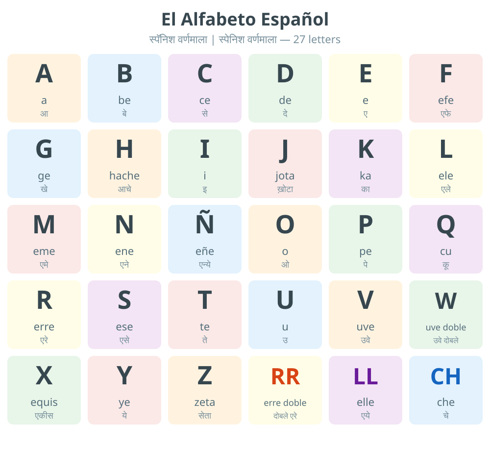

### Los Números — Numbers

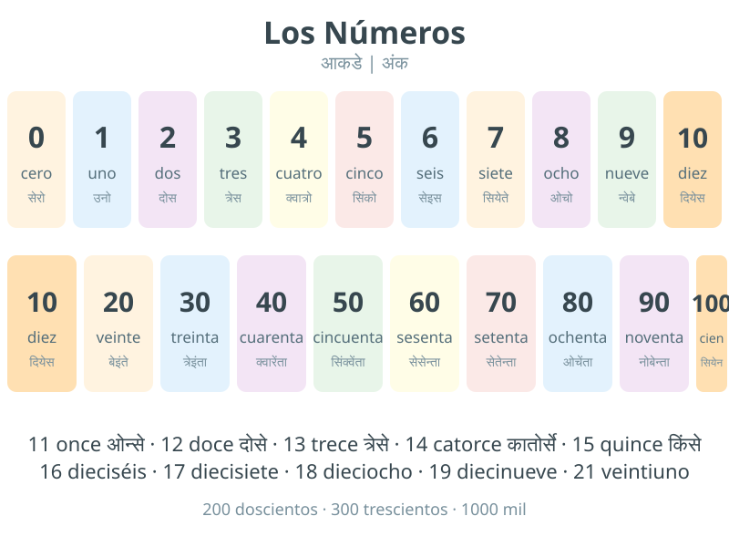

### Los Colores — Colors

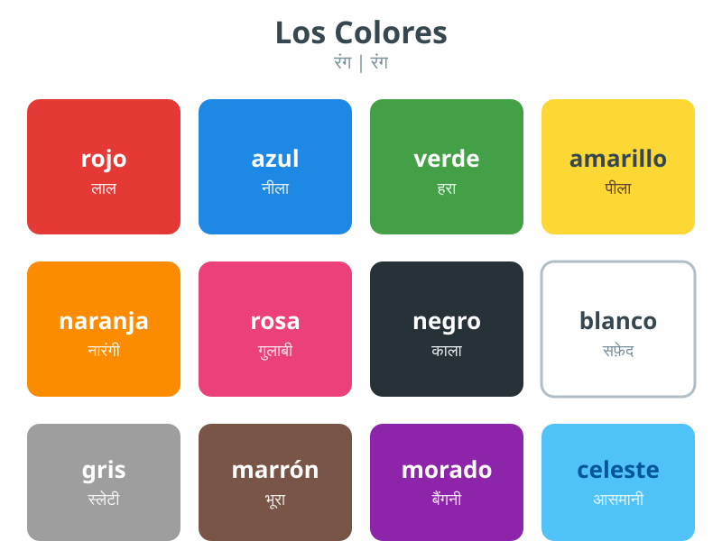

### Los Días y Los Meses — Days and Months

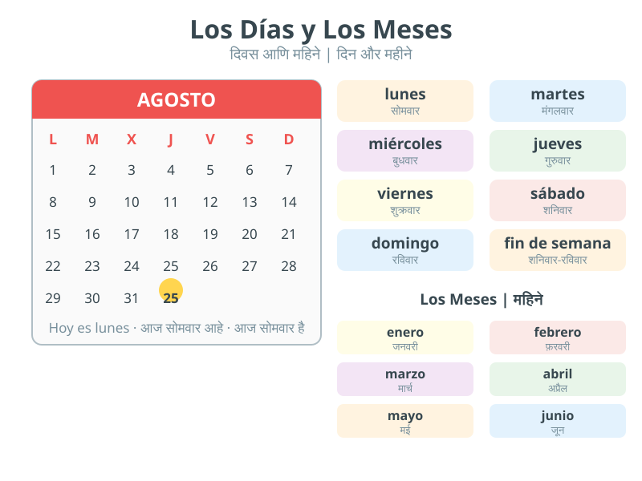

### La Familia — Family

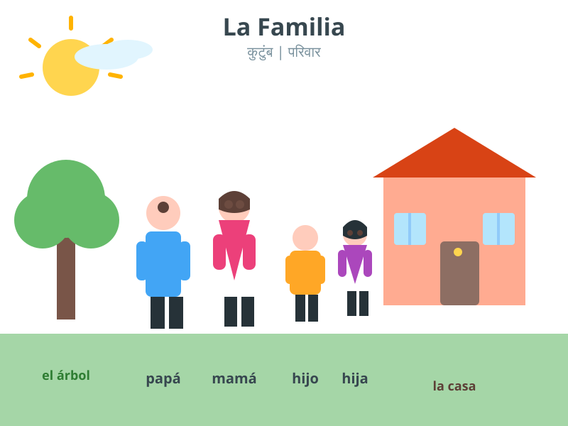

### La Casa — House

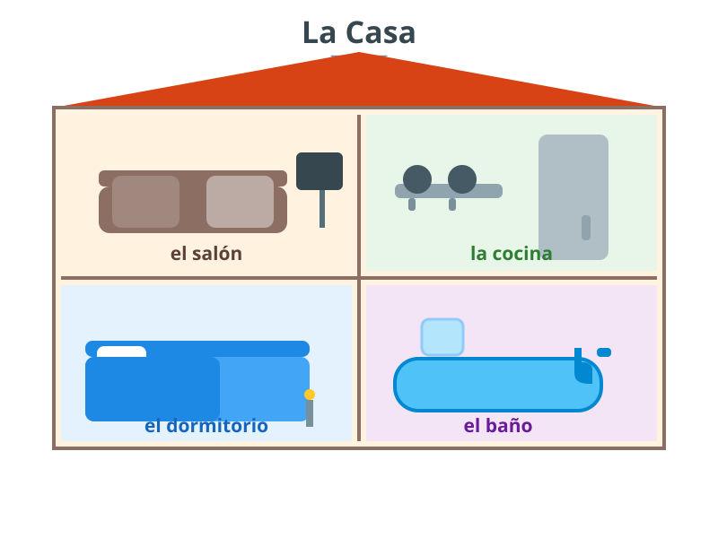

### La Escuela — Classroom

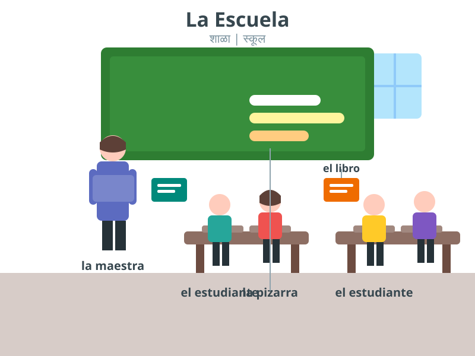

### Los Materiales Escolares — School Supplies

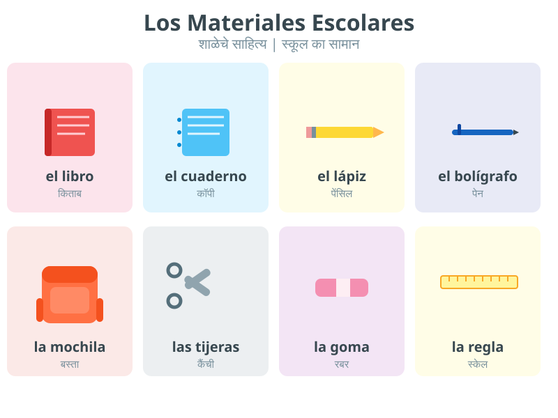

### El Restaurante — Restaurant

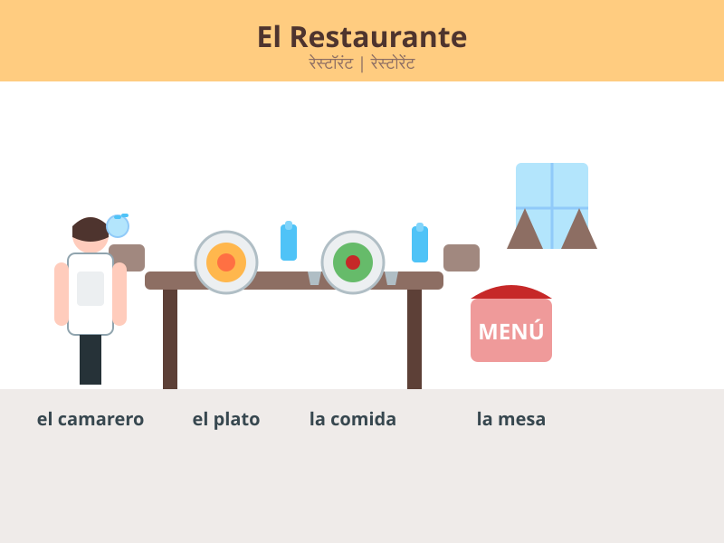

### El Aeropuerto — Airport

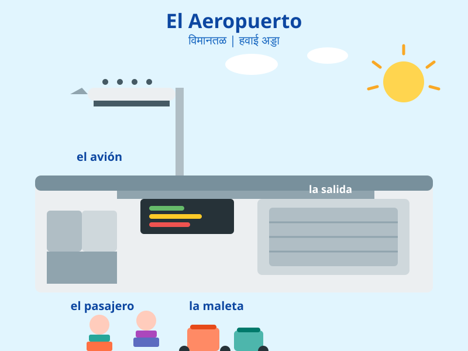

### La Ciudad — City

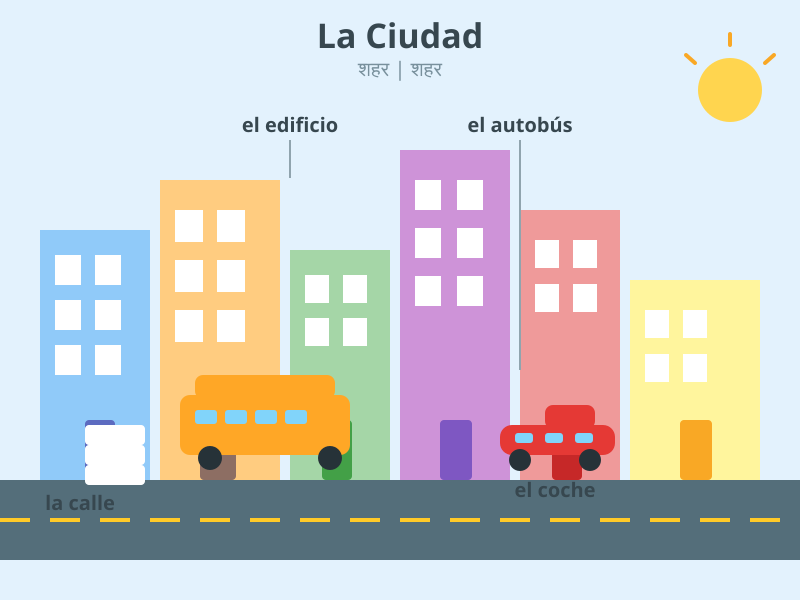

### El Transporte — Transport

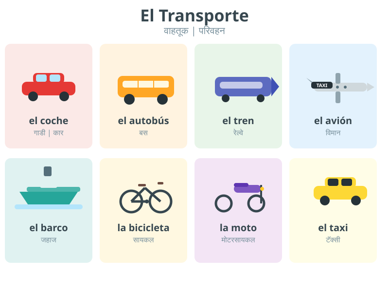

### La Tienda — Shopping

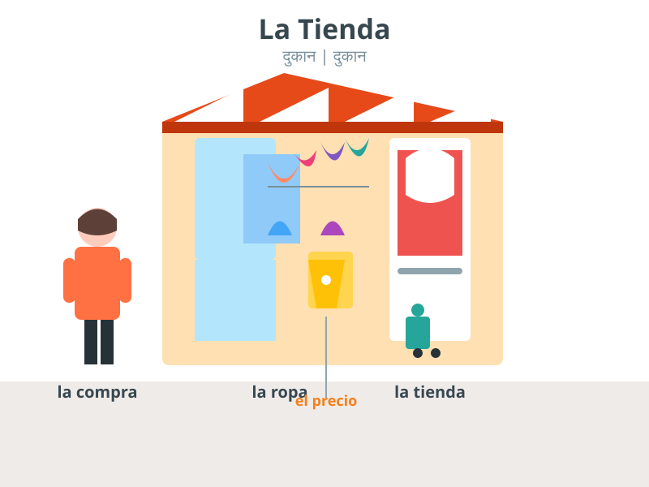

### La Ropa — Clothes

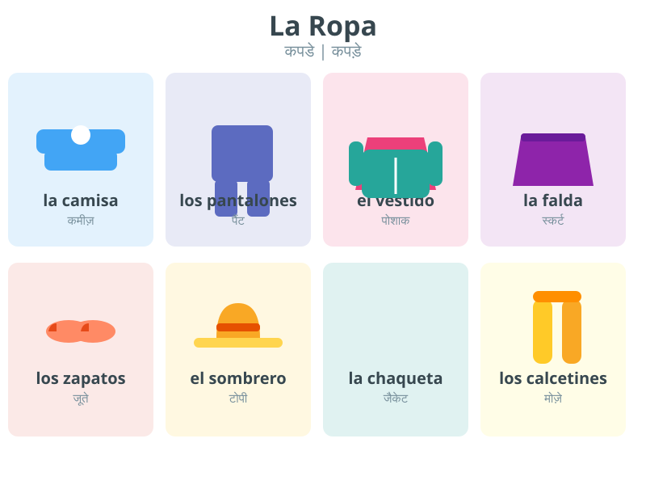

### Las Profesiones — Professions

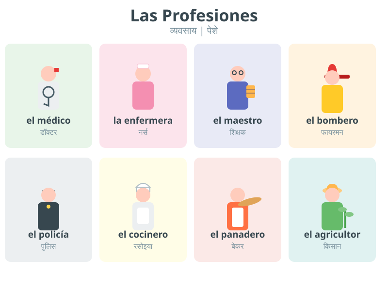

### El Tiempo — Weather

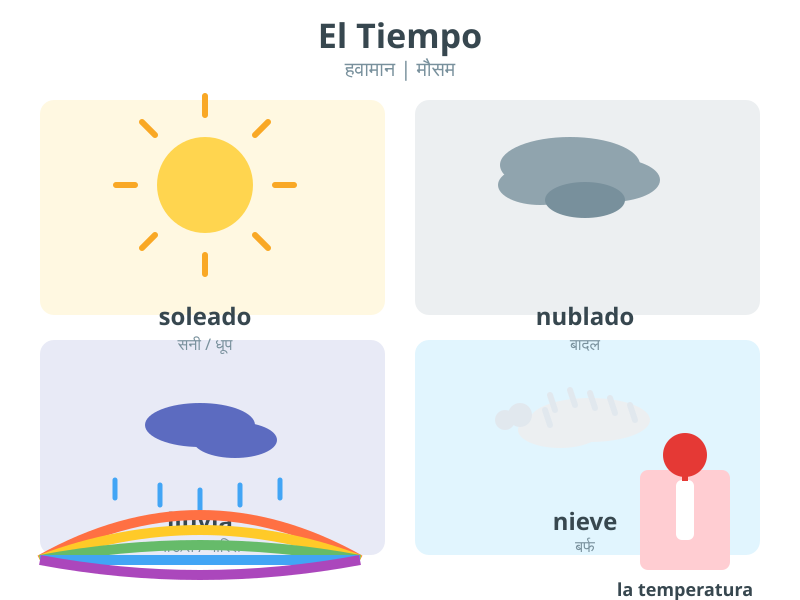

### La Comida — Food

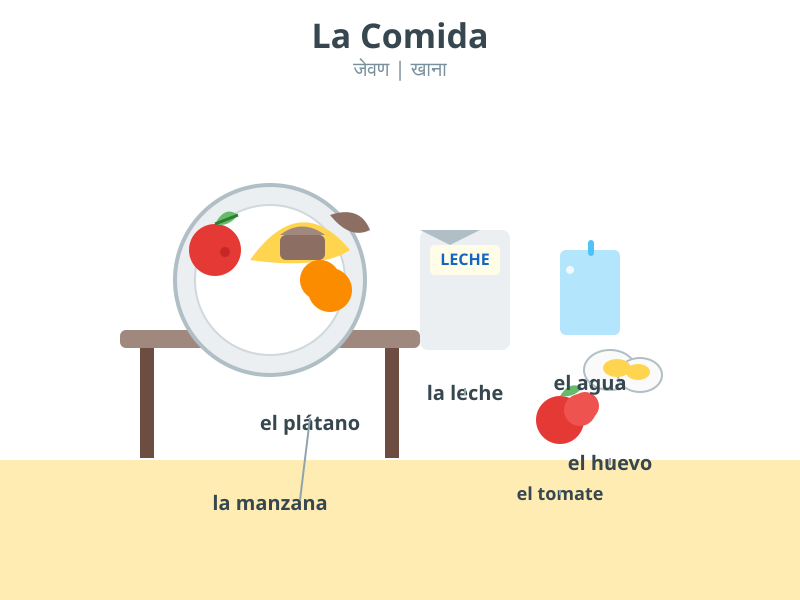

### El Cuerpo — Body Parts

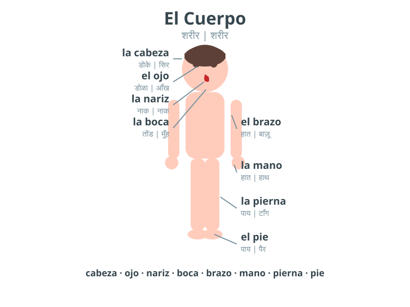

### El Examen — DELE A1 & A2 Exam

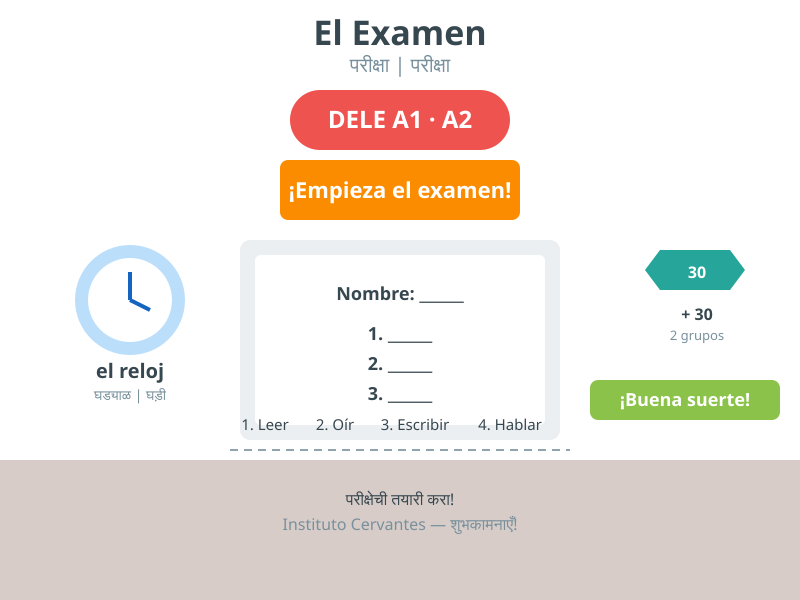

### Cover mock — Book Cover

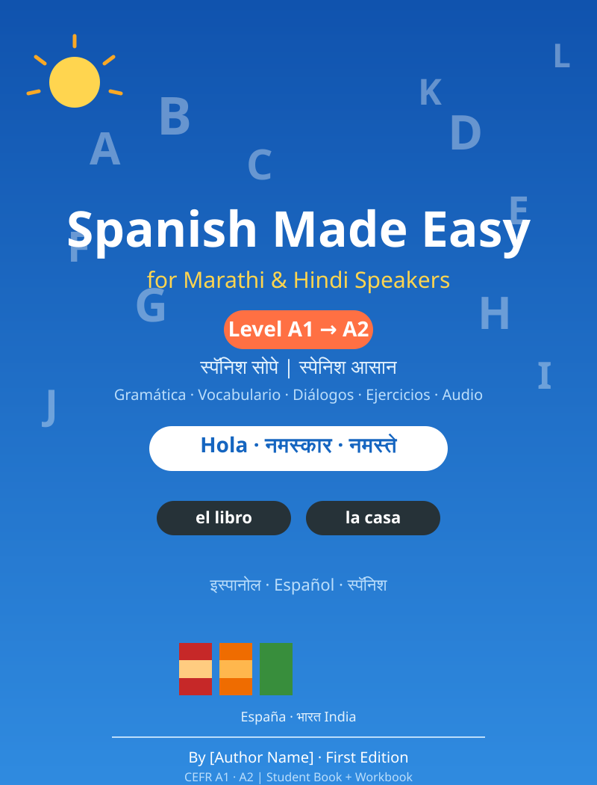

---

# Lesson Template — Spanish Made Easy for Marathi & Hindi Speakers

> Reusable template for writing **every lesson** (A1 → A2).
> Fill in the placeholders and follow the structure below.

---

## 1. Master Lesson Structure (use for every lesson)

```
Create Lesson {N} — Topic: {TOPIC} — CEFR level {A1/A2}.

Explain everything FIRST in Marathi, THEN in Hindi, then show Spanish examples.

Include, in this exact order:

1. Lesson objectives (in Marathi and Hindi)
2. New vocabulary — exactly 20 words:
   Columns: Spanish | Marathi | Hindi | Pronunciation (Devanagari)
3. One dialogue (6–8 lines) with:
   Spanish | Pronunciation | Marathi translation | Hindi translation
4. Grammar notes for this lesson (A1: simple, A2: with examples)
5. 10 practice sentences (Spanish + Marathi + Hindi)
6. 10 exercises: fill blanks, matching, true/false, correct-the-error
7. 5 MCQ questions with answer marked ✔
8. 5 translation sentences (Marathi/Hindi → Spanish)
9. Speaking practice (3 tasks)
10. Writing practice (1 task)

Rules:
- Pronunciation must use ONLY Devanagari script (आ से ज्ञ)
- Spanish must be 100% grammatically correct with accents
- Marathi and Hindi translations must be natural, not literal
- Add "Answer Key" for all exercises and MCQ
- Keep within A1/A2 CEFR vocabulary
```

---

## 2. Lesson File Structure

```
Lesson-{NN}-{topic}.md
├── 1. Objectives (ध्येय / लक्ष्य)
├── 2. Vocabulary (20 words) — Spanish | Marathi | Hindi | Pronunciation
├── 3. Dialogue — Spanish | Pronunciation | Marathi | Hindi
├── 4. Grammar notes
├── 5. Practice sentences (10)
├── 6. Exercises (10) + Answer Key
├── 7. MCQ (5) + Answer Key
├── 8. Translation practice (5) + Answer Key
├── 9. Speaking practice
├── 10. Writing practice
└── 11. Lesson Quiz (10 points) + Answer Key
```

---

## 3. Standard Column Headers (use everywhere)

| Spanish | Marathi | Hindi | Pronunciation |

> Keep this exact column order in **every** table in the book for consistency.

---

## 4. Quality Checklist (run after every lesson)

- [ ] Spanish accents correct: ¿ ¡ á é í ó ú ü ñ
- [ ] H silent everywhere (hola → ओला, never होला)
- [ ] J → ख़, LL → य, Ñ → न्य, RR → rolled र
- [ ] Stress marks on exceptions: está, café, jamón
- [ ] Articles (el/la/un/una) present on all nouns
- [ ] Marathi is मराठी, Hindi is हिंदी — never mixed
- [ ] Pronunciation column uses only Devanagari
- [ ] 20 vocabulary words per lesson
- [ ] All exercises have an answer key
- [ ] CEFR level respected (no A2 grammar in A1 lessons)

---

## 5. How to Use (Phases 3–7)

1. **Phase 3** — use the Master Lesson Structure with Lesson {N} and {TOPIC} from the A1/A2 curriculum
2. **Phase 6** — check the dialogue is natural; fix translations
3. **Phase 7** — verify exercises; answer key must match
4. **Phase 14** — run the Quality Review checklist below
5. **Phase 15** — assemble into the book with the TOC

---

## 6. Quality Review Checklist

```
Review this Spanish lesson for a book for Marathi/Hindi speakers.
Check:
1. Spanish grammar and accents (must be error-free)
2. Marathi translation naturalness
3. Hindi translation naturalness
4. Pronunciation accuracy (Devanagari)
5. CEFR A1/A2 compliance
6. Exercise answer-key correctness
7. Table consistency (column order)
8. No English needed as bridge language

Report errors as: Location | Issue | Suggested fix
```

---

## 7. Naming Conventions

| Item | Format | Example |
| --- | --- | --- |
| Lesson file | `Lesson-03-Greetings.md` | — |
| Audio clip | `audio/l03-vocab.mp3`, `audio/l03-dialogue.mp3` | — |
| Image | `images/greetings.svg` | — |
| Flashcards | `flashcards/l03.md` | — |
| Quiz | `quizzes/l03-quiz.md` | — |


---

# Vocabulary Starter — 200 Core Spanish Words

> Starter dictionary for **Spanish Made Easy** — Spanish | Marathi | Hindi | Pronunciation | Example.
> Build on this to reach the Phase 5 target of 3,000 words.
> Pronunciation is in Devanagari only.

---

## 1. Greetings & Politeness (16)

| Spanish | Marathi | Hindi | Pronunciation | Example |
| --- | --- | --- | --- | --- |
| hola | नमस्कार | नमस्ते | ओला | ¡Hola, amigo! |
| adiós | निरोप | अलविदा | अदिओस | Adiós, hasta luego. |
| buenos días | शुभ सकाळ | सुप्रभात | ब्वेनोस दियास | Buenos días, señor. |
| buenas tardes | शुभ दुपार | नमस्ते (दोपहर) | ब्वेनास तार्देस | Buenas tardes, señora. |
| buenas noches | शुभ रात्री | शुभ रात्रि | ब्वेनास नोचेस | Buenas noches, mamá. |
| gracias | धन्यवाद | धन्यवाद | ग्रासियास | Gracias por todo. |
| por favor | कृपया | कृपया | पोर फाबोर | Un café, por favor. |
| de nada | काही नाही | कोई बात नहीं | दे नादा | De nada, de nada. |
| perdón | माफ करा | माफ़ कीजिए | पेर्दोन | Perdón, ¿dónde está? |
| lo siento | मला वाईट वाटते | मुझे खेद है | लो सियेंतो | Lo siento mucho. |
| sí | होय | हाँ | सी | Sí, quiero. |
| no | नाही | नहीं | नो | No, gracias. |
| hasta luego | पुन्हा भेटू | फिर मिलेंगे | आस्ता ल्वेगो | ¡Hasta luego! |
| hasta mañana | उद्या भेटू | कल मिलेंगे | आस्ता मान्याना | ¡Hasta mañana! |
| bienvenido | स्वागत | स्वागत है | बियेनबेनिदो | ¡Bienvenido a casa! |
| feliz | आनंदी | खुश | फेलिस | Feliz cumpleaños. |

## 2. Numbers (12)

| Spanish | Marathi | Hindi | Pronunciation | Example |
| --- | --- | --- | --- | --- |
| uno | एक | एक | उनो | Un libro. |
| dos | दोन | दो | दोस | Dos hermanos. |
| tres | तीन | तीन | त्रेस | Tres gatos. |
| cuatro | चार | चार | क्वात्रो | Cuatro sillas. |
| cinco | पाच | पाँच | सिंको | Cinco dedos. |
| diez | दहा | दस | दियेस | Diez pesos. |
| veinte | वीस | बीस | बेइंते | Veinte años. |
| cien | शंभर | सौ | सियेन | Cien pesos. |
| mil | हजार | हज़ार | मील | Mil personas. |
| primero | पहिला | पहला | प्रीमेरो | El primer día. |
| segundo | दुसरा | दूसरा | सेगुंदो | La segunda vez. |
| último | शेवटचा | आख़िरी | उल्तीमो | El último tren. |

## 3. Colors (11)

| Spanish | Marathi | Hindi | Pronunciation | Example |
| --- | --- | --- | --- | --- |
| rojo | लाल | लाल | रोखो | Un coche rojo. |
| azul | निळा | नीला | असुल | El mar azul. |
| verde | हिरवा | हरा | बेर्दे | La hierba verde. |
| amarillo | पिवळा | पीला | अमारियो | El sol amarillo. |
| naranja | केशरी | नारंगी | नारान्खा | Una camisa naranja. |
| rosa | गुलाबी | गुलाबी | रोसा | Una flor rosa. |
| negro | काळा | काला | नेग्रो | Un gato negro. |
| blanco | पांढरा | सफ़ेद | ब्लांको | Papel blanco. |
| gris | राखाडी | स्लेटी | ग्रिस | Un día gris. |
| marrón | तपकिरी | भूरा | मारोन | Zapatos marrones. |
| morado | जांभळा | बैंगनी | मोरादो | Una bufanda morada. |

## 4. Days & Months (19)

| Spanish | Marathi | Hindi | Pronunciation | Example |
| --- | --- | --- | --- | --- |
| lunes | सोमवार | सोमवार | लुनेस | El lunes trabajo. |
| martes | मंगळवार | मंगलवार | मार्तेस | El martes estudiamos. |
| miércoles | बुधवार | बुधवार | मियेर्कोलेस | El miércoles llueve. |
| jueves | गुरुवार | गुरुवार | ख्वेबेस | El jueves hay clase. |
| viernes | शुक्रवार | शुक्रवार | बियेर्नेस | El viernes descanso. |
| sábado | शनिवार | शनिवार | साबादो | El sábado salimos. |
| domingo | रविवार | रविवार | दोमिंगो | El domingo no trabajo. |
| enero | जानेवारी | जनवरी | एनेरो | Enero es frío. |
| febrero | फेब्रुवारी | फ़रवरी | फेब्रेरो | Febrero tiene 28 días. |
| marzo | मार्च | मार्च | मार्सो | Marzo es primavera. |
| abril | एप्रिल | अप्रैल | अब्रिल | Abril llueve mucho. |
| mayo | मे | मई | मायो | Mayo es bonito. |
| junio | जून | जून | खुनियो | Junio es cálido. |
| julio | जुलै | जुलाई | खुलियो | Julio es verano. |
| agosto | ऑगस्ट | अगस्त | आगोस्तो | Agosto es muy caliente. |
| septiembre | सप्टेंबर | सितंबर | सेप्तिएम्ब्रे | Septiembre empieza la escuela. |
| octubre | ऑक्टोबर | अक्टूबर | ओक्तुब्रे | Octubre es otoño. |
| noviembre | नोव्हेंबर | नवंबर | नोबिएम्ब्रे | Noviembre es fresco. |
| diciembre | डिसेंबर | दिसंबर | दिसिएम्ब्रे | Diciembre es Navidad. |

## 5. Family (14)

| Spanish | Marathi | Hindi | Pronunciation | Example |
| --- | --- | --- | --- | --- |
| padre | वडील | पिता | पाद्रे | Mi padre es médico. |
| madre | आई | माँ | माद्रे | Mi madre cocina. |
| hijo | मुलगा | बेटा | इखो | Tengo un hijo. |
| hija | मुलगी | बेटी | इखा | Mi hija estudia. |
| hermano | भाऊ | भाई | एर्मानो | Mi hermano es alto. |
| hermana | बहीण | बहन | एर्माना | Mi hermana es pequeña. |
| abuelo | आजोबा | दादा/नाना | आब्वेलो | Mi abuelo camina lento. |
| abuela | आजी | दादी/नानी | आब्वेला | Mi abuela es dulce. |
| tío | काका/मामा | चाचा/मामा | तीओ | Mi tío vive en Mumbai. |
| tía | काकू/मावशी | चाची/मामी | तीआ | Mi tía es maestra. |
| primo | चुलत भाऊ | चचेरा भाई | प्रीमो | Mi primo es mi amigo. |
| prima | चुलत बहीण | चचेरी बहन | प्रीमा | Mi prima canta bien. |
| esposo | नवरा | पति | एस्पोसो | Mi esposo trabaja duro. |
| esposa | बायको | पत्नी | एस्पोसा | Mi esposa es doctora. |

## 6. Food (20)

| Spanish | Marathi | Hindi | Pronunciation | Example |
| --- | --- | --- | --- | --- |
| pan | पाव | रोटी/ब्रेड | पान | El pan está caliente. |
| arroz | तांदूळ | चावल | अरोस | Me gusta el arroz. |
| carne | मांस | मांस | कार्ने | Como carne el domingo. |
| pollo | कोंबडी | मुर्गा | पोयो | El pollo está rico. |
| pescado | मासा | मछली | पेस्कादो | El pescado es sano. |
| huevo | अंडे | अंडा | उएबो | Desayuno con huevo. |
| leche | दूध | दूध | लेचे | Bebo leche caliente. |
| queso | चीज | चीज़/पनीर | केसो | El queso es fuerte. |
| agua | पाणी | पानी | आग्वा | Quiero agua fría. |
| té | चहा | चाय | ते | Tomo té por la tarde. |
| café | कॉफी | कॉफ़ी | काफे | El café está amargo. |
| manzana | सफरचंद | सेब | मान्साना | Una manzana al día. |
| plátano | केळे | केला | प्लातानो | El plátano es dulce. |
| naranja | संत्रे | संतरा | नारान्खा | La naranja es jugosa. |
| tomate | टोमॅटो | टमाटर | तोमाते | El tomate es rojo. |
| sopa | सूप | सूप | सोपा | La sopa está caliente. |
| azúcar | साखर | चीनी | आसुकार | El té tiene azúcar. |
| sal | मीठ | नमक | साल | La sopa tiene poca sal. |
| fruta | फळ | फल | फ्रुता | La fruta es sana. |
| verdura | भाजी | सब्ज़ी | बेरदुरा | Como verduras todos los días. |

## 7. Drinks (8)

| Spanish | Marathi | Hindi | Pronunciation | Example |
| --- | --- | --- | --- | --- |
| agua | पाणी | पानी | आग्वा | Agua, por favor. |
| leche | दूध | दूध | लेचे | Leche con chocolate. |
| café | कॉफी | कॉफ़ी | काफे | Un café solo. |
| té | चहा | चाय | ते | Té con limón. |
| jugo | रस | जूस | खुगो | Jugo de mango. |
| cerveza | बिअर | बियर | सेर्बेसा | Una cerveza fría. |
| vino | द्राक्षारस | शराब | बीनो | Vino tinto, por favor. |
| refresco | शीतपेय | कोल्ड ड्रिंक | रेफ्रेस्को | Un refresco sin hielo. |

## 8. House (16)

| Spanish | Marathi | Hindi | Pronunciation | Example |
| --- | --- | --- | --- | --- |
| casa | घर | घर | कासा | Mi casa es grande. |
| cocina | स्वयंपाकघर | रसोई | कोसीना | La cocina está limpia. |
| dormitorio | बेडरूम | शयनकक्ष | दोर्मीतोरियो | Mi dormitorio es azul. |
| baño | स्नानगृह | बाथरूम | बान्यो | El baño está ocupado. |
| salón | दिवाणखाना | बैठक कक्ष | सालोन | El salón es cómodo. |
| puerta | दरवाजा | दरवाज़ा | प्वेर्ता | La puerta está abierta. |
| ventana | खिडकी | खिड़की | बेंताना | La ventana es grande. |
| mesa | टेबल | मेज़ | मेसा | La mesa es de madera. |
| silla | खुर्ची | कुर्सी | सिया | Una silla roja. |
| cama | अंथरूण | बिस्तर | कामा | La cama es suave. |
| sofá | सोफा | सोफ़ा | सोफा | El sofá es nuevo. |
| nevera | फ्रीज | फ़्रिज | नेबेरा | La nevera está llena. |
| lámpara | दिवा | लैंप | लाम्पारा | La lámpara está encendida. |
| espejo | आरसा | आईना | एस्पेखो | El espejo está roto. |
| escalera | पायऱ्या | सीढ़ियाँ | एस्कालेरा | La escalera es alta. |
| jardín | बाग | बगीचा | खार्दीन | El jardín tiene flores. |

## 9. School (14)

| Spanish | Marathi | Hindi | Pronunciation | Example |
| --- | --- | --- | --- | --- |
| escuela | शाळा | स्कूल | एस्क्वेला | La escuela está cerca. |
| clase | वर्ग | कक्षा | क्लासे | La clase empieza a las 9. |
| maestro | शिक्षक | शिक्षक | माएस्त्रो | El maestro explica bien. |
| maestra | शिक्षिका | शिक्षिका | माएस्त्रा | La maestra es amable. |
| estudiante | विद्यार्थी | छात्र | एस्तुदियांते | El estudiante pregunta. |
| libro | पुस्तक | किताब | लीब्रो | El libro es interesante. |
| cuaderno | वही | कॉपी | क्वादेर्नो | Mi cuaderno es azul. |
| lápiz | पेन्सिल | पेंसिल | लापिस | Un lápiz amarillo. |
| bolígrafo | पेन | कलम/पेन | बोलीग्राफो | El bolígrafo es rojo. |
| mochila | दप्तर | बस्ता | मोचिला | La mochila es pesada. |
| pizarra | फळा | ब्लैकबोर्ड | पिसारा | La pizarra es verde. |
| tarea | गृहपाठ | होमवर्क | तारेआ | La tarea es difícil. |
| examen | परीक्षा | परीक्षा | एग्सामेन | El examen es fácil. |
| alumno | विद्यार्थी | विद्यार्थी | आलुम्नो | Hay veinte alumnos. |

## 10. Clothes (10)

| Spanish | Marathi | Hindi | Pronunciation | Example |
| --- | --- | --- | --- | --- |
| camisa | शर्ट | कमीज़ | कामीसा | La camisa es blanca. |
| pantalones | पँट | पैंट | पान्तालोनेस | Los pantalones son negros. |
| vestido | साडी/पोशाख | पोशाक | बेस्तीदो | El vestido es bonito. |
| falda | स्कर्ट | स्कर्ट | फाल्दा | La falda es corta. |
| zapatos | शूज | जूते | सापातोस | Los zapatos son cómodos. |
| sombrero | टोपी | टोपी | सोम्ब्रेरो | El sombrero es viejo. |
| chaqueta | जॅकेट | जैकेट | चाकेता | La chaqueta es caliente. |
| calcetines | मोजे | मोज़े | काल्सेतीनेस | Los calcetines son blancos. |
| abrigo | कोट | कोट | आब्रिगो | El abrigo es largo. |
| bufanda | स्कार्फ | दुपट्टा | बुफान्दा | La bufanda es de lana. |

## 11. Transport (12)

| Spanish | Marathi | Hindi | Pronunciation | Example |
| --- | --- | --- | --- | --- |
| coche | गाडी | कार | कोचे | El coche es rápido. |
| autobús | बस | बस | आउतोबुस | El autobús llega tarde. |
| tren | रेल्वे | रेलगाड़ी | त्रेन | El tren sale a las 8. |
| avión | विमान | हवाई जहाज़ | आबियोन | El avión vuela alto. |
| barco | जहाज | जहाज़ | बार्को | El barco es grande. |
| bicicleta | सायकल | साइकिल | बिसिक्लेता | La bicicleta es mía. |
| moto | मोटरसायकल | मोटरसाइकिल | मोतो | La moto es ruidosa. |
| taxi | टॅक्सी | टैक्सी | ताक्सी | Un taxi al aeropuerto. |
| metro | मेट्रो | मेट्रो | मेत्रो | El metro es rápido. |
| parada | स्टॉप | स्टॉप | पारादा | La parada está cerca. |
| estación | स्थानक | स्टेशन | एस्तासियोन | La estación es vieja. |
| billete | तिकीट | टिकट | बियेते | Un billete a Madrid. |

## 12. Body (14)

| Spanish | Marathi | Hindi | Pronunciation | Example |
| --- | --- | --- | --- | --- |
| cabeza | डोके | सिर | काबेसा | Me duele la cabeza. |
| ojo | डोळा | आँख | ओखो | Tengo los ojos negros. |
| nariz | नाक | नाक | नारिस | La nariz es pequeña. |
| boca | तोंड | मुँह | बोका | Abre la boca. |
| oreja | कान | कान | ओरेखा | Me duele la oreja. |
| mano | हात | हाथ | मानो | Dame la mano. |
| brazo | हात | बाज़ू | ब्रासो | El brazo es fuerte. |
| pierna | पाय | टाँग | पियेर्ना | Me duele la pierna. |
| pie | पाय | पैर | पिये | El pie está frío. |
| dedo | बोट | उंगली | देदो | Cinco dedos en la mano. |
| estómago | पोट | पेट | एस्तोमागो | Me duele el estómago. |
| corazón | हृदय | दिल | कोरासोन | El corazón late rápido. |
| pelo | केस | बाल | पेलो | El pelo es negro. |
| espalda | पाठ | पीठ | एस्पाल्दा | Me duele la espalda. |

## 13. Nature (14)

| Spanish | Marathi | Hindi | Pronunciation | Example |
| --- | --- | --- | --- | --- |
| sol | सूर्य | सूरज | सोल | El sol brilla. |
| luna | चंद्र | चाँद | लुना | La luna es blanca. |
| cielo | आकाश | आसमान | सियेलो | El cielo es azul. |
| lluvia | पाऊस | बारिश | युबिया | La lluvia es fuerte. |
| nieve | बर्फ | बर्फ | नियेबे | La nieve es blanca. |
| viento | वारा | हवा | बियेंतो | El viento es frío. |
| árbol | झाड | पेड़ | आर्बोल | El árbol es alto. |
| flor | फूल | फूल | फ्लोर | La flor es roja. |
| río | नदी | नदी | रीओ | El río es largo. |
| mar | समुद्र | समुद्र | मार | El mar es azul. |
| montaña | पर्वत | पहाड़ | मोंतान्या | La montaña es alta. |
| tierra | जमीन | धरती | तियेरा | La tierra es seca. |
| fuego | आग | आग | फ्वेगो | El fuego es caliente. |
| animal | प्राणी | जानवर | आनिमाल | El animal es salvaje. |

## 14. Time (10)

| Spanish | Marathi | Hindi | Pronunciation | Example |
| --- | --- | --- | --- | --- |
| tiempo | वेळ | समय | तियेम्पो | No tengo tiempo. |
| hora | तास | घंटा | ओरा | ¿Qué hora es? |
| minuto | मिनिट | मिनट | मिनुतो | Un minuto, por favor. |
| día | दिवस | दिन | दीआ | Buen día. |
| noche | रात्र | रात | नोचे | La noche es tranquila. |
| semana | आठवडा | हफ़्ता | सेमाना | La semana es larga. |
| mes | महिना | महीना | मेस | El mes es corto. |
| año | वर्ष | साल | आन्यो | Feliz año nuevo. |
| hoy | आज | आज | ओय | Hoy es lunes. |
| mañana | उद्या | कल | मान्याना | Mañana voy a la escuela. |

## 15. Common Verbs (16)

| Spanish | Marathi | Hindi | Pronunciation | Example |
| --- | --- | --- | --- | --- |
| ser | असणे | होना | सेर | Yo soy de India. |
| estar | असणे | होना | एस्तार | Estoy en casa. |
| tener | असणे (कडे) | रखना | तेनेर | Tengo dos hermanos. |
| ir | जाणे | जाना | इर | Voy a la escuela. |
| venir | येणे | आना | बेनेर | Vengo del trabajo. |
| hablar | बोलणे | बोलना | आब्लार | Hablo español un poco. |
| comer | खाणे | खाना | कोमेर | Como a las 2. |
| beber | पिणे | पीना | बेबेर | Bebo agua. |
| vivir | राहणे | रहना | बीबीर | Vivo en Mumbai. |
| trabajar | काम करणे | काम करना | त्राबाखार | Trabajo en una oficina. |
| estudiar | शिकणे | पढ़ना | एस्तुदियार | Estudio español. |
| mirar | पाहणे | देखना | मिरार | Miro la televisión. |
| escuchar | ऐकणे | सुनना | एस्कुचार | Escucho música. |
| caminar | चालणे | चलना | कामिनार | Camino al parque. |
| comprar | विकत घेणे | खरीदना | कोंप्रार | Compro pan. |
| querer | इच्छा असणे | चाहना | केरेर | Quiero un café. |

## 16. Common Adjectives (14)

| Spanish | Marathi | Hindi | Pronunciation | Example |
| --- | --- | --- | --- | --- |
| grande | मोठा | बड़ा | ग्रान्दे | Una casa grande. |
| pequeño | लहान | छोटा | पेकेन्यो | Un perro pequeño. |
| bueno | चांगला | अच्छा | ब्वेनो | Un buen amigo. |
| malo | वाईट | बुरा | मालो | Mal tiempo. |
| nuevo | नवीन | नया | न्वेबो | Un coche nuevo. |
| viejo | जुना | पुराना | बियेखो | Un libro viejo. |
| alto | उंच | लंबा | आल्तो | Un hombre alto. |
| bajo | बुटका | छोटा | बाखो | Una mesa baja. |
| frío | थंड | ठंडा | फ्रीओ | Agua fría. |
| caliente | गरम | गर्म | कालियेंते | Té caliente. |
| fácil | सोपे | आसान | फासील | El examen es fácil. |
| difícil | कठीण | मुश्किल | दीफिसील | La tarea es difícil. |
| caro | महाग | महँगा | कारो | El hotel es caro. |
| barato | स्वस्त | सस्ता | बारातो | La fruta es barata. |


---

# DELE A1 & A2 Exam Guide (स्पॅनिश परीक्षा मार्गदर्शिका / स्पेनिश परीक्षा मार्गदर्शिका)

> Complete guide to the official **DELE A1** and **DELE A2** exams from Instituto Cervantes — structure, scoring, sample questions, exam vocabulary and tips, explained in **Marathi** (मराठी) and **Hindi** (हिंदी).
>
> Related files: [Mock Test A1](mock-test-a1.md) · [Mock Test A2](mock-test-a2.md)

---

## 1. Exam Overview — परीक्षेचा परिचय / परीक्षा का परिचय

| | DELE A1 | DELE A2 |
| --- | --- | --- |
| Who | Complete beginners (~100 study hours) | After A1 (~200 study hours) |
| Pruebas | 4: Comprensión de lectura, Comprensión auditiva, Expresión e interacción escritas, Expresión e interacción orales | Same 4 pruebas, longer format |
| Total time | ~100 min (+ 10–15 min speaking) | ~150 min (+ 12 min speaking) |
| Max points | 100 (25 per prueba) | 100 (25 per prueba) |
| **Pass rule** | **≥30/50 in EACH of the 2 groups** | **≥30/50 in EACH of the 2 groups** |
| Validity | Forever | Forever |

**The two groups (important!):**
- **Group 1:** Comprensión de lectura (25) + Expresión e interacción escritas (25) = 50 → need **30**
- **Group 2:** Comprensión auditiva (25) + Expresión e interacción orales (25) = 50 → need **30**

> **मराठी:** तुम्हाला **दोन्ही** गटांमध्ये उत्तीर्ण व्हावे लागेल — गट 1 (वाचन + लेखन) मध्ये किमान 30 आणि गट 2 (ऐकणे + बोलणे) मध्ये किमान 30. एका गटात जास्त गुण दुसऱ्या गटाची भरपाई करत नाहीत!
>
> **हिंदी:** आपको **दोनों** समूहों में उत्तीर्ण होना है — समूह 1 (पढ़ना + लिखना) में कम से कम 30 और समूह 2 (सुनना + बोलना) में कम से कम 30। एक समूह के अधिक अंक दूसरे की भरपाई नहीं करते!

---

## 2. DELE A1 — Prueba by Prueba (विभाग-वार / भाग-वार)

| Prueba | Duration | Points | Tasks |
| --- | --- | --- | --- |
| **Comprensión de lectura** (Reading — वाचन / पढ़ना) | 45 min | 25 | 4 |
| **Comprensión auditiva** (Listening — ऐकणे / सुनना) | 20 min | 25 | 4 |
| **Expresión e interacción escritas** (Writing — लेखन / लिखना) | 25 min | 25 | 2 |
| **Expresión e interacción orales** (Speaking — बोलणे / बोलना) | 10 min (+10 prep) | 25 | 4 |

### 2.1 Comprensión de lectura (45 min, 25 points)

| Task | Content | Items |
| --- | --- | --- |
| 1 | Match 5 short notices to 5 situations | 5 |
| 2 | Short text (SMS/note) — **verdadero / falso** | 5 |
| 3 | 3 short texts + match questions | 6 |
| 4 | Longer text — **choose correct answer (A/B/C)** | 9 |

Reading example (notice):
> **„Biblioteca: abierta de lunes a viernes, de 9 a 18 horas."**
> **Pregunta:** La biblioteca está abierta el sábado. → **falso**

### 2.2 Comprensión auditiva (20 min, 25 points)
- Task 1: 5 short dialogues + choose the correct picture
- Task 2: announcements — verdadero/falso
- Task 3: dialogue + choose A/B/C
- Task 4: longer conversation + choose A/B/C

### 2.3 Expresión e interacción escritas (25 min, 25 points)
- Task 1: **fill a form** (datos personales: nombre, apellidos, dirección, teléfono, e-mail)
- Task 2: **write a short message** (~30–40 words, e.g., a birthday invitation to a friend)

### 2.4 Expresión e interacción orales (10 min + 10 prep, 25 points)
- Task 1: **introduce yourself** (name, country, city, family, job, hobbies)
- Task 2: describe a **photograph** (who, where, what is happening)
- Task 3: **monologue** on a simple topic (e.g., mi familia)
- Task 4: **dialogue** with the examiner (ask/answer about daily life)

Speaking model (Task 1 — 30 seconds):
> „Hola, me llamo Priya Sharma. Soy de India, de Mumbai. Hablo maratí, hindi y un poco de español. Soy estudiante. Me gusta la música."

---

## 3. DELE A2 — Prueba by Prueba

| Prueba | Duration | Points |
| --- | --- | --- |
| **Comprensión de lectura** | 60 min | 25 |
| **Comprensión auditiva** | 35 min | 25 |
| **Expresión e interacción escritas** | 45 min | 25 |
| **Expresión e interacción orales** | 12 min (+12 prep) | 25 |

### 3.1 Comprensión de lectura (60 min)
- Longer texts: notices, e-mails, newspaper articles, advertisements
- Tasks: matching, verdadero/falso, A/B/C choice

### 3.2 Comprensión auditiva (35 min)
- Conversations, radio programmes, announcements, phone messages

### 3.3 Expresión e interacción escritas (45 min)
- Task 1: **write a letter or e-mail** (~80–100 words): invitation, complaint, thanks
- Task 2: write a **note/message** in reply to a situation (~40 words)

### 3.4 Expresión e interacción orales (12 min)
- Introduction · describe a photo (more detail) · talk about a topic (e.g., mi trabajo, mi ciudad) · dialogue with examiner (plans, past experiences)

---

## 4. Exam Vocabulary — परीक्षा शब्दसंग्रह / परीक्षा शब्दावली (~70 words)

| Spanish | Pronunciation | English | Hindi | Marathi |
| --- | --- | --- | --- | --- |
| el examen | एल एक्सामेन | exam | परीक्षा | परीक्षा |
| la prueba | ला प्रुएबा | test/task | परीक्षा/कार्य | चाचणी/काम |
| aprobar | अपरोबार | to pass | पास होना | उत्तीर्ण होणे |
| suspender | सुस्पेंडेर | to fail | फेल होना | अनुत्तीर्ण होणे |
| la nota | ला नोटा | mark/grade | अंक | गुण |
| la pregunta | ला प्रेगुंटा | question | सवाल | प्रश्न |
| la respuesta | ला रेस्पुएस्टा | answer | जवाब | उत्तर |
| el texto | एल तेक्स्तो | text | पाठ | मजकूर |
| la palabra | ला पालाबरा | word | शब्द | शब्द |
| la frase | ला फ्रासे | sentence | वाक्य | वाक्य |
| el anuncio | एल आनुन्सियो | notice/advert | विज्ञापन | जाहिरात |
| el mensaje | एल मेन्साहे | message | संदेश | संदेश |
| el formulario | एल फ़ोर्मुलारियो | form | फ़ॉर्म | अर्ज |
| rellenar | रेये नार | to fill in | भरना | भरणे |
| marcar | मार्कार | to mark | निशान लगाना | खूण करणे |
| escuchar | एस्कुचार | to listen | सुनना | ऐकणे |
| leer | लेएर | to read | पढ़ना | वाचणे |
| escribir | एस्क्रिबिर | to write | लिखना | लिहिणे |
| hablar | आबलार | to speak | बोलना | बोलणे |
| oír | ओइर | to hear | सुनना | ऐकणे |
| ¿Puede repetir, por favor? | पुएदे रेपेतीर? | Can you repeat? | दोहराएँ? | पुन्हा सांगाल? |
| No entiendo | नो एन्टिएन्दो | I don't understand | समझा नहीं | समजले नाही |
| más despacio | मास देस्पासियो | more slowly | धीरे | हळू |
| otra vez | ओत्रा बेस | again | फिर से | पुन्हा |
| verdadero | बेरदादेरो | true | सही | खरे |
| falso | फ़ाल्सो | false | गलत | खोटे |
| correcto | कोर्रेक्तो | correct | सही | बरोबर |
| el nombre | एल नोम्ब्रे | first name | नाम | नाव |
| los apellidos | लोस अपेयिदोस | surname | उपनाम | आडनाव |
| la dirección | ला दिरेक्सियोन | address | पता | पत्ता |
| el teléfono | एल तेलेफ़ोनो | phone | फ़ोन | फोन |
| la fecha | ला फ़ेचा | date | तारीख | तारीख |
| la hora | ला ओरा | time | समय | वेळ |
| la hoja de respuestas | ला ओहा दे रेस्पुएस्तास | answer sheet | उत्तर पत्रक | उत्तरपत्रिका |
| llenar | येयार | to fill | भरना | भरणे |
| subrayar | सुब्रायार | to underline | रेखांकित करना | अधोरेखित करणे |
| tachar | ताचार | to cross out | काटना | काढणे |
| elegir | एलेहिर | to choose | चुनना | निवडणे |
| la foto | ला फ़ोतो | photo | फ़ोटो | छायाचित्र |
| describir | देस्क्रिबिर | to describe | वर्णन करना | वर्णन करणे |
| presentarse | प्रेसेन्तार्से | to introduce yourself | परिचय देना | ओळख करणे |
| contar | कोंतार | to tell | बताना | सांगणे |
| gustar | गुस्तार | to like | पसंद होना | आवडणे |
| querer | केरेर | to want | चाहना | हवे असणे |
| poder | पोदेर | can | सकना | शकणे |
| tener que | तेनेर के | must | करना पड़ता है | लागणे |
| la familia | ला फ़ामिलिया | family | परिवार | कुटुंब |
| el trabajo | एल त्राबाहो | work | काम | काम |
| la ciudad | ला सियुदाद | city | शहर | शहर |
| el país | एल पाइस | country | देश | देश |
| la tienda | ला तिएन्दा | shop | दुकान | दुकान |
| el restaurante | एल रेस्तोरान्ते | restaurant | रेस्तराँ | रेस्टॉरंट |
| el supermercado | एल सुपेरमेरकादो | supermarket | सुपरमार्केट | सुपरमार्केट |
| el médico | एल मेदिको | doctor | डॉक्टर | डॉक्टर |
| el tren | एल त्रेन | train | ट्रेन | ट्रेन |
| el billete | एल बियेते | ticket | टिकट | तिकीट |
| comprar | कोम्प्रार | to buy | खरीदना | खरेदी करणे |
| pagar | पागार | to pay | भुगतान करना | पैसे देणे |
| costar | कोस्तार | to cost | कीमत होना | किंमत असणे |
| abierto | आबिएर्तो | open | खुला | उघडे |
| cerrado | सेरादो | closed | बंद | बंद |
| hoy | ओय | today | आज | आज |
| mañana | मान्याना | tomorrow | कल (आगे) | उद्या |
| ayer | आयेर | yesterday | कल (पीछे) | काल |
| lunes | लुनेस | Monday | सोमवार | सोमवार |
| domingo | दोमिंगो | Sunday | रविवार | रविवार |
| la semana | ला सेमाना | week | सप्ताह | आठवडा |
| el año | एल आन्यो | year | साल | वर्ष |
| el mes | एल मेस | month | महीना | महिना |

---

## 5. Exam Day Tips for Marathi/Hindi Speakers (परीक्षेच्या दिवसाच्या टिप्स / परीक्षा दिवस की टिप्स)

### 5.1 During Comprensión de lectura
- Skim the text first, then read the question, then search for the answer.
- **Verdadero** only if the text says it EXACTLY — do not use your own knowledge.
- Time plan: Task 4 is the hardest — finish Tasks 1–3 fast, leave time for Task 4.

### 5.2 During Comprensión auditiva
- Read the questions in the pause before the audio.
- Answers come in order — tick immediately.
- Missed one? Forget it and stay with the next question.

### 5.3 During Expresión e interacción escritas
- **Answer every point** of the task (¿Cuándo? ¿Dónde? ¿Qué?) — missing points lose marks.
- Task 2 A1: ~30–40 words minimum. A2 Task 1: ~80–100 words.
- Salutation: **Querido** (male) / **Querida** (female) + name; close with **Un abrazo** / **Saludos** + your name.
- Accents matter: "el" (the) vs "él" (he), "si" (if) vs "sí" (yes). Learn where to put á é í ó ú.

### 5.4 During Expresión e interacción orales
- Speak clearly and at normal speed — examiners score communication, not perfection.
- Don't understand? Say „¿Puede repetir, por favor?" — **no marks are deducted**.
- Describe a photo with the 4 Ws: **¿Quién?** (who) · **¿Dónde?** (where) · **¿Qué hace?** (what is doing) · **¿Qué hay?** (what is there).
- Prepare your introduction (name, country, city, family, work, hobby) and reuse it.

### 5.5 Pronunciation traps for Indian students (उच्चारण / उच्चार)

| Spanish | Sounds like | Trap |
| --- | --- | --- |
| **r** | र (single tap) | "pero" = पेरो |
| **rr** | रर्र (rolled) | "perro" = पेर्र्रो (dog) — "pero" vs "perro"! |
| **b / v** | ब (both) | "vino" = बीनो (not वीनो) |
| **j** | ख़ (strong h) | "joven" = खोबेन |
| **g (before e/i)** | ख | "general" = खेनेराल |
| **c (before e/i)** | स | "cine" = सीने |
| **z** | स | "zapato" = सापातो |
| **h** | silent | "hola" = ओला (never हला) |
| **ñ** | न्य | "año" = आन्यो (not आनो) |
| **ll** | य | "llamo" = यामो |
| **e** | ए (always short) | "mes" = मेस |
| **o** | ओ (never "औ") | "como" = कोमो |
| **u** | ऊ (never "अ") | "cultura" = कुल्तूरा |
| **que/gui** | के/गी (u silent) | "queso" = केसो, "guiar" = गियार |

---

## 6. A1 Topic Checklist (शब्द विषय चेकलिस्ट / शब्द विषय सूची)

Tick each topic before your exam — you must know ~300 A1 words:

- [ ] Greetings & politeness (hola, buenos días, gracias, adiós)
- [ ] Numbers 0–100 (prices, phone numbers, dates)
- [ ] Alphabet & spelling your name
- [ ] Countries, nationalities, languages
- [ ] Family (padre, madre, hermano, hermana)
- [ ] House & furniture (casa, habitación, cocina)
- [ ] Food & drink (pan, agua, café, arroz)
- [ ] Shopping (comprar, costar, el precio)
- [ ] Time: hours, days, months, seasons
- [ ] Work & professions (trabajo, profesor, médico)
- [ ] Transport & travel (tren, autobús, billete)
- [ ] Health (enfermo, dolor, médico)
- [ ] Weather (llueve, hace frío, hace sol)
- [ ] Free time & hobbies (música, cine, deporte)
- [ ] Daily routine verbs (levantarse, comer, dormir)
- [ ] Question words (qué, quién, dónde, cuándo, cómo, por qué)
- [ ] Possessives (mi, tu, su, nuestro)
- [ ] ser + estar + tener + gustar

---

## 7. 6-Week A1 Exam Plan (सहा आठवड्यांचा प्लॅन / छह सप्ताह की योजना)

| Week | Focus | Daily time |
| --- | --- | --- |
| 1 | Alphabet, sounds, spelling, greetings, ser/estar | 60 min |
| 2 | Numbers, dates, time, gustar | 60 min |
| 3 | Vocabulary topic sets (15 topics), verb endings -ar/-er/-ir | 90 min |
| 4 | Reading + listening practice every day | 90 min |
| 5 | Writing: forms + 30-word messages; speaking aloud | 90 min |
| 6 | Full mock tests (3×), weak-point revision | 2 hours |

> For A2: repeat the plan at A2 level (longer texts, 80–100 word e-mails, past tense **pretérito perfecto**) for 6–8 weeks after A1.

---

## 8. Scoring Sheet (गुणपत्रिका / अंक तालिका) — print & use in practice

| Group | Prueba | Max | Test 1 | Test 2 | Test 3 |
| --- | --- | --- | --- | --- | --- |
| 1 | Comprensión de lectura | 25 | | | |
| 1 | Expresión e interacción escritas | 25 | | | |
| | **Group 1 total (pass ≥ 30)** | **50** | | | |
| 2 | Comprensión auditiva | 25 | | | |
| 2 | Expresión e interacción orales | 25 | | | |
| | **Group 2 total (pass ≥ 30)** | **50** | | | |

> **Next step:** Try the [DELE A1 Mock Test](mock-test-a1.md) now — exactly like the real exam.


---

# DELE A1 Mock Test

> **Complete practice exam — exactly like the real DELE A1 (Instituto Cervantes).**
> Instructions are trilingual: **Spanish · Hindi (हिंदी) · Marathi (मराठी)**.
>
> | Prueba | Time | Points |
> | --- | --- | --- |
> | 1. Comprensión de lectura (Reading / पढ़ना / वाचन) | 45 min | 25 |
> | 2. Comprensión auditiva (Listening / सुनना / ऐकणे) | 20 min | 25 |
> | 3. Expresión e interacción escritas (Writing / लिखना / लेखन) | 25 min | 25 |
> | 4. Expresión e interacción orales (Speaking / बोलना / बोलणे) | 10 min + 10 prep | 25 |
> | **Total** | **~100 min** | **100** |
>
> **Pass rule (important / महत्वाचे / महत्त्वाचे):** Group 1 (lectura + escritas) ≥ 30/50 **AND** Group 2 (auditiva + orales) ≥ 30/50. Both groups must pass!
>
> **How to use:** Set a stopwatch. For auditiva, ask someone to read the script aloud once, or record and play it. Answers are on the last page — don't peek!

---

## Prueba 1 — Comprensión de lectura (45 minutos · 25 puntos)

> **Instructions (Hindi):** आप सूचनाएँ, संदेश और छोटे पाठ पढ़ेंगे और सवालों के जवाब देंगे।
>
> **Instructions (Marathi):** तुम्ही सूचना, संदेश व छोटे मजकूर वाचाल आणि प्रश्नांची उत्तरे द्याल.

### Tarea 1 — Match notices to situations (5 puntos)

| Aviso | Texto |
| --- | --- |
| 1 | **Prohibido fumar** (Smoking forbidden / धूम्रपान वर्जित) |
| 2 | **Oferta: 2 × 1 en camisetas** (Offer: 2 for 1 on t-shirts) |
| 3 | **Cerrado los domingos** (Closed on Sundays) |
| 4 | **No entrar con animales** (No animals inside) |
| 5 | **Abierto de 9 a 14 horas** (Open 9 to 14) |

- a) Quiero comprar una camiseta barata. → **2**
- b) Estoy con mi perro y no puedo entrar. → **4**
- c) Mañana es domingo, la tienda no abre. → **3**
- d) No puedo fumar aquí. → **1**
- e) La oficina abre por la mañana. → **5**

1. → **2** · 2. → **4** · 3. → **3** · 4. → **1** · 5. → **5**

### Tarea 2 — Short message — verdadero / falso (5 puntos)

> „Hola mamá, estoy en el cine. La película es muy larga, llego a casa a las diez. La comida está en la nevera. ¡Hasta luego!"

6. La película es corta. → **falso**
7. Llega a casa a las diez. → **verdadero**
8. La comida está en la nevera. → **verdadero**
9. Escribe un mensaje a su padre. → **falso** (a su madre)
10. Está en el cine. → **verdadero**

### Tarea 3 — Three short texts — match questions (6 puntos)

> **Texto A:** „Mi casa es pequeña pero bonita. Tiene una habitación, una cocina y un baño. Vivo en el centro de Madrid." — Ana
> **Texto B:** „Tengo dos hijos, Pablo y Lucía. Trabajo en un hospital. Me gusta cocinar los domingos." — Carlos
> **Texto C:** „Soy estudiante de español. Las clases son por la tarde, de 5 a 7. El profesor es muy simpático." — Ravi

11. ¿Quién trabaja en un hospital? → **Carlos** (B)
12. ¿Quién aprende español? → **Ravi** (C)
13. ¿Quién tiene dos hijos? → **Carlos** (B)
14. ¿Quién vive en el centro? → **Ana** (A)
15. ¿Cuántas habitaciones tiene la casa de Ana? → **una**
16. ¿Cuándo son las clases de español? → **por la tarde, de 5 a 7**

### Tarea 4 — Longer text — choose A/B/C (9 puntos)

> „El sábado fui al mercado con mi madre. Compramos fruta y verdura. Las manzanas costaban 2 euros el kilo. También compramos pan. Después comimos en un restaurante pequeño cerca del mercado. La comida estaba muy buena. Volvimos a casa a las cinco de la tarde."

17. ¿Cuándo fueron al mercado?
    - A) El domingo · B) **El sábado** · C) El viernes → **B**
18. ¿Con quién fue?
    - A) Con su padre · B) Con su amiga · C) **Con su madre** → **C**
19. ¿Qué compraron?
    - A) **Fruta y verdura** · B) Carne y pescado · C) Ropa → **A**
20. ¿Cuánto costaban las manzanas?
    - A) 1 euro · B) **2 euros el kilo** · C) 3 euros → **B**
21. ¿Qué más compraron?
    - A) Queso · B) Leche · C) **Pan** → **C**
22. ¿Dónde comieron?
    - A) En casa · B) **En un restaurante pequeño** · C) En el mercado → **B**
23. ¿Cómo estaba la comida?
    - A) Mala · B) **Muy buena** · C) No les gustó → **B**
24. ¿A qué hora volvieron a casa?
    - A) A las tres · B) A las cuatro · C) **A las cinco** → **C**
25. El mercado está cerca de…
    - A) La casa · B) **El restaurante** · C) El cine → **B**

**Lectura total: 25 puntos**

---

## Prueba 2 — Comprensión auditiva (20 minutos · 25 puntos)

> **Instructions (Hindi):** आप छोटे संवाद और घोषणाएँ सुनेंगे और चित्र/उत्तर चुनेंगे।
>
> **Instructions (Marathi):** तुम्ही छोटे संवाद व जाहिराती ऐकाल आणि चित्र/उत्तरे निवडाल.

### Tarea 1 — Short dialogues — choose the picture (5 puntos)

*Read each dialogue once. Student chooses A, B or C (described as pictures).*

> **Hombre:** ¿Qué desea tomar?
> **Mujer:** Un café con leche, por favor.

1. ¿Qué pide la mujer?
    - A) Té · B) **Café con leche** · C) Agua → **B**

> **Mujer:** ¿Dónde está el supermercado?
> **Hombre:** Está al lado del banco, en la calle Mayor.

2. ¿Dónde está el supermercado?
    - A) **Al lado del banco** · B) Al lado del cine · C) En el centro → **A**

> **Niño:** Mamá, ¿puedo ver la tele?
> **Madre:** No, primero haz los deberes.

3. ¿Qué tiene que hacer el niño?
    - A) Ver la tele · B) Jugar · C) **Hacer los deberes** → **C**

> **Hombre:** ¿A qué hora sale el tren a Valencia?
> **Mujer:** A las nueve y media, del andén 3.

4. ¿A qué hora sale el tren?
    - A) A las nueve · B) **A las nueve y media** · C) A las diez → **B**

> **Mujer:** ¿Cuánto cuesta la falda?
> **Vendedor:** Son 20 euros, pero hoy hay 10% de descuento.

5. ¿Cuánto cuesta la falda con descuento?
    - A) 20 euros · B) **18 euros** · C) 10 euros → **B**

### Tarea 2 — Announcements — verdadero / falso (5 puntos)

*Read each twice.*

> „Atención, pasajeros del vuelo IB 452 con destino a Barcelona: la salida será a las 12:30. Por favor, pasen a la puerta de embarque 5."

6. El vuelo sale a las 12:30. → **verdadero**
7. El destino es Madrid. → **falso** (Barcelona)

> „El museo abre de martes a domingo, de 10 a 19 horas. Los lunes está cerrado."

8. El museo abre los lunes. → **falso**
9. El museo cierra a las 7 de la tarde. → **verdadero** (19 h)

> „Se busca profesor de inglés. Clases por la tarde. Interesados: llamar al 912 345 678."

10. El anuncio busca un profesor de inglés. → **verdadero**

### Tarea 3 — Dialogue — choose A/B/C (5 puntos)

*Read twice.*

> **Pedro:** Hola, María, ¿qué tal?
> **María:** Muy bien, gracias. ¿Y tú?
> **Pedro:** Bien. Oye, ¿quieres venir a mi fiesta de cumpleaños el sábado?
> **María:** ¡Claro que sí! ¿A qué hora?
> **Pedro:** A las ocho, en mi casa.
> **María:** Perfecto, ¿qué puedo traer?
> **Pedro:** Una torta, si quieres. ¡Hasta el sábado!

11. ¿Cuándo es la fiesta?
    - A) El domingo · B) **El sábado** · C) El viernes → **B**
12. ¿Dónde es la fiesta?
    - A) **En casa de Pedro** · B) En un restaurante · C) En el parque → **A**
13. ¿A qué hora empieza la fiesta?
    - A) A las seis · B) A las siete · C) **A las ocho** → **C**
14. ¿Qué va a traer María?
    - A) Una bebida · B) **Una torta** · C) Música → **B**
15. María dice que…
    - A) No puede ir · B) No le gusta Pedro · C) **Va a la fiesta** → **C**

### Tarea 4 — Longer conversation — choose A/B/C (10 puntos)

*Read twice.*

> **Señora García:** Buenos días, necesito una cita con el doctor.
> **Recepcionista:** Buenos días. ¿Cuál es su nombre?
> **Señora García:** Carmen García, con cita el jueves, pero necesito venir hoy porque tengo dolor de cabeza.
> **Recepcionista:** Un momento… Hoy a las 5 de la tarde tiene hueco. ¿Le parece bien?
> **Señora García:** Sí, perfecto. ¿El doctor está en la consulta 2?
> **Recepcionista:** No, ahora el doctor Pérez está en la consulta 3, en la primera planta.

16. ¿Quién llama?
    - A) El doctor · B) **La señora García** · C) La recepcionista → **B**
17. ¿Por qué llama?
    - A) **Tiene dolor de cabeza** · B) Tiene dolor de estómago · C) Quiere una receta → **A**
18. ¿Cuándo tenía cita antes?
    - A) El martes · B) El miércoles · C) **El jueves** → **C**
19. ¿A qué hora es la nueva cita?
    - A) A las 4 · B) **A las 5** · C) A las 6 → **B**
20. ¿En qué consulta está el doctor Pérez?
    - A) Consulta 1 · B) Consulta 2 · C) **Consulta 3** → **C**
21. ¿En qué planta está la consulta 3?
    - A) **Primera planta** · B) Segunda planta · C) Planta baja → **A**
22. La señora García quiere venir…
    - A) La semana que viene · B) **Hoy** · C) El jueves → **B**
23. La recepcionista dice que hoy tiene hueco…
    - A) Por la mañana · B) **Por la tarde** · C) Mañana → **B**
24. ¿Qué necesita la señora García?
    - A) Una medicina · B) Un examen · C) **Una cita con el doctor** → **C**
25. La señora García tiene cita con el doctor…
    - A) Martínez · B) **Pérez** · C) García → **B**

**Auditiva total: 25 puntos**

---

## Prueba 3 — Expresión e interacción escritas (25 minutos · 25 puntos)

> **Instructions (Hindi):** आप एक फ़ॉर्म भरेंगे और एक छोटा संदेश लिखेंगे।
>
> **Instructions (Marathi):** तुम्ही एक फॉर्म भराल आणि एक छोटा संदेश लिहाल.

### Tarea 1 — Fill the form (12 puntos)

Quiere apuntarse a un curso de español. Rellene el formulario con SUS datos reales.

> **Formulario de inscripción — Escuela Cervantes**
>
> **Nombre:** ______________
> **Apellidos:** ______________
> **Dirección:** ______________
> **Ciudad:** ______________
> **Teléfono:** ______________
> **Correo electrónico:** ______________
> **Idiomas que habla:** ______________
> **Nivel de español:** A1  (already ticked)
> **Firma:** ______________

### Tarea 2 — Short message, ~30–40 words (13 puntos)

> Es el cumpleaños de su amiga Ana el sábado. Escriba un mensaje a Ana.
> (आपकी दोस्त अन्ना का जन्मदिन शनिवार को है। अन्ना को संदेश लिखें। / तुमच्या मैत्रिणीचा वाढदिवस शनिवारी आहे. तिला संदेश लिहा.)
> Include: **Felicidades** (congratulations) · **¿Cuándo?** (day/time) · **¿Dónde?** (place)

**Model answer (your message should be similar):**

> „Hola Ana, ¡feliz cumpleaños! Te invito a mi casa el sábado a las 7 de la tarde. Vamos a celebrar juntos. No olvides traer música. Un abrazo, Riya"

> Scoring: saludo 2 P · felicidades 2 P · cuándo 3 P · dónde 3 P · despedida 3 P — total 13 P.

**Escritas total: 25 puntos**

---

## Prueba 4 — Expresión e interacción orales (10 minutos + 10 de preparación · 25 puntos)

> **Instructions (Hindi):** परिचय, एक फ़ोटो का वर्णन, एक विषय पर बोलना और परीक्षक से बातचीत।
>
> **Instructions (Marathi):** ओळख, एका फोटोचे वर्णन, एका विषयावर बोलणे व परीक्षकाशी संवाद.

### Tarea 1 — Preséntese (6 puntos) — say for ~30 seconds

Say your name, country, city, languages, work/study, hobby.

**Model answer:**

> „Hola, me llamo Priya Sharma. Soy de India, de Pune. Hablo maratí, hindi, inglés y un poco de español. Soy estudiante. Me gusta la música y el cine."

### Tarea 2 — Describe a photo (7 puntos) — say for ~1 minute

Describe: **¿Quién? ¿Dónde? ¿Qué hace? ¿Qué hay?** (Who? Where? What is doing? What is there?)

**Sample photo description:** a family eating at a restaurant table.

> „En la foto hay una familia. Están en un restaurante. El padre come una sopa, la madre bebe agua y los niños miran el menú. Hay pan y fruta en la mesa. La familia está contenta."

### Tarea 3 — Monologue: Mi familia (6 puntos) — say for ~1 minute

> „Mi familia es pequeña. Somos cuatro: mi padre, mi madre, mi hermano y yo. Mi padre es profesor y mi madre es médica. Mi hermano tiene 10 años. Los domingos comemos juntos. Quiero mucho a mi familia."

### Tarea 4 — Dialogue with examiner (6 puntos)

The examiner asks simple questions — answer fully:

- ¿Cómo te llamas? → „Me llamo Riya."
- ¿Cuántos años tienes? → „Tengo 25 años."
- ¿Qué te gusta hacer? → „Me gusta bailar y escuchar música."
- ¿Dónde vives? → „Vivo en Pune, en la calle College Road."
- ¿A qué hora te levantas? → „Me levanto a las siete."
- And you ask 1 question back: → „¿Usted trabaja aquí?" / „¿Le gusta la comida india?"

**Orales total: 25 puntos**

---

## Answer Key (उत्तर कुंजी / उत्तरे)

### Lectura (25)

| Q | A | Q | A | Q | A | Q | A |
| --- | --- | --- | --- | --- | --- | --- | --- |
| 1 | 2 | 6 | falso | 11 | B | 17 | B |
| 2 | 4 | 7 | verdadero | 12 | C | 18 | C |
| 3 | 3 | 8 | verdadero | 13 | B | 19 | A |
| 4 | 1 | 9 | falso | 14 | A | 20 | B |
| 5 | 5 | 10 | verdadero | 15 | una | 21 | C |
| 16 | por la tarde, de 5 a 7 | 22 | B | 23 | B | 24 | C |
| 25 | B | | | | | | |

### Auditiva (25)

| Q | A | Q | A | Q | A | Q | A |
| --- | --- | --- | --- | --- | --- | --- | --- |
| 1 | B | 7 | falso | 13 | C | 19 | B |
| 2 | A | 8 | falso | 14 | B | 20 | C |
| 3 | C | 9 | verdadero | 15 | C | 21 | A |
| 4 | B | 10 | verdadero | 16 | B | 22 | B |
| 5 | B | 11 | B | 17 | A | 23 | B |
| 6 | verdadero | 12 | A | 18 | C | 24 | C |
| 25 | B | | | | | | |

### Escritas (25)
- Tarea 1: one correct personal detail = 1 P, all 9 fields = 12 P
- Tarea 2: see model answer — saludo 2 · felicidades 2 · cuándo 3 · dónde 3 · despedida 3

### Orales (25)
- Tarea 1: 6 P (name, country, city, languages, work, hobby = 1 P each)
- Tarea 2: 7 P (4 Ws covered + fluency)
- Tarea 3: 6 P (topic covered, ~5 sentences)
- Tarea 4: 6 P (answers + own question)

## Scoring Sheet (गुणांकन / गुण पत्रक)

| Group | Prueba | Max | My Score |
| --- | --- | --- | --- |
| 1 | Comprensión de lectura | 25 | |
| 1 | Expresión e interacción escritas | 25 | |
| | **Group 1 total — pass ≥ 30** | **50** | |
| 2 | Comprensión auditiva | 25 | |
| 2 | Expresión e interacción orales | 25 | |
| | **Group 2 total — pass ≥ 30** | **50** | |


---

# DELE A2 Mock Test

> **Complete practice exam — exactly like the real DELE A2 (Instituto Cervantes).**
> Instructions are trilingual: **Spanish · Hindi (हिंदी) · Marathi (मराठी)**.
>
> | Prueba | Time | Points |
> | --- | --- | --- |
> | 1. Comprensión de lectura (Reading / पढ़ना / वाचन) | 60 min | 25 |
> | 2. Comprensión auditiva (Listening / सुनना / ऐकणे) | 35 min | 25 |
> | 3. Expresión e interacción escritas (Writing / लिखना / लेखन) | 45 min | 25 |
> | 4. Expresión e interacción orales (Speaking / बोलना / बोलणे) | 12 min + 12 prep | 25 |
> | **Total** | **~150 min** | **100** |
>
> **Pass rule (important / महत्वाचे / महत्त्वाचे):** Group 1 (lectura + escritas) ≥ 30/50 **AND** Group 2 (auditiva + orales) ≥ 30/50. Both groups must pass!
>
> **How to use:** Set a stopwatch. For auditiva, ask someone to read the script aloud (each text once or twice as marked). Answers are on the last page — don't peek!

---

## Prueba 1 — Comprensión de lectura (60 minutos · 25 puntos)

> **Instructions (Hindi):** A2 पढ़ने में लंबे पाठ, ईमेल, समाचार और विज्ञापन शामिल हैं।
>
> **Instructions (Marathi):** A2 वाचनात मोठे मजकूर, ईमेल, वृत्तपत्रे व जाहिराती आहेत.

### Tarea 1 — Notices — match to situations (6 puntos)

| Aviso | Texto |
| --- | --- |
| 1 | **Sala de espera: apaguen los móviles** |
| 2 | **Venta de garaje — sábado de 10 a 14** |
| 3 | **Piscina cerrada por reparación hasta el 15 de junio** |
| 4 | **Se busca camarero — experiencia no necesaria** |

- a) Quiero vender cosas usadas. → **2**
- b) Estoy en el hospital y suena mi móvil. → **1**
- c) Quiero nadar, pero no es posible. → **3**
- d) Busco trabajo en un restaurante. → **4**

1. → **2** · 2. → **1** · 3. → **3** · 4. → **4**

> | Aviso | Texto |
> | --- | --- |
> | 5 | **Oficina de correos: abierta de 9 a 14 y de 16 a 19** |
> | 6 | **Menú del día: 12 euros, bebida incluida** |

- e) Quiero almorzar barato. → **6**
- f) Necesito enviar una carta. → **5**

5. → **6** · 6. → **5**

### Tarea 2 — E-Mail — verdadero / falso (6 puntos)

> „Querido Sr. Mehta: Gracias por su consulta. Lamentablemente, la habitación individual del 5 al 8 de julio ya está ocupada. Podemos ofrecerle una doble por 80 euros la noche, desayuno incluido. El desayuno se sirve de 7 a 10. Un cordial saludo, Hotel Sol"

7. El Sr. Mehta ha hecho una consulta. → **verdadero**
8. La habitación individual está libre. → **falso** (ocupada)
9. La doble cuesta 80 euros la noche. → **verdadero**
10. El desayuno no está incluido. → **falso**
11. El desayuno se sirve de 7 a 10. → **verdadero**
12. El hotel se llama Hotel Sol. → **verdadero**

### Tarea 3 — Newspaper article — verdadero / falso (7 puntos)

> „Ayer se inauguró en la ciudad un nuevo centro de bicicletas. Los ciclistas pueden reparar sus bicicletas y comprar bicicletas usadas a buen precio. El centro cierra los lunes. Hasta finales de agosto hay un 20% de descuento en todas las reparaciones. Además, el primer sábado de cada mes la reparación es gratuita."

13. El centro se inauguró ayer. → **verdadero**
14. Solo se venden bicicletas nuevas. → **falso** (usadas)
15. El centro cierra los lunes. → **verdadero**
16. Hay 20% de descuento hasta agosto. → **verdadero**
17. No se pueden reparar bicicletas. → **falso**
18. La reparación es gratis el primer sábado de cada mes. → **verdadero**
19. El centro está cerca del parque. → **falso** (no se dice / no mencionado)

### Tarea 4 — Matching advertisements (6 puntos)

> **Aviso 7:** Curso de italiano para principiantes — martes de 18 a 20, 120 €/mes.
> **Aviso 8:** Vendo piano, muy buen estado, 400 €.
> **Aviso 9:** Busco canguro — sábados por la tarde, 10 €/hora.
> **Aviso 10:** Busco piso: 2 habitaciones, hasta 700 €, en el centro.

20. Quiero aprender italiano. → **7**
21. Vendo un instrumento musical. → **8**
22. Necesito alguien para mi hijo el sábado. → **9**
23. Busco una casa en el centro. → **10**

> **Aviso 11:** Se vende coche, 5 años, poco uso, 8.500 €.
> **Aviso 12:** Profesora de yoga — clases a domicilio.

24. Me duele la espalda y quiero relajarme. → **12**
25. Quiero comprar un coche de segunda mano. → **11**

**Lectura total: 25 puntos**

---

## Prueba 2 — Comprensión auditiva (35 minutos · 25 puntos)

> **Instructions (Hindi):** A2 सुनने में लंबे संवाद, रेडियो और फ़ोन संदेश हैं।
>
> **Instructions (Marathi):** A2 ऐकण्यात मोठे संवाद, रेडिओ व फोन संदेश आहेत.

### Tarea 1 — Conversations — verdadero / falso (6 puntos)

*Read each once.*

> **Hombre:** Buenos días, quiero una habitación para dos noches.
> **Mujer:** Muy bien. La individual cuesta 65 euros por noche, desayuno incluido.
> **Hombre:** Perfecto, ¿el wifi es gratis?
> **Mujer:** Sí, es gratis.

1. El hombre quiere una habitación para tres noches. → **falso**
2. La habitación cuesta 65 euros por noche. → **verdadero**
3. El desayuno no está incluido. → **falso**
4. El wifi cuesta dinero extra. → **falso**

> **Mujer:** ¿Aprobaste el examen de ayer?
> **Hombre:** ¡Sí! Saqué 72 puntos.
> **Mujer:** ¡Felicidades! ¿Cuándo empieza tu curso nuevo?
> **Hombre:** El lunes a las nueve.

5. El hombre sacó 72 puntos. → **verdadero**
6. El curso nuevo empieza el lunes a las nueve. → **verdadero**

### Tarea 2 — Radio — choose A/B/C (6 puntos)

*Read once.*

> „Y ahora la información de tráfico: en la autopista A5, entre Fráncfort y Darmstadt, hay un accidente. Hay atascos largos. Por favor, conduzcan despacio. El autobús 42 circula hoy por otra ruta por obras."

7. ¿Qué ha pasado en la autopista?
    - A) Un concierto · B) **Un accidente** · C) Una fiesta → **B**
8. ¿Qué deben hacer los conductores?
    - A) Conducir rápido · B) **Conducir despacio** · C) Quedarse en casa → **B**
9. ¿Por qué el autobús 42 va por otra ruta?
    - A) Por el accidente · B) Por mal tiempo · C) **Por obras** → **C**

> „Y ahora el tiempo para mañana: por la mañana nublado, por la tarde lloverá. Las temperaturas entre 12 y 18 grados."

10. ¿Cómo estará el tiempo por la mañana?
    - A) **Nublado** · B) Soleado · C) Con nieve → **A**
11. ¿Cuándo lloverá?
    - A) Por la mañana · B) **Por la tarde** · C) Por la noche → **B**
12. ¿Qué temperaturas habrá?
    - A) 8–12 grados · B) **12–18 grados** · C) 18–25 grados → **B**

### Tarea 3 — Phone messages — choose A/B/C (7 puntos)

*Read each twice.*

> „Hola, Ana, aquí la señora Berger de la escuela de idiomas. Tu curso de español no empieza el miércoles, sino el jueves a las 6 de la tarde. Trae el libro, por favor. Adiós."

13. ¿Quién llama?
    - A) Ana · B) **La señora Berger** · C) Una amiga → **B**
14. ¿Cuándo empieza el curso?
    - A) El miércoles · B) El jueves a las 6 · C) **El jueves a las 6 de la tarde** → **C**
15. ¿Qué tiene que traer Ana?
    - A) **El libro** · B) El cuaderno · C) El pasaporte → **A**

> „Buenos días, señor Shah, aquí la clínica del doctor Vega. Su cita del viernes a las 10 no es posible. ¿Puede venir el lunes a las 2? Llame al 912 555 777, por favor."

16. La cita del señor Shah…
    - A) Es el viernes a las 10 · B) **Ha cambiado** · C) Es el lunes a las 10 → **B**
17. ¿Cuándo puede venir el señor Shah?
    - A) El viernes a las 10 · B) **El lunes a las 2** · C) El lunes a las 10 → **B**
18. ¿Qué número debe llamar?
    - A) 912 555 888 · B) **912 555 777** · C) 912 777 555 → **B**
19. ¿Cómo se llama la clínica? → this is A/B/C:
    - A) Clínica Berger · B) Clínica del doctor Vega · C) **Clínica del doctor Vega** → **B** (key: doctor Vega)

### Tarea 4 — Longer conversation — verdadero / falso (6 puntos)

*Read twice.*

> **Claudia:** Hola, Tom, ¿qué hiciste el fin de semana?
> **Tom:** Fui a la montaña con mi familia. Salimos el sábado y volvimos el domingo.
> **Claudia:** ¿Y qué tal el tiempo?
> **Tom:** El sábado hizo muy buen tiempo, caminamos mucho. El domingo llovió, así que fuimos a la piscina.
> **Claudia:** ¿Os gustó?
> **Tom:** ¡Sí, mucho! La próxima vez vienes tú.

20. Tom fue a la montaña con su familia. → **verdadero**
21. Salieron el viernes. → **falso** (el sábado)
22. El sábado llovió. → **falso** (el domingo llovió)
23. El domingo fueron a la piscina. → **verdadero**
24. Tom fue solo. → **falso** (con su familia)
25. A Tom le gustó mucho. → **verdadero**

**Auditiva total: 25 puntos**

---

## Prueba 3 — Expresión e interacción escritas (45 minutos · 25 puntos)

> **Instructions (Hindi):** आप एक ईमेल/पत्र (~80–100 शब्द) और एक छोटा नोट (~40 शब्द) लिखेंगे।
>
> **Instructions (Marathi):** तुम्ही एक ईमेल/पत्र (~80–100 शब्द) आणि एक छोटी नोंद (~40 शब्द) लिहाल.

### Tarea 1 — Letter/E-Mail, ~80–100 words (14 puntos)

> Usted alquiló un piso por dos semanas, pero hay problemas. Escriba un correo al arrendador, el señor Koch.
> (आपने दो हफ्ते के लिए मकान किराए पर लिया है, पर समस्याएँ हैं। मालिक को ईमेल लिखें। / तुम्ही दो आठवड्यांसाठी घर भाड्याने घेतले आहे, पण समस्या आहेत. मालकाला ईमेल लिहा.)
> Include: **saludo** · **el problema (la ducha no funciona)** · **pida una solución** · **despedida**

**Model answer (~90 words):**

> „Estimado señor Koch: Le escribo porque tengo un problema con el piso que alquilé. La ducha no funciona desde el lunes y tampoco hay agua caliente. Llamé a la agencia, pero nadie responde. ¿Puede enviar a un técnico esta semana? Es muy importante para mí. También quiero saber si es posible bajar el precio por estos días. Muchas gracias por su ayuda. Un saludo, Ravi Kumar"

### Tarea 2 — Note, ~40 words (11 puntos)

> Su amiga Laura le escribe: „¡Hola! Te visito el fin de semana. Llego el sábado a las 2 en tren. ¿Hay estación en tu ciudad? ¿Dónde vives exactamente? ¡Podemos cocinar juntos! ¿Qué te gusta cocinar? ¡Hasta pronto!"
> Respond: **di que sí hay estación** · **da tu dirección** · **di qué te gusta cocinar** · **haz una pregunta**

**Model answer (~45 words):**

> „Hola Laura, ¡qué alegría! Sí, hay estación. Vivo en la calle de los Pinos 12. Me gusta cocinar pasta, pero también cocina india. ¿Te gusta la comida picante? Te espero el sábado. Un abrazo, Riya"

> Scoring: saludo 2 P · cada respuesta 2 P (3×2=6) · pregunta propia 3 P → 11 P.

**Escritas total: 25 puntos**

---

## Prueba 4 — Expresión e interacción orales (12 minutos + 12 de preparación · 25 puntos)

> **Instructions (Hindi):** परिचय, फ़ोटो वर्णन, विषय पर बातचीत और परीक्षक से संवाद।
>
> **Instructions (Marathi):** ओळख, फोटो वर्णन, विषयावर बोलणे व परीक्षकाशी संवाद.

### Tarea 1 — Preséntese (6 puntos) — say for ~40 seconds

Name, country, city, family, work/study, hobbies, plans.

**Model answer:**

> „Hola, me llamo Ravi Kumar. Soy de la India y vivo en Fráncfort desde hace dos años. Hablo hindi, maratí, inglés y español. Trabajo como ingeniero. En mi tiempo libre juego al fútbol y escucho música. El año que viene quiero visitar Madrid."

### Tarea 2 — Describe a photo (7 puntos) — say for ~1.5 minutes

Describe: **¿Quién? ¿Dónde? ¿Qué pasa? ¿Qué hay? ¿Qué ropa llevan?** (Who? Where? What is happening? What is there? What are they wearing?)

**Sample:** a market scene.

> „En la foto hay un mercado al aire libre. Hay muchas personas y puestos de fruta y verdura. Una mujer compra manzanas, el vendedor pesa la fruta. Hay tomates, plátanos y naranjas. La mujer lleva una camisa azul y una bolsa roja. Es un día soleado y la gente está contenta."

### Tarea 3 — Topic: Mi trabajo / Mis estudios (6 puntos) — speak ~1.5 minutes

> „Trabajo como ingeniero en una empresa pequeña. Empiezo a las nueve y termino a las seis. Trabajo con mi ordenador y con un equipo de cinco personas. El trabajo es interesante, pero a veces hay mucho estrés. Me gusta porque aprendo cosas nuevas cada día. El fin de semana descanso y hago deporte."

### Tarea 4 — Dialogue with examiner (6 puntos)

Answer fully and ask questions back:

- ¿Qué hiciste el fin de semana pasado? → „Fui al parque con mis amigos y comimos en un restaurante."
- ¿Qué vas a hacer mañana? → „Mañana tengo clase de español a las siete."
- ¿Cuál es tu comida favorita? → „Me gusta mucho la comida india, sobre todo el arroz con pollo."
- Ask the examiner: → „¿Usted también estudia idiomas?" / „¿Ha visitado la India alguna vez?"

**Orales total: 25 puntos**

---

## Answer Key (उत्तर कुंजी / उत्तरे)

### Lectura (25)

| Q | A | Q | A | Q | A | Q | A |
| --- | --- | --- | --- | --- | --- | --- | --- |
| 1 | 2 | 7 | verdadero | 13 | verdadero | 19 | falso |
| 2 | 1 | 8 | falso | 14 | falso | 20 | 7 |
| 3 | 3 | 9 | verdadero | 15 | verdadero | 21 | 8 |
| 4 | 4 | 10 | falso | 16 | verdadero | 22 | 9 |
| 5 | 6 | 11 | verdadero | 17 | falso | 23 | 10 |
| 6 | 5 | 12 | verdadero | 18 | verdadero | 24 | 12 |
| 25 | 11 | | | | | | |

### Auditiva (25)

| Q | A | Q | A | Q | A | Q | A |
| --- | --- | --- | --- | --- | --- | --- | --- |
| 1 | falso | 7 | B | 13 | B | 19 | B |
| 2 | verdadero | 8 | B | 14 | C | 20 | verdadero |
| 3 | falso | 9 | C | 15 | A | 21 | falso |
| 4 | falso | 10 | A | 16 | B | 22 | falso |
| 5 | verdadero | 11 | B | 17 | B | 23 | verdadero |
| 6 | verdadero | 12 | B | 18 | B | 24 | falso |
| 25 | verdadero | | | | | | |

### Escritas (25)
- Tarea 1 (14 P): saludo 2 · problema 4 · solución 4 · despedida 2 · extensión 2
- Tarea 2 (11 P): saludo 2 · cada respuesta 2 P (3×2=6) · pregunta propia 3

### Orales (25)
- Tarea 1: 6 P · Tarea 2: 7 P (4 Ws + ropa + fluidez) · Tarea 3: 6 P · Tarea 4: 6 P

## Scoring Sheet (गुणांकन / गुण पत्रक)

| Group | Prueba | Max | My Score |
| --- | --- | --- | --- |
| 1 | Comprensión de lectura | 25 | |
| 1 | Expresión e interacción escritas | 25 | |
| | **Group 1 total — pass ≥ 30** | **50** | |
| 2 | Comprensión auditiva | 25 | |
| 2 | Expresión e interacción orales | 25 | |
| | **Group 2 total — pass ≥ 30** | **50** | |

> **Next step:** Revise with the [DELE Exam Guide](dele-exam-guide.md) — especially the exam vocabulary and pronunciation traps.
